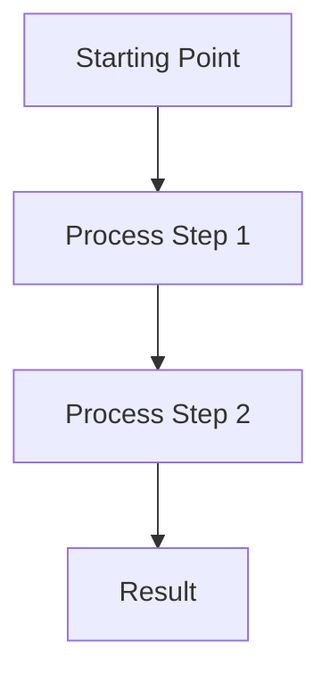
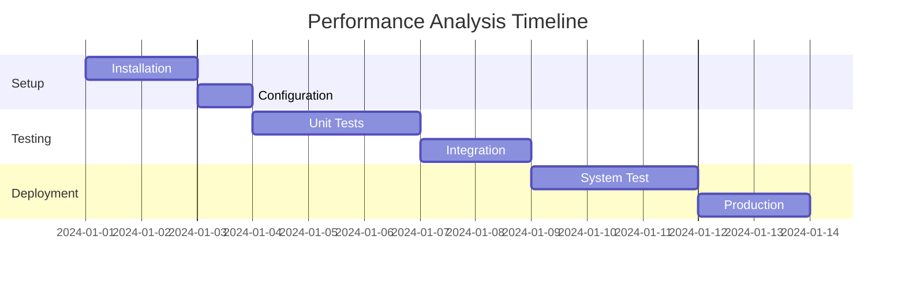

# Chapter X: [Chapter Title]

## Learning Objectives

By the end of this chapter, you will be able to:
- [ ] [Specific, measurable learning objective 1]
- [ ] [Specific, measurable learning objective 2]
- [ ] [Specific, measurable learning objective 3]
- [ ] [Specific, measurable learning objective 4]
- [ ] [Specific, measurable learning objective 5]

## Prerequisites

Before starting this chapter, you should have:
- [Required knowledge or skill from previous chapters]
- [Software or tools that must be installed]
- [Mathematical concepts that are essential]

## Introduction

[Start with a compelling real-world application or problem]
[Hook the reader with why this technology matters]
[Provide a brief roadmap of what will be covered]

## 1. Core Concepts

### 1.1 [Primary Concept]

**Definition**: [Clear, concise definition of the concept]

**Why it matters**: [Explain the importance in humanoid robotics]

**Key characteristics**:
- [Characteristic 1 with explanation]
- [Characteristic 2 with explanation]
- [Characteristic 3 with explanation]



*Figure 1: [Diagram caption explaining what the visualization shows]*

### 1.2 [Related Concept]

**Connection**: How this relates to the previous concept

**Implementation details**:
- [Detail 1 with code example if applicable]
- [Detail 2 with configuration settings]
- [Detail 3 with best practices]

```python
# Code example with comprehensive documentation
def example_function(parameter: str) -> str:
    """
    Brief description of what this function does.

    Args:
        parameter: Description of the parameter

    Returns:
        Description of the return value

    Raises:
        ValueError: If the parameter is invalid
    """
    # Implementation with error handling
    if not parameter:
        raise ValueError("Parameter cannot be empty")

    result = process_parameter(parameter)
    return result
```

## 2. Implementation

### 2.1 Setup and Configuration

[Step-by-step guide for setting up the environment]

```bash
# Installation commands
sudo apt-get install [package-name]
pip install [python-package]

# Configuration file example
cat > config.yaml << EOF
key1: value1
key2: value2
EOF
```

### 2.2 Practical Example

[Complete, working example that demonstrates the concept]

```python
# Full working example
class PracticalImplementation:
    """
    Complete implementation showing [concept] in action.

    This example demonstrates:
    1. How to [specific task]
    2. How to handle [common issue]
    3. Best practices for [related concern]
    """

    def __init__(self, config: Dict[str, Any]):
        """Initialize with configuration."""
        self.config = config
        self._validate_config()

    def execute(self) -> Result:
        """
        Execute the main functionality.

        Returns:
            Result object containing execution status
        """
        try:
            # Main implementation
            intermediate = self._process_step1()
            final_result = self._process_step2(intermediate)
            return Result(success=True, data=final_result)
        except Exception as e:
            logger.error(f"Execution failed: {e}")
            return Result(success=False, error=str(e))
```

## 3. In Practice

### 3.1 Real-World Application

[Describe a real humanoid robot or system using this technology]

### 3.2 Case Study

[Detailed example with:
- Problem statement
- Solution approach
- Implementation details
- Results achieved
- Lessons learned]

### 3.3 Performance Considerations



## 4. Advanced Topics

### 4.1 [Advanced Topic 1]

[Expert-level content that goes beyond the basics]

### 4.2 [Advanced Topic 2]

[Cutting-edge research or industry practices]

:::tip Pro Tip
[Share professional insights or expert advice that readers won't find in basic documentation]
:::

:::warning Common Pitfall
[Highlight common mistakes and how to avoid them]
:::

### 4.3 Future Directions

[Emerging trends and what's coming next in this area]

## 5. Knowledge Check

### Multiple Choice Questions

1. **Question text here?**
   - a) Option A
   - b) Option B
   - c) Option C
   - d) Option D

   **Answer**: [correct letter] - [explanation of why it's correct and why others are wrong]

2. **Another question?**
   - a) Option A
   - b) Option B
   - c) Option C
   - d) Option D

   **Answer**: [correct letter] - [explanation]

### Short Answer Questions

1. **Question requiring explanation**

   **Sample Answer**: [Provide a brief, correct answer]

### Practical Exercises

1. **Exercise: Implement [feature]**

   **Objective**: [What the exercise teaches]

   **Steps**:
   - [ ] Step 1 with specific instructions
   - [ ] Step 2 with expected outcome
   - [ ] Step 3 with validation criteria

   **Hint**: [Optional guidance if needed]

2. **Exercise: Debug [problem]**

   **Scenario**: [Describe the problem]

   **Task**: [What needs to be fixed]

   **Solution Approach**: [High-level guidance]

## Summary

[Recap of key concepts covered]
[Emphasize practical skills gained]
[Preview next chapter or related topics]

## Further Reading

- [Resource 1 with link]
- [Resource 2 with link]
- [Research paper 3 with citation]
- [Documentation 4 with link]

## References

[Properly formatted citations for all references used]