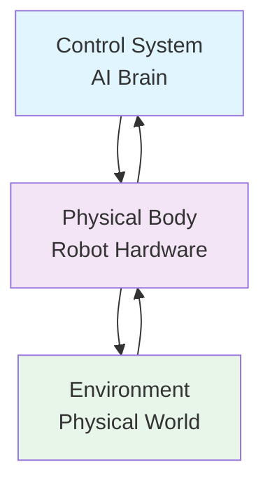

## Learning Objectives

- Understand the fundamental concepts of Physical AI and embodied intelligence
- Distinguish between traditional AI and embodied AI systems
- Explore the historical evolution of humanoid robotics
- Identify key components of embodied AI systems
- Recognize the challenges and opportunities in physical AI development

## 1.1 What is Physical AI?

Physical AI represents the convergence of artificial intelligence with physical embodiment in the real world. Unlike traditional AI systems that operate purely in digital spaces, Physical AI systems interact with and manipulate the physical environment through robotic bodies, sensors, and actuators.

### 1.1.1 Defining Embodied Intelligence

Embodied intelligence refers to the cognitive capabilities that emerge from the dynamic interaction between an agent's control system, its physical body, and the environment. This triad of components creates a feedback loop where:

- **The body** provides sensory input about the environment
- **The environment** imposes physical constraints and opportunities
- **The control system** processes information and generates actions



### 1.1.2 Key Differences from Traditional AI

| Aspect | Traditional AI | Physical AI |
|--------|---------------|-------------|
| **Domain** | Purely digital | Physical world |
| **Input** | Structured data, text, images | Multimodal sensory data |
| **Output** | Predictions, classifications | Physical actions, movements |
| **Constraints** | Computational | Physical, temporal, energy |
| **Feedback** | Training data | Real-time environmental interaction |

## 1.2 Historical Evolution

### 1.2.1 Early Robotics (1950s-1970s)

The foundation of Physical AI began with early robotics research:

- **1954**: George Devol designs the first programmable robot arm
- **1961**: Unimate becomes the first industrial robot
- **1970s**: Shakey the robot demonstrates basic navigation and reasoning

### 1.2.2 Humanoid Robotics Emergence (1980s-2000s)

The development of humanoid robots marked a significant milestone:

- **1986**: Honda begins P1 project, leading to ASIMO
- **1993**: MIT's Cog project explores humanoid cognition
- **2000**: Honda introduces ASIMO, capable of walking and interaction

### 1.2.3 Modern Physical AI (2010s-Present)

Recent advances have accelerated Physical AI development:

- **Deep Learning breakthroughs** enabling better perception
- **Improved simulation platforms** for training
- **Advanced materials** and actuation technologies
- **Cloud robotics** and distributed intelligence

## 1.3 Components of Embodied AI Systems

### 1.3.1 Perception System

The perception system serves as the robot's sensory interface with the world:

```python
# Example: Basic perception pipeline structure
class PerceptionSystem:
    def __init__(self):
        self.sensors = {
            'vision': CameraSensor(),
            'lidar': LidarSensor(),
            'inertial': IMUSensor(),
            'tactile': TactileSensor()
        }
        self.fusion = SensorFusion()

    def perceive(self):
        sensor_data = {}
        for sensor_type, sensor in self.sensors.items():
            sensor_data[sensor_type] = sensor.read()

        return self.fusion.combine(sensor_data)
```

### 1.3.2 Cognitive Architecture

The cognitive architecture processes perceptions and makes decisions:

- **Perception-Action Loop**: Continuous cycle of sensing and acting
- **Memory Systems**: Short-term working memory and long-term knowledge storage
- **Learning Mechanisms**: Adaptation through experience
- **Decision Making**: Planning and reasoning for action selection

### 1.3.3 Motor System

The motor system translates decisions into physical actions:

- **Kinematic Planning**: Computing feasible movements
- **Dynamic Control**: Managing forces and torques
- **Actuator Control**: Low-level motor commands
- **Feedback Control**: Real-time error correction

## 1.4 The Embodiment Advantage

### 1.4.1 Grounded Cognition

Physical embodiment provides several advantages:

1. **Grounded Understanding**: Concepts are tied to physical experiences
2. **Natural Learning**: Interaction with real-world constraints
3. **Energy Efficiency**: Physical constraints reduce search space
4. **Social Interaction**: Bodies facilitate natural human communication

### 1.4.2 Emergent Behaviors

Complex behaviors emerge from simple rules when coupled with embodiment:


## 1.5 Applications of Physical AI

### 1.5.1 Service Robotics

- **Domestic assistance**: Helping with household tasks
- **Elder care**: Providing support and companionship
- **Retail**: Customer service and inventory management

### 1.5.2 Manufacturing

- **Flexible automation**: Adaptable production systems
- **Quality control**: Visual inspection and testing
- **Collaborative robots**: Working alongside humans

### 1.5.3 Healthcare

- **Surgical assistance**: Precision medical procedures
- **Rehabilitation**: Personalized therapy systems
- **Patient care**: Monitoring and support

### 1.5.4 Exploration

- **Space exploration**: Autonomous planetary rovers
- **Deep sea**: Underwater research vehicles
- **Disaster response**: Search and rescue operations

## 1.6 Challenges in Physical AI

### 1.6.1 Technical Challenges

1. **Perception in Unstructured Environments**
   - Variable lighting conditions
   - Occlusions and limited viewpoints
   - Dynamic, unpredictable environments

2. **Motor Control Complexity**
   - High-dimensional action spaces
   - Real-time constraints
   - Safety and reliability requirements

3. **Energy Efficiency**
   - Limited battery life
   - Power consumption of computation
   - Efficient actuation design

### 1.6.2 Fundamental Challenges

1. **The Symbol Grounding Problem**
   - How symbols acquire meaning
   - Connecting abstract concepts to sensory experience

2. **Common Sense Reasoning**
   - Understanding physical intuitions
   - Predicting object behaviors

3. **Developmental Learning**
   - How robots learn like children
   - Curriculum learning approaches

## 1.7 Future Directions

### 1.7.1 Emerging Trends

- **Neuromorphic Computing**: Brain-inspired hardware architectures
- **Soft Robotics**: Compliant, adaptable robot bodies
- **Swarm Intelligence**: Coordinated multi-robot systems
- **Human-Robot Collaboration**: Natural interaction paradigms

### 1.7.2 Ethical Considerations

As Physical AI systems become more capable, we must address:

- **Safety**: Ensuring reliable and predictable behavior
- **Privacy**: Protecting personal data collected by robots
- **Autonomy**: Balancing independence with human control
- **Impact**: Considering societal and economic effects

## 1.8 Case Study: Boston Dynamics' Atlas

Boston Dynamics' Atlas robot exemplifies current Physical AI capabilities:

```python
# Simplified example of Atlas control architecture
class AtlasController:
    def __init__(self):
        self.state_estimator = StateEstimator()
        self.motion_planner = MotionPlanner()
        self.balance_controller = BalanceController()
        self.behavior_system = BehaviorSystem()

    def update(self, sensory_input):
        # Estimate current state
        state = self.state_estimator.update(sensory_input)

        # Generate behavior
        behavior = self.behavior_system.select_behavior(state)

        # Plan motion
        trajectory = self.motion_planner.plan(behavior, state)

        # Generate control commands
        commands = self.balance_controller.execute(trajectory)

        return commands
```

### 1.8.1 Key Features

- **Dynamic Mobility**: Running, jumping, and backflips
- **Perception**: Lidar and stereo vision
- **Manipulation**: Mobile manipulation capabilities
- **Autonomy**: Perception-driven navigation

### 1.8.2 Technical Achievements

- **Whole-body control**: Coordinated motion of all joints
- **Dynamic balance**: Maintaining stability during dynamic motions
- **Terrain adaptation**: Adjusting gait for different surfaces
- **Real-time perception**: Processing sensor data at high rates

## 1.9 Summary

Physical AI represents a paradigm shift in artificial intelligence, bringing abstract intelligence into the physical world through embodied systems. This chapter introduced:

1. The fundamental concepts of embodied intelligence
2. The historical evolution of physical AI systems
3. Key components and architectures
4. Applications and challenges
5. Future directions and ethical considerations

The journey into Physical AI requires understanding not just algorithms and computation, but also physics, mechanics, and the intricate relationship between mind, body, and world. As we progress through this textbook, we'll explore each component in detail, building from foundations to advanced implementations.

## Knowledge Check

### Multiple Choice Questions

1. **What distinguishes Physical AI from traditional AI?**
   - a) Physical AI uses more computational resources
   - b) Physical AI interacts with the physical world through embodiment
   - c) Physical AI is only used in industrial applications
   - d) Physical AI cannot learn from data

2. **Which of the following is NOT a component of embodied AI systems?**
   - a) Perception system
   - b) Cognitive architecture
   - c) Motor system
   - d) Database management system

3. **What is the symbol grounding problem?**
   - a) How to store symbols efficiently
   - b) How symbols acquire meaning through sensory experience
   - c) How to translate between programming languages
   - d) How to compress symbolic representations

### Short Answer Questions

1. Explain the concept of embodied intelligence and why it's important for AI systems.

2. Describe the perception-action loop and its role in Physical AI systems.

3. What are three major challenges in developing Physical AI systems?

### Practical Exercise

Design a simple embodied AI system for a specific task (e.g., autonomous vacuum cleaner). Identify the key components (perception, cognition, action) and describe how they would interact.

---

*Next Chapter: Sensors & Perception - We'll dive deep into the various sensors that enable robots to perceive and understand their environment.*