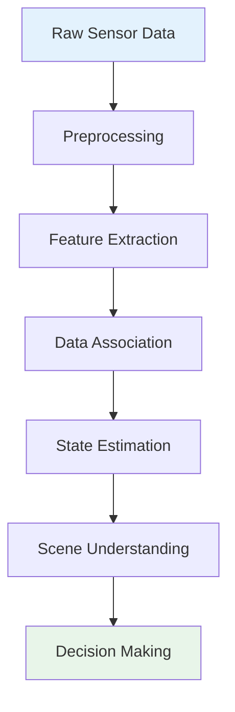

## Learning Objectives

- Understand the principles and applications of major sensor types in robotics
- Learn about LiDAR technology and its role in 3D perception
- Explore computer vision concepts and camera-based perception
- Master inertial measurement units (IMUs) and motion sensing
- Implement sensor fusion techniques for robust perception

## 2.1 Introduction to Robotic Perception

Robotic perception is the process by which a robot interprets sensory data to understand its environment and own state. A robust perception system is crucial for autonomous operation, enabling robots to navigate, manipulate objects, and interact safely with humans.

### 2.1.1 The Perception Pipeline



The perception pipeline consists of several key stages:

1. **Data Acquisition**: Collecting raw sensor measurements
2. **Preprocessing**: Noise reduction and calibration
3. **Feature Extraction**: Identifying meaningful patterns
4. **Data Association**: Matching features across time and sensors
5. **State Estimation**: Determining robot and environment state
6. **Scene Understanding**: High-level interpretation of the environment

## 2.2 Vision Sensors

### 2.2.1 Camera Types and Technologies

#### Monocular Cameras

Monocular cameras provide a single viewpoint of the world, capturing 2D projections of the 3D environment:

```python
# Basic camera interface example
class MonocularCamera:
    def __init__(self, resolution, fps):
        self.resolution = resolution
        self.fps = fps
        self.intrinsics = self._calibrate_intrinsics()
        self.distortion = self._calibrate_distortion()

    def capture_frame(self):
        # Capture raw image data
        raw_image = self._read_sensor()

        # Apply distortion correction
        corrected = self._undistort(raw_image)

        return {
            'image': corrected,
            'timestamp': time.time(),
            'camera_info': self.intrinsics
        }

    def pixel_to_ray(self, u, v):
        """Convert pixel coordinates to camera ray"""
        fx, fy = self.intrinsics['fx'], self.intrinsics['fy']
        cx, cy = self.intrinsics['cx'], self.intrinsics['cy']

        # Normalize pixel coordinates
        x = (u - cx) / fx
        y = (v - cy) / fy

        # Ray direction in camera frame
        ray = np.array([x, y, 1.0])
        return ray / np.linalg.norm(ray)
```

#### Stereo Cameras

Stereo cameras use two spatially separated cameras to compute depth through triangulation:

```python
class StereoCamera:
    def __init__(self, baseline, camera_params):
        self.baseline = baseline
        self.left_camera = MonocularCamera(**camera_params)
        self.right_camera = MonocularCamera(**camera_params)
        self.stereo_matcher = cv2.StereoBM_create(
            numDisparities=64, blockSize=15
        )

    def compute_disparity(self, left_image, right_image):
        """Compute disparity map from stereo pair"""
        gray_left = cv2.cvtColor(left_image, cv2.COLOR_BGR2GRAY)
        gray_right = cv2.cvtColor(right_image, cv2.COLOR_BGR2GRAY)

        disparity = self.stereo_matcher.compute(gray_left, gray_right)
        return disparity

    def disparity_to_depth(self, disparity):
        """Convert disparity to depth using triangulation"""
        # Depth = (focal_length * baseline) / disparity
        focal_length = self.left_camera.intrinsics['fx']
        depth = (focal_length * self.baseline) / (disparity + 1e-6)
        return depth

    def capture_stereo_pair(self):
        """Capture synchronized stereo images"""
        left_data = self.left_camera.capture_frame()
        right_data = self.right_camera.capture_frame()

        disparity = self.compute_disparity(
            left_data['image'], right_data['image']
        )
        depth = self.disparity_to_depth(disparity)

        return {
            'left_image': left_data['image'],
            'right_image': right_data['image'],
            'disparity': disparity,
            'depth': depth,
            'timestamp': left_data['timestamp']
        }
```

#### RGB-D Cameras

RGB-D cameras provide both color and depth information through active sensing:

```python
class RGBCDCamera:
    def __init__(self, device_id):
        self.device_id = device_id
        self.color_stream = None
        self.depth_stream = None
        self.extrinsics = self._get_calibration()

    def align_depth_to_color(self, depth_image, color_image):
        """Align depth image to color image coordinates"""
        # Create alignment object
        align = rs.align(rs.stream.color)

        # Process frames
        frames = align.process({
            'depth': depth_image,
            'color': color_image
        })

        return frames.get_depth_frame()

    def get_point_cloud(self, color_image, depth_image):
        """Convert depth and color to 3D point cloud"""
        points = []

        height, width = depth_image.shape
        for v in range(height):
            for u in range(width):
                depth = depth_image[v, u]
                if depth > 0:  # Valid depth measurement
                    # Convert depth to 3D point
                    x, y, z = self._deproject(u, v, depth)

                    # Get color
                    color = color_image[v, u]

                    points.append({
                        'x': x, 'y': y, 'z': z,
                        'r': color[0], 'g': color[1], 'b': color[2]
                    })

        return points
```

### 2.2.2 Computer Vision Processing

#### Feature Detection

```python
class FeatureDetector:
    def __init__(self, detector_type='ORB'):
        if detector_type == 'SIFT':
            self.detector = cv2.SIFT_create()
        elif detector_type == 'ORB':
            self.detector = cv2.ORB_create()
        elif detector_type == 'AKAZE':
            self.detector = cv2.AKAZE_create()

    def detect_and_compute(self, image):
        """Detect keypoints and compute descriptors"""
        keypoints, descriptors = self.detector.detectAndCompute(
            image, None
        )
        return keypoints, descriptors

    def match_features(self, desc1, desc2, ratio_thresh=0.7):
        """Match features between two images"""
        # Use BFMatcher for binary descriptors
        matcher = cv2.BFMatcher(cv2.NORM_HAMMING, crossCheck=False)

        # Find k best matches
        matches = matcher.knnMatch(desc1, desc2, k=2)

        # Apply Lowe's ratio test
        good_matches = []
        for match_pair in matches:
            if len(match_pair) == 2:
                m, n = match_pair
                if m.distance < ratio_thresh * n.distance:
                    good_matches.append(m)

        return good_matches
```

#### Object Detection

```python
class ObjectDetector:
    def __init__(self, model_path, confidence_threshold=0.5):
        self.net = cv2.dnn.readNetFromONNX(model_path)
        self.confidence_threshold = confidence_threshold
        self.classes = self._load_classes()

    def detect_objects(self, image):
        """Detect objects in image using YOLO"""
        # Preprocess image
        blob = cv2.dnn.blobFromImage(
            image, 1/255.0, (416, 416), swapRB=True, crop=False
        )

        # Forward pass
        self.net.setInput(blob)
        outputs = self.net.forward()

        # Process detections
        boxes = []
        confidences = []
        class_ids = []

        for output in outputs:
            for detection in output:
                scores = detection[5:]
                class_id = np.argmax(scores)
                confidence = scores[class_id]

                if confidence > self.confidence_threshold:
                    # Get bounding box
                    center_x = int(detection[0] * image.shape[1])
                    center_y = int(detection[1] * image.shape[0])
                    width = int(detection[2] * image.shape[1])
                    height = int(detection[3] * image.shape[0])

                    # Convert to corner coordinates
                    x = int(center_x - width / 2)
                    y = int(center_y - height / 2)

                    boxes.append([x, y, width, height])
                    confidences.append(float(confidence))
                    class_ids.append(class_id)

        # Apply non-maximum suppression
        indices = cv2.dnn.NMSBoxes(
            boxes, confidences,
            self.confidence_threshold,
            0.4
        )

        # Return filtered detections
        detections = []
        for i in indices:
            i = i[0]
            detections.append({
                'box': boxes[i],
                'confidence': confidences[i],
                'class_id': class_ids[i],
                'class_name': self.classes[class_ids[i]]
            })

        return detections
```

## 2.3 LiDAR Sensors

### 2.3.1 LiDAR Fundamentals

LiDAR (Light Detection and Ranging) sensors measure distance by emitting laser pulses and measuring the time of flight of reflected light. This provides accurate 3D point clouds of the environment.

```python
class LidarSensor:
    def __init__(self, scan_frequency, range_max, angle_min, angle_max):
        self.scan_frequency = scan_frequency
        self.range_max = range_max
        self.angle_min = angle_min
        self.angle_max = angle_max
        self.angle_increment = (angle_max - angle_min) / 360

    def generate_scan(self, obstacles):
        """Simulate LiDAR scan given obstacle positions"""
        num_readings = 360
        ranges = np.full(num_readings, self.range_max)
        intensities = np.zeros(num_readings)

        for i in range(num_readings):
            angle = self.angle_min + i * self.angle_increment

            # Cast ray in this direction
            ray_length = self.range_max
            ray_end = np.array([
                ray_length * np.cos(angle),
                ray_length * np.sin(angle)
            ])

            # Check for intersections with obstacles
            min_distance = self.range_max
            max_intensity = 0

            for obstacle in obstacles:
                # Simple intersection test for circular obstacles
                dist = self._ray_circle_intersection(
                    np.array([0, 0]), ray_end,
                    obstacle['center'], obstacle['radius']
                )

                if dist < min_distance:
                    min_distance = dist
                    # Simulate intensity based on material
                    max_intensity = obstacle.get('intensity', 100)

            ranges[i] = min_distance
            intensities[i] = max_intensity

        return {
            'ranges': ranges,
            'intensities': intensities,
            'angle_min': self.angle_min,
            'angle_increment': self.angle_increment,
            'timestamp': time.time()
        }

    def _ray_circle_intersection(self, ray_origin, ray_end, circle_center, radius):
        """Calculate intersection distance between ray and circle"""
        # Ray equation: P = O + t*D
        # Circle equation: |P - C|^2 = r^2

        ray_direction = ray_end - ray_origin
        ray_length = np.linalg.norm(ray_direction)
        ray_direction = ray_direction / ray_length

        # Quadratic formula coefficients
        oc = ray_origin - circle_center
        a = np.dot(ray_direction, ray_direction)
        b = 2.0 * np.dot(oc, ray_direction)
        c = np.dot(oc, oc) - radius * radius

        discriminant = b*b - 4*a*c

        if discriminant < 0:
            return ray_length  # No intersection

        # Calculate intersection points
        t1 = (-b - np.sqrt(discriminant)) / (2*a)
        t2 = (-b + np.sqrt(discriminant)) / (2*a)

        # Return closest positive intersection
        if t1 > 0 and t1 < ray_length:
            return t1
        elif t2 > 0 and t2 < ray_length:
            return t2
        else:
            return ray_length
```

### 2.3.2 Point Cloud Processing

```python
class PointCloudProcessor:
    def __init__(self, voxel_size=0.1):
        self.voxel_size = voxel_size

    def filter_ground_plane(self, points, height_threshold=0.1):
        """Filter out ground plane from point cloud"""
        # Use RANSAC to find ground plane
        ground_points, non_ground_points = self._ransac_plane(
            points, distance_threshold=height_threshold
        )

        return non_ground_points

    def cluster_objects(self, points, distance_threshold=0.5):
        """Cluster points into individual objects"""
        # Use DBSCAN clustering
        points_array = np.array([[p['x'], p['y'], p['z']] for p in points])

        clustering = DBSCAN(
            eps=distance_threshold,
            min_samples=10
        ).fit(points_array)

        clusters = {}
        for i, label in enumerate(clustering.labels_):
            if label != -1:  # Not noise
                if label not in clusters:
                    clusters[label] = []
                clusters[label].append(points[i])

        return clusters

    def voxel_grid_filter(self, points):
        """Reduce point cloud density using voxel grid"""
        # Create voxel grid
        voxel_dict = {}

        for point in points:
            # Calculate voxel coordinates
            voxel_x = int(point['x'] / self.voxel_size)
            voxel_y = int(point['y'] / self.voxel_size)
            voxel_z = int(point['z'] / self.voxel_size)

            voxel_key = (voxel_x, voxel_y, voxel_z)

            if voxel_key not in voxel_dict:
                voxel_dict[voxel_key] = []

            voxel_dict[voxel_key].append(point)

        # Average points in each voxel
        filtered_points = []
        for voxel_points in voxel_dict.values():
            # Calculate centroid
            avg_point = {
                'x': np.mean([p['x'] for p in voxel_points]),
                'y': np.mean([p['y'] for p in voxel_points]),
                'z': np.mean([p['z'] for p in voxel_points]),
                'intensity': np.mean([p.get('intensity', 0) for p in voxel_points])
            }
            filtered_points.append(avg_point)

        return filtered_points
```

### 2.3.3 3D Object Detection

```python
class ObjectDetector3D:
    def __init__(self, model_path):
        self.model = self._load_model(model_path)

    def detect_objects_in_point_cloud(self, point_cloud):
        """Detect 3D bounding boxes in point cloud"""
        # Preprocess point cloud
        processed_points = self._preprocess_point_cloud(point_cloud)

        # Run inference
        predictions = self.model.predict(processed_points)

        # Post-process predictions
        detections = []
        for pred in predictions:
            if pred['confidence'] > 0.5:
                detection = {
                    'center': pred['center'],
                    'size': pred['size'],
                    'heading': pred['heading'],
                    'class': pred['class'],
                    'confidence': pred['confidence']
                }
                detections.append(detection)

        return detections

    def track_objects(self, detections, previous_tracks):
        """Track objects across multiple frames"""
        if not previous_tracks:
            # Initialize tracks for first frame
            tracks = []
            for i, detection in enumerate(detections):
                track = {
                    'id': i,
                    'detection': detection,
                    'kalman_filter': self._init_kalman_filter(detection),
                    'age': 1
                }
                tracks.append(track)
            return tracks

        # Associate detections with existing tracks
        tracks = []
        for track in previous_tracks:
            # Predict next position
            predicted_state = track['kalman_filter'].predict()

            # Find best matching detection
            best_match = self._find_best_match(
                predicted_state, detections
            )

            if best_match:
                # Update track with new detection
                track['kalman_filter'].update(best_match['center'])
                track['detection'] = best_match
                track['age'] += 1
                tracks.append(track)

                # Remove matched detection from list
                detections.remove(best_match)
            else:
                # Keep track if not too old
                if track['age'] < 5:
                    tracks.append(track)

        # Create new tracks for unmatched detections
        for detection in detections:
            track = {
                'id': len(tracks) + max([t['id'] for t in tracks]) + 1,
                'detection': detection,
                'kalman_filter': self._init_kalman_filter(detection),
                'age': 1
            }
            tracks.append(track)

        return tracks
```

## 2.4 Inertial Measurement Units (IMUs)

### 2.4.1 IMU Components and Principles

IMUs typically contain three types of sensors:

1. **Accelerometers**: Measure specific force (proper acceleration)
2. **Gyroscopes**: Measure angular velocity
3. **Magnetometers**: Measure magnetic field (optional, for heading)

```python
class IMU:
    def __init__(self):
        self.accelerometer = Accelerometer()
        self.gyroscope = Gyroscope()
        self.magnetometer = Magnetometer()

        # Calibration parameters
        self.accel_bias = np.zeros(3)
        self.gyro_bias = np.zeros(3)
        self.accel_scale = np.ones(3)
        self.gyro_scale = np.ones(3)

        # State estimation
        self.orientation = np.array([1.0, 0.0, 0.0, 0.0])  # Quaternion
        self.velocity = np.zeros(3)
        self.position = np.zeros(3)

    def read_raw_data(self):
        """Read raw sensor data"""
        return {
            'accel': self.accelerometer.read_raw(),
            'gyro': self.gyroscope.read_raw(),
            'mag': self.magnetometer.read_raw(),
            'timestamp': time.time()
        }

    def calibrate(self, samples=1000):
        """Calibrate IMU biases and scales"""
        print("Collecting calibration data...")

        accel_samples = []
        gyro_samples = []
        mag_samples = []

        for _ in range(samples):
            raw_data = self.read_raw_data()
            accel_samples.append(raw_data['accel'])
            gyro_samples.append(raw_data['gyro'])
            mag_samples.append(raw_data['mag'])
            time.sleep(0.01)

        # Calculate biases (assuming device is stationary)
        self.accel_bias = np.mean(accel_samples, axis=0)
        self.gyro_bias = np.mean(gyro_samples, axis=0)

        # Calculate magnetometer calibration
        mag_array = np.array(mag_samples)
        mag_center = np.mean(mag_array, axis=0)

        # Hard iron calibration
        mag_distances = np.linalg.norm(mag_array - mag_center, axis=1)
        mag_radius = np.mean(mag_distances)

        print("Calibration complete!")

    def process_data(self, raw_data):
        """Process raw IMU data"""
        # Apply calibration
        accel = (raw_data['accel'] - self.accel_bias) * self.accel_scale
        gyro = (raw_data['gyro'] - self.gyro_bias) * self.gyro_scale
        mag = raw_data['mag']

        # Estimate orientation using Madgwick filter
        self._update_orientation_madgwick(accel, gyro, mag, raw_data['timestamp'])

        return {
            'acceleration': accel,
            'angular_velocity': gyro,
            'magnetic_field': mag,
            'orientation': self.orientation,
            'timestamp': raw_data['timestamp']
        }

    def _update_orientation_madgwick(self, accel, gyro, mag, timestamp):
        """Update orientation using Madgwick AHRS algorithm"""
        # Madgwick filter implementation
        # (Simplified version - actual implementation more complex)

        # Convert to body frame
        q = self.orientation

        # Normalize measurements
        if np.linalg.norm(accel) > 0:
            accel = accel / np.linalg.norm(accel)
        if np.linalg.norm(mag) > 0:
            mag = mag / np.linalg.norm(mag)

        # Compute objective function gradient
        f_g = self._compute_gradient_g(q, accel)
        f_m = self._compute_gradient_m(q, accel, mag)

        # Compute gradient descent step
        beta = 0.1  # Filter gain
        q_dot = 0.5 * self._quaternion_multiply(q, [0, gyro[0], gyro[1], gyro[2]]) \
                - beta * (f_g + f_m)

        # Integrate
        dt = timestamp - getattr(self, 'last_timestamp', timestamp)
        self.orientation = self.orientation + q_dot * dt
        self.orientation = self.orientation / np.linalg.norm(self.orientation)

        self.last_timestamp = timestamp
```

### 2.4.2 State Estimation with IMU

```python
class IMUStateEstimator:
    def __init__(self):
        self.imu = IMU()
        self.kalman_filter = self._init_extended_kalman_filter()

        # Noise parameters
        self.process_noise = np.diag([0.01, 0.01, 0.01,  # Angular velocity
                                     0.1, 0.1, 0.1,    # Acceleration
                                     0.001, 0.001, 0.001])  # Orientation
        self.measurement_noise = np.diag([0.1, 0.1, 0.1])  # Accelerometer

    def estimate_state(self, raw_imu_data):
        """Estimate robot state from IMU measurements"""
        # Process IMU data
        processed_data = self.imu.process_data(raw_imu_data)

        # Predict step
        self._predict_state(processed_data)

        # Update step (if additional measurements available)
        # self._update_with_measurements()

        return {
            'orientation': self.kalman_filter.state[6:9],
            'angular_velocity': processed_data['angular_velocity'],
            'linear_acceleration': processed_data['acceleration'],
            'covariance': self.kalman_filter.P
        }

    def _predict_state(self, imu_data):
        """EKF prediction step"""
        # State vector: [p, v, q] (position, velocity, quaternion)
        # Control input: [omega, a] (angular velocity, acceleration)

        omega = imu_data['angular_velocity']
        a = imu_data['acceleration']

        # State transition
        q = self.kalman_filter.state[6:9]
        v = self.kalman_filter.state[3:6]

        # Quaternion derivative
        q_dot = 0.5 * self._quaternion_multiply(q, [0, omega[0], omega[1], omega[2]])

        # Update state
        dt = 0.01  # Time step
        self.kalman_filter.state[0:3] += v * dt  # Position
        self.kalman_filter.state[3:6] += a * dt  # Velocity
        self.kalman_filter.state[6:9] += q_dot * dt  # Orientation

        # Normalize quaternion
        self.kalman_filter.state[6:9] /= np.linalg.norm(self.kalman_filter.state[6:9])

        # Update covariance
        self.kalman_filter.predict(dt=dt)
```

## 2.5 Sensor Fusion

### 2.5.1 Multi-Sensor Fusion Architectures

```python
class SensorFusion:
    def __init__(self):
        self.sensors = {
            'camera': CameraSensor(),
            'lidar': LidarSensor(),
            'imu': IMU()
        }

        # Fusion state
        self.fused_state = None
        self.covariance = np.eye(15)  # State covariance matrix

        # Kalman filter for fusion
        self.kf = self._init_fusion_kalman_filter()

    def fuse_sensors(self, sensor_data):
        """Fuse data from multiple sensors"""
        # Predict step
        self._predict_state(sensor_data['imu'])

        # Update step with each sensor
        if 'camera' in sensor_data:
            self._update_with_camera(sensor_data['camera'])

        if 'lidar' in sensor_data:
            self._update_with_lidar(sensor_data['lidar'])

        # Extract fused state
        self.fused_state = {
            'position': self.kf.state[0:3],
            'velocity': self.kf.state[3:6],
            'orientation': self.kf.state[6:10],
            'angular_velocity': self.kf.state[10:13],
            'timestamp': time.time()
        }

        return self.fused_state

    def _update_with_camera(self, camera_data):
        """Update state with camera measurements"""
        # Visual odometry update
        if 'visual_odometry' in camera_data:
            vo_measurement = camera_data['visual_odometry']

            # Measurement matrix for visual odometry
            H = np.zeros((6, 15))
            H[0:3, 6:10] = self._quaternion_to_rotation_matrix(
                self.kf.state[6:10]
            )  # Position from orientation
            H[3:6, 10:13] = np.eye(3)  # Angular velocity

            # Update Kalman filter
            self.kf.update(vo_measurement, H, self.camera_noise)

    def _update_with_lidar(self, lidar_data):
        """Update state with LiDAR measurements"""
        # Point cloud registration update
        if 'odometry' in lidar_data:
            lidar_odom = lidar_data['odometry']

            # Measurement matrix for LiDAR odometry
            H = np.zeros((6, 15))
            H[0:3, 0:3] = np.eye(3)  # Position
            H[3:6, 6:10] = np.eye(4)[:, 0:3]  # Orientation

            # Update Kalman filter
            self.kf.update(lidar_odom, H, self.lidar_noise)
```

### 2.5.2 Extended Kalman Filter for Navigation

```python
class NavigationFilter:
    def __init__(self):
        # State: [x, y, z, vx, vy, vz, qw, qx, qy, qz, bx, by, bz]
        # Position, velocity, orientation, accelerometer bias
        self.state = np.zeros(13)
        self.state[6] = 1.0  # Quaternion w component

        # Covariance matrix
        self.P = np.eye(13) * 0.1

        # Process noise
        self.Q = np.diag([0.01, 0.01, 0.01,    # Position noise
                         0.1, 0.1, 0.1,        # Velocity noise
                         0.01, 0.01, 0.01,     # Orientation noise
                         0.001, 0.001, 0.001]) # Bias noise

        # Measurement noises
        self.R_gps = np.diag([1.0, 1.0, 2.0])     # GPS noise
        self.R_imu = np.diag([0.1, 0.1, 0.1])     # IMU noise
        self.R_vision = np.diag([0.05, 0.05, 0.1]) # Visual odometry noise

    def predict(self, imu_data, dt):
        """EKF prediction step"""
        # Extract measurements
        accel = imu_data['acceleration']
        gyro = imu_data['angular_velocity']

        # Remove gravity from acceleration
        R = self._quaternion_to_rotation_matrix(self.state[6:10])
        gravity_world = np.array([0, 0, -9.81])
        accel_body = accel - R.T @ gravity_world

        # State transition
        # Position update
        self.state[0:3] += self.state[3:6] * dt + 0.5 * R @ accel_body * dt**2

        # Velocity update
        self.state[3:6] += R @ accel_body * dt

        # Orientation update
        omega = gyro - self.state[10:13]  # Remove bias
        q_dot = 0.5 * self._quaternion_multiply(
            self.state[6:10],
            np.array([0, omega[0], omega[1], omega[2]])
        )
        self.state[6:10] += q_dot * dt
        self.state[6:10] /= np.linalg.norm(self.state[6:10])

        # Bias update (random walk)
        self.state[10:13] += 0 * dt  # Assuming zero-mean bias noise

        # Compute Jacobian
        F = self._compute_jacobian(accel_body, omega, dt)

        # Update covariance
        self.P = F @ self.P @ F.T + self.Q

    def update_gps(self, gps_data):
        """EKF update with GPS measurement"""
        # Measurement vector
        z = np.array([gps_data['x'], gps_data['y'], gps_data['z']])

        # Measurement matrix
        H = np.zeros((3, 13))
        H[0:3, 0:3] = np.eye(3)

        # Innovation
        y = z - self.state[0:3]

        # Innovation covariance
        S = H @ self.P @ H.T + self.R_gps

        # Kalman gain
        K = self.P @ H.T @ np.linalg.inv(S)

        # State update
        self.state += K @ y

        # Covariance update
        I = np.eye(13)
        self.P = (I - K @ H) @ self.P

        # Normalize quaternion
        self.state[6:10] /= np.linalg.norm(self.state[6:10])
```

## 2.6 Perception for Navigation

### 2.6.1 SLAM (Simultaneous Localization and Mapping)

```python
class VisualSLAM:
    def __init__(self):
        self.feature_detector = FeatureDetector()
        self.map = Map()
        self.pose = np.eye(4)  # Camera pose
        self.keyframes = []
        self.last_keyframe = None

    def process_frame(self, image, timestamp):
        """Process single frame for SLAM"""
        # Detect features
        keypoints, descriptors = self.feature_detector.detect_and_compute(image)

        if self.last_keyframe is None:
            # Initialize with first frame
            self._initialize_map(keypoints, descriptors, image)
            return self.pose

        # Track features
        tracked_points = self._track_features(
            keypoints, descriptors, self.last_keyframe
        )

        if len(tracked_points) < 50:
            # Create new keyframe
            self._create_keyframe(image, keypoints, descriptors, timestamp)

        # Estimate motion
        if len(tracked_points) > 10:
            self._estimate_pose(tracked_points)

            # Triangulate new map points
            self._triangulate_points(tracked_points)

            # Optimize (bundle adjustment)
            if len(self.keyframes) > 3:
                self._optimize()

        return self.pose

    def _initialize_map(self, keypoints, descriptors, image):
        """Initialize SLAM map with first frame"""
        self.last_keyframe = {
            'image': image,
            'keypoints': keypoints,
            'descriptors': descriptors,
            'pose': np.eye(4),
            'timestamp': time.time()
        }
        self.keyframes.append(self.last_keyframe)

        # Create initial map points from stereo or known camera motion
        self._create_initial_map_points(keypoints)

    def _track_features(self, keypoints, descriptors, last_keyframe):
        """Track features between frames"""
        # Match descriptors
        matches = self.feature_detector.match_features(
            descriptors, last_keyframe['descriptors']
        )

        tracked_points = []
        for match in matches:
            pt1 = last_keyframe['keypoints'][match.queryIdx].pt
            pt2 = keypoints[match.trainIdx].pt

            tracked_points.append({
                'prev_pt': pt1,
                'curr_pt': pt2,
                'descriptor': descriptors[match.trainIdx]
            })

        return tracked_points

    def _estimate_pose(self, tracked_points):
        """Estimate camera pose from tracked features"""
        # Extract 2D-2D correspondences
        prev_pts = np.array([p['prev_pt'] for p in tracked_points])
        curr_pts = np.array([p['curr_pt'] for p in tracked_points])

        # Estimate essential matrix
        E, mask = cv2.findEssentialMat(
            prev_pts, curr_pts,
            self.camera_matrix,
            method=cv2.RANSAC,
            prob=0.999, threshold=1.0
        )

        # Recover pose from essential matrix
        _, R, t, mask = cv2.recoverPose(
            E, prev_pts, curr_pts, self.camera_matrix
        )

        # Update current pose
        T = np.eye(4)
        T[0:3, 0:3] = R
        T[0:3, 3] = t.flatten()

        self.pose = self.last_keyframe['pose'] @ T
```

### 2.6.2 Navigation with Obstacle Avoidance

```python
class NavigationSystem:
    def __init__(self):
        self.occupancy_grid = OccupancyGrid(resolution=0.1)
        self.path_planner = AStarPlanner()
        self.local_planner = DWAPlanner()

    def update_map(self, point_cloud, robot_pose):
        """Update occupancy grid with new sensor data"""
        # Transform point cloud to world frame
        world_points = self._transform_to_world(point_cloud, robot_pose)

        # Update occupancy probabilities
        for point in world_points:
            grid_x, grid_y = self.occupancy_grid.world_to_grid(
                point['x'], point['y']
            )
            self.occupancy_grid.update_occupancy(grid_x, grid_y, True)

        # Ray tracing for free space
        for point in world_points:
            self._ray_trace_free_space(robot_pose, point)

    def plan_path(self, start, goal):
        """Plan global path from start to goal"""
        # Create global plan
        global_path = self.path_planner.plan(
            start, goal, self.occupancy_grid
        )

        if not global_path:
            print("No path found!")
            return None

        return global_path

    def execute_navigation(self, current_pose, global_path):
        """Execute local navigation following global path"""
        if not global_path:
            return None

        # Find target on global path
        target_pose = self._find_target_pose(current_pose, global_path)

        # Generate local trajectory using DWA
        local_trajectory = self.local_planner.plan(
            current_pose, target_pose, self.occupancy_grid
        )

        return local_trajectory

    def _find_target_pose(self, current_pose, global_path):
        """Find appropriate target pose on global path"""
        lookahead_distance = 2.0  # meters

        # Find point on path at lookahead distance
        min_dist = float('inf')
        target_idx = 0

        for i, path_point in enumerate(global_path):
            dist = np.linalg.norm(current_pose[0:2] - path_point[0:2])
            if dist < min_dist:
                min_dist = dist
                target_idx = i

        # Look ahead
        for i in range(target_idx, len(global_path)):
            point = global_path[i]
            dist = np.linalg.norm(current_pose[0:2] - point[0:2])
            if dist >= lookahead_distance:
                return point

        # If end of path reached
        return global_path[-1]
```

## 2.7 Best Practices and Considerations

### 2.7.1 Sensor Selection Guidelines

When selecting sensors for a robotics application, consider:

1. **Environment Conditions**
   - Indoor/Outdoor operation
   - Lighting conditions (for cameras)
   - Weather conditions (for LiDAR)
   - EM interference (for magnetic sensors)

2. **Task Requirements**
   - Required accuracy and precision
   - Update rate needs
   - Field of view requirements
   - Range limitations

3. **System Constraints**
   - Power consumption
   - Computational requirements
   - Size and weight
   - Cost considerations

### 2.7.2 Calibration Procedures

Regular calibration is essential for accurate perception:

```python
class SensorCalibration:
    def __init__(self):
        self.calibration_data = {}

    def calibrate_camera(self, checkerboard_size, square_size):
        """Calibrate camera intrinsics and distortion"""
        # Collect checkerboard images
        calibration_images = self._collect_calibration_images()

        # Find checkerboard corners
        object_points = []
        image_points = []

        for image in calibration_images:
            ret, corners = cv2.findChessboardCorners(
                image, checkerboard_size, None
            )

            if ret:
                # Add object points (3D world coordinates)
                objp = np.zeros(
                    (checkerboard_size[0] * checkerboard_size[1], 3),
                    np.float32
                )
                objp[:, :2] = np.mgrid[
                    0:checkerboard_size[0],
                    0:checkerboard_size[1]
                ].T.reshape(-1, 2) * square_size

                object_points.append(objp)
                image_points.append(corners)

        # Calibrate camera
        ret, camera_matrix, dist_coeffs, rvecs, tvecs = cv2.calibrateCamera(
            object_points, image_points,
            image.shape[::-1], None, None
        )

        if ret:
            self.calibration_data['camera'] = {
                'camera_matrix': camera_matrix,
                'dist_coeffs': dist_coeffs,
                'reprojection_error': self._compute_reprojection_error(
                    object_points, image_points, rvecs, tvecs,
                    camera_matrix, dist_coeffs
                )
            }

        return ret

    def calibrate_imu(self, duration_seconds=30):
        """Calibrate IMU biases and scales"""
        print("Keeping IMU stationary for bias calibration...")

        # Collect stationary data
        accel_samples = []
        gyro_samples = []

        start_time = time.time()
        while time.time() - start_time < duration_seconds:
            raw_data = self._read_imu_raw()
            accel_samples.append(raw_data['accel'])
            gyro_samples.append(raw_data['gyro'])
            time.sleep(0.01)

        # Calculate biases
        accel_bias = np.mean(accel_samples, axis=0)
        gyro_bias = np.mean(gyro_samples, axis=0)

        # Scale calibration (requires special motion patterns)
        print("Performing scale calibration...")
        # [Implementation for scale calibration]

        self.calibration_data['imu'] = {
            'accel_bias': accel_bias,
            'gyro_bias': gyro_bias,
            'accel_scale': np.ones(3),
            'gyro_scale': np.ones(3)
        }

        return True
```

## 2.8 Summary

This chapter covered the essential sensors and perception systems for robotics:

1. **Vision Sensors**: Monocular, stereo, and RGB-D cameras with computer vision techniques
2. **LiDAR**: 3D sensing technology with point cloud processing and object detection
3. **IMUs**: Inertial sensing for motion estimation and orientation tracking
4. **Sensor Fusion**: Combining multiple sensors for robust perception
5. **SLAM**: Simultaneous localization and mapping for navigation
6. **Best Practices**: Sensor selection, calibration, and implementation considerations

A robust perception system combines multiple complementary sensors through sophisticated fusion algorithms to provide reliable understanding of the robot's environment and state. This foundation enables higher-level behaviors such as navigation, manipulation, and human-robot interaction.

## Knowledge Check

### Multiple Choice Questions

1. **Which sensor provides direct 3D depth measurements?**
   - a) Monocular camera
   - b) Stereo camera
   - c) RGB-D camera
   - d) All of the above

2. **What is the principle behind LiDAR operation?**
   - a) Structured light projection
   - b) Time-of-flight measurement
   - c) Stereo triangulation
   - d) Magnetic field distortion

3. **Why is sensor fusion important in robotics?**
   - a) It reduces sensor costs
   - b) It combines complementary strengths and mitigates weaknesses
   - c) It simplifies sensor calibration
   - d) It eliminates the need for multiple sensors

### Short Answer Questions

1. Explain the difference between active and passive depth sensing methods.

2. Describe the Extended Kalman Filter's role in sensor fusion for navigation.

3. What are the main components of an IMU and how do they contribute to state estimation?

### Practical Exercise

Design a perception system for an autonomous warehouse robot. Specify which sensors you would use, justify your choices, and outline the sensor fusion architecture to achieve reliable navigation and object detection in a dynamic warehouse environment.

---

*Next Chapter: ROS 2 Architecture & Core Concepts - We'll explore the Robot Operating System framework that enables modular and scalable robotics software development.*