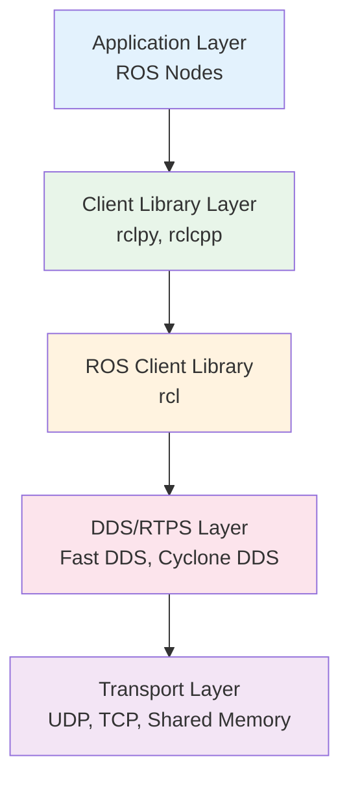
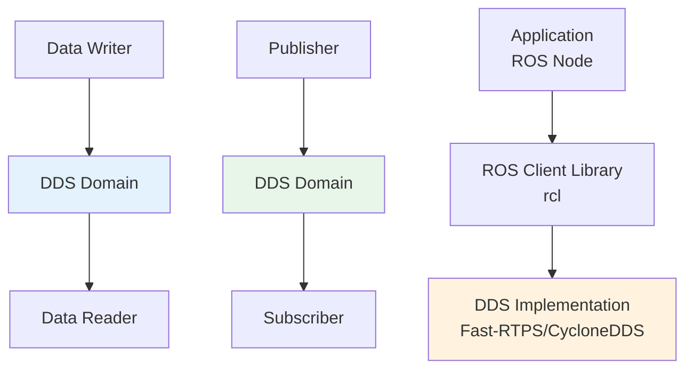

## Learning Objectives

- Understand ROS 2 architecture and its advantages over ROS 1
- Master core ROS 2 concepts: nodes, topics, services, and actions
- Learn about DDS (Data Distribution Service) middleware
- Explore ROS 2 communication patterns and quality of service
- Understand workspace structure and package management

## 3.1 Introduction to ROS 2

Robot Operating System (ROS) 2 is the next generation of the widely adopted ROS framework, designed to address the limitations of ROS 1 while maintaining compatibility with the core philosophy of providing a flexible, modular software development framework for robotics.

### 3.1.1 Key Differences from ROS 1

| Feature | ROS 1 | ROS 2 |
|---------|-------|-------|
| **Communication** | TCP/IP based master system | DDS-based decentralized system |
| **Real-time** | Not real-time capable | Real-time capable |
| **Platform Support** | Linux only | Linux, Windows, macOS |
| **Security** | No built-in security | Built-in security features |
| **Production Ready** | Research and prototyping | Production deployment ready |
| **License** | BSD | Apache 2.0 |

### 3.1.2 ROS 2 Architecture Overview



The ROS 2 architecture consists of multiple layers:

1. **Application Layer**: Where developers write their robot software as ROS nodes
2. **Client Library Layer**: Language-specific APIs (rclpy for Python, rclcpp for C++)
3. **ROS Client Library**: Language-agnostic ROS API
4. **DDS/RTPS Layer**: Middleware for real-time distributed communication
5. **Transport Layer**: Physical data transport mechanisms

## 3.2 Core Concepts

### 3.2.1 Nodes

Nodes are the fundamental execution units in ROS 2. Each node is a process that performs computation and communicates with other nodes through ROS 2 communication mechanisms.

```python
# Basic ROS 2 Node in Python
import rclpy
from rclpy.node import Node
from std_msgs.msg import String

class MinimalNode(Node):
    def __init__(self):
        super().__init__('minimal_node')

        # Publisher
        self.publisher = self.create_publisher(
            String, 'topic', 10
        )

        # Timer for periodic publishing
        timer_period = 0.5  # seconds
        self.timer = self.create_timer(
            timer_period, self.timer_callback
        )
        self.count = 0

    def timer_callback(self):
        msg = String()
        msg.data = f'Hello World: {self.count}'
        self.publisher.publish(msg)
        self.get_logger().info(f'Publishing: "{msg.data}"')
        self.count += 1

def main(args=None):
    rclpy.init(args=args)

    minimal_node = MinimalNode()

    try:
        rclpy.spin(minimal_node)
    except KeyboardInterrupt:
        pass
    finally:
        minimal_node.destroy_node()
        rclpy.shutdown()

if __name__ == '__main__':
    main()
```

### 3.2.2 Topics and Messages

Topics are named buses over which nodes exchange messages. They provide a many-to-many communication pattern where multiple nodes can publish to and subscribe to the same topic.

```python
# Publisher example
class PublisherNode(Node):
    def __init__(self):
        super().__init__('publisher_node')

        # Create publisher with QoS profile
        qos_profile = rclpy.qos.QoSProfile(
            depth=10,
            reliability=rclpy.qos.ReliabilityPolicy.RELIABLE,
            durability=rclpy.qos.DurabilityPolicy.VOLATILE
        )

        self.publisher = self.create_publisher(
            String, 'chatter', qos_profile
        )

        self.timer = self.create_timer(
            1.0, self.publish_message
        )

    def publish_message(self):
        msg = String()
        msg.data = f"Message at {self.get_clock().now().to_msg().sec}"
        self.publisher.publish(msg)

# Subscriber example
class SubscriberNode(Node):
    def __init__(self):
        super().__init__('subscriber_node')

        # Create subscriber with QoS profile
        qos_profile = rclpy.qos.QoSProfile(
            depth=10,
            reliability=rclpy.qos.ReliabilityPolicy.RELIABLE
        )

        self.subscription = self.create_subscription(
            String, 'chatter',
            self.listener_callback, qos_profile
        )

    def listener_callback(self, msg):
        self.get_logger().info(f'I heard: "{msg.data}"')
```

### 3.2.3 Custom Messages

ROS 2 allows defining custom message types using ROS Interface Definition Language (IDL).

```yaml
# Custom message definition file
# my_package/msg/CustomMessage.msg

string header_frame_id
builtin_interfaces/Time stamp
float64[] joint_positions
float64[] joint_velocities
sensor_msgs/Image camera_image
geometry_msgs/PoseStamped end_effector_pose
bool[] digital_inputs
```

```python
# Using custom messages
from my_package.msg import CustomMessage

class CustomPublisher(Node):
    def __init__(self):
        super().__init__('custom_publisher')

        self.publisher = self.create_publisher(
            CustomMessage, 'robot_state', 10
        )

    def publish_robot_state(self):
        msg = CustomMessage()
        msg.header_frame_id = "robot_base"
        msg.stamp = self.get_clock().now().to_msg()

        # Joint states
        msg.joint_positions = [0.0, 1.57, -1.57, 0.0]
        msg.joint_velocities = [0.1, 0.2, -0.2, 0.0]

        # Image (would normally be from camera)
        msg.camera_image.header.stamp = msg.stamp
        # ... image data

        self.publisher.publish(msg)
```

### 3.2.4 Services

Services provide request-response communication between nodes. They're suitable for queries or commands that require immediate responses.

```python
# Service definition file
# my_package/srv/AddTwoInts.srv
int64 a
int64 b
---
int64 sum

# Server node
class ServiceServer(Node):
    def __init__(self):
        super().__init__('service_server')

        self.service = self.create_service(
            AddTwoInts, 'add_two_ints',
            self.add_two_ints_callback
        )

    def add_two_ints_callback(self, request, response):
        response.sum = request.a + request.b
        self.get_logger().info(
            f'Incoming request\na: {request.a} b: {request.b}'
        )
        return response

# Client node
class ServiceClient(Node):
    def __init__(self):
        super().__init__('service_client')

        self.client = self.create_client(
            AddTwoInts, 'add_two_ints'
        )

        while not self.client.wait_for_service(timeout_sec=1.0):
            self.get_logger().info('Service not available, waiting...')

    def send_request(self, a, b):
        request = AddTwoInts.Request()
        request.a = a
        request.b = b

        future = self.client.call_async(request)
        future.add_done_callback(self.response_callback)

    def response_callback(self, future):
        try:
            response = future.result()
            self.get_logger().info(
                f'Result of add_two_ints: {response.sum}'
            )
        except Exception as e:
            self.get_logger().error(f'Service call failed: {e}')
```

### 3.2.5 Actions

Actions are designed for long-running tasks that provide periodic feedback and allow for cancellation. They combine the benefits of services (goal-oriented) and topics (continuous feedback).

```python
# Action definition file
# my_package/action/Fibonacci.action
int32 order
---
int32[] sequence
---
int32[] partial_sequence

# Action server
class FibonacciActionServer(Node):
    def __init__(self):
        super().__init__('fibonacci_action_server')

        self.action_server = ActionServer(
            self,
            Fibonacci,
            'fibonacci',
            self.execute_callback
        )

    async def execute_callback(self, goal_handle):
        self.get_logger().info('Executing goal...')

        feedback_msg = Fibonacci.Feedback()
        feedback_msg.partial_sequence = [0, 1]

        for i in range(1, goal_handle.request.order):
            feedback_msg.partial_sequence.append(
                feedback_msg.partial_sequence[i] +
                feedback_msg.partial_sequence[i-1]
            )

            goal_handle.publish_feedback(feedback_msg)

            # Check for cancellation
            if goal_handle.is_cancel_requested:
                goal_handle.canceled()
                self.get_logger().info('Goal canceled')
                return Fibonacci.Result()

        goal_handle.succeed()

        result = Fibonacci.Result()
        result.sequence = feedback_msg.partial_sequence
        return result

# Action client
class FibonacciActionClient(Node):
    def __init__(self):
        super().__init__('fibonacci_action_client')

        self.action_client = ActionClient(
            self, Fibonacci, 'fibonacci'
        )

    def send_goal(self, order):
        goal_msg = Fibonacci.Goal()
        goal_msg.order = order

        self.action_client.wait_for_server()

        send_goal_future = self.action_client.send_goal_async(
            goal_msg,
            feedback_callback=self.feedback_callback
        )
        send_goal_future.add_done_callback(self.goal_response_callback)

    def goal_response_callback(self, future):
        goal_handle = future.result()

        if not goal_handle.accepted:
            self.get_logger().info('Goal rejected :(')
            return

        self.get_logger().info('Goal accepted :)')

        get_result_future = goal_handle.get_result_async()
        get_result_future.add_done_callback(self.get_result_callback)

    def feedback_callback(self, feedback_msg):
        self.get_logger().info(
            f'Received feedback: {feedback_msg.feedback.partial_sequence}'
        )

    def get_result_callback(self, future):
        result = future.result().result
        self.get_logger().info(
            f'Result: {result.sequence}'
        )
```

## 3.3 DDS (Data Distribution Service) Middleware

ROS 2 uses DDS as its underlying middleware, providing real-time, publish-subscribe communication with configurable Quality of Service (QoS) policies.

### 3.3.1 DDS Fundamentals



### 3.3.2 Quality of Service (QoS) Profiles

QoS policies define the reliability, durability, and other characteristics of communication between DDS entities.

```python
# Different QoS profiles for different use cases

# 1. Sensor data - Best effort, transient local
sensor_qos = rclpy.qos.QoSProfile(
    depth=10,
    reliability=rclpy.qos.ReliabilityPolicy.BEST_EFFORT,
    durability=rclpy.qos.DurabilityPolicy.TRANSIENT_LOCAL,
    deadline=rclpy.qos.Duration(seconds=0, nanoseconds=100000000)  # 100ms
)

# 2. Control commands - Reliable, volatile
control_qos = rclpy.qos.QoSProfile(
    depth=10,
    reliability=rclpy.qos.ReliabilityPolicy.RELIABLE,
    durability=rclpy.qos.DurabilityPolicy.VOLATILE,
    deadline=rclpy.qos.Duration(seconds=0, nanoseconds=50000000)  # 50ms
)

# 3. Map data - Reliable, transient local
map_qos = rclpy.qos.QoSProfile(
    depth=1,
    reliability=rclpy.qos.ReliabilityPolicy.RELIABLE,
    durability=rclpy.qos.DurabilityPolicy.TRANSIENT_LOCAL,
    history=rclpy.qos.HistoryPolicy.KEEP_LAST
)

# Applying QoS to publisher/subscription
class SensorNode(Node):
    def __init__(self):
        super().__init__('sensor_node')

        # Publisher with sensor-specific QoS
        self.publisher = self.create_publisher(
            Image, 'camera/image_raw', sensor_qos
        )
```

### 3.3.3 DDS Vendors and Configuration

ROS 2 supports multiple DDS implementations:

```yaml
# ROS 2 DDS configuration in .ros2/profiles.yaml
profiles:
  default:
    rmw_implementation: rmw_cyclonedds_cpp
    security:
      enable: false

  fastdds:
    rmw_implementation: rmw_fastrtps_cpp
    security:
      enable: true
      security_root_path: ~/.ros/security

# FastDDS configuration file (fastdds_profile.xml)
<profiles>
    <profile name="robot_profile">
        <data_writer profile_name="sensor_writer">
            <qos>
                <reliability>
                    <kind>RELIABLE</kind>
                </reliability>
                <durability>
                    <kind>TRANSIENT_LOCAL</kind>
                </durability>
                <history>
                    <kind>KEEP_LAST</kind>
                    <depth>10</depth>
                </history>
            </qos>
        </data_writer>
    </profile>
</profiles>
```

## 3.4 Node Composition and Lifecycle

### 3.4.1 Node Composition

Node composition allows multiple ROS nodes to be combined into a single process, reducing overhead and improving performance.

```python
# Composable node example
class ComposableNode1(Node):
    def __init__(self):
        super().__init__('composable_node_1')
        self.publisher = self.create_publisher(
            String, 'topic1', 10
        )
        # ... node logic

class ComposableNode2(Node):
    def __init__(self):
        super().__init__('composable_node_2')
        self.subscription = self.create_subscription(
            String, 'topic1',
            self.listener_callback, 10
        )
        # ... node logic

    def listener_callback(self, msg):
        self.get_logger().info(f'Received: {msg.data}')

# Launch file for composed nodes
from launch import LaunchDescription
from launch_ros.actions import ComposableNodeContainer
from launch_ros.descriptions import ComposableNode

def generate_launch_description():
    container = ComposableNodeContainer(
        name='my_container',
        namespace='',
        package='rclcpp_components',
        executable='component_container',
        composable_node_descriptions=[
            ComposableNode(
                package='my_package',
                plugin='my_package::ComposableNode1',
                name='node1'
            ),
            ComposableNode(
                package='my_package',
                plugin='my_package::ComposableNode2',
                name='node2'
            )
        ],
        output='screen'
    )

    return LaunchDescription([container])
```

### 3.4.2 Node Lifecycle

Lifecycle nodes provide standardized state management for robust startup, shutdown, and error handling.

```python
# Lifecycle node example
from lifecycle_msgs.msg import Transition
from lifecycle_msgs.srv import ChangeState, GetState

class LifecycleRobot(Node):
    def __init__(self):
        super().__init__('lifecycle_robot')

        # Lifecycle states
        self.states = {
            'unconfigured': 'Unconfigured',
            'inactive': 'Inactive',
            'active': 'Active',
            'finalized': 'Finalized'
        }

        self.current_state = 'unconfigured'

    def configure(self):
        """Configure node (unconfigured -> inactive)"""
        if self.current_state == 'unconfigured':
            # Initialize hardware, create publishers/subscribers
            self._initialize_hardware()
            self._create_communications()
            self.current_state = 'inactive'
            self.get_logger().info('Node configured')
            return True
        return False

    def activate(self):
        """Activate node (inactive -> active)"""
        if self.current_state == 'inactive':
            # Start periodic operations
            self._start_operations()
            self.current_state = 'active'
            self.get_logger().info('Node activated')
            return True
        return False

    def deactivate(self):
        """Deactivate node (active -> inactive)"""
        if self.current_state == 'active':
            # Stop operations
            self._stop_operations()
            self.current_state = 'inactive'
            self.get_logger().info('Node deactivated')
            return True
        return False

    def cleanup(self):
        """Cleanup node (inactive -> unconfigured)"""
        if self.current_state == 'inactive':
            # Cleanup resources
            self._cleanup_resources()
            self.current_state = 'unconfigured'
            self.get_logger().info('Node cleaned up')
            return True
        return False

    def shutdown(self):
        """Shutdown node (any state -> finalized)"""
        self._emergency_stop()
        self.current_state = 'finalized'
        self.get_logger().info('Node shutdown')
```

## 3.5 ROS 2 Workspaces and Packages

### 3.5.1 Workspace Structure

```bash
# ROS 2 workspace structure
ros2_ws/
├── src/                 # Source packages
│   ├── package1/
│   │   ├── include/    # Header files
│   │   ├── src/        # Source files
│   │   ├── launch/     # Launch files
│   │   ├── resource/   # Resource files
│   │   ├── test/       # Test files
│   │   └── package.xml # Package manifest
│   └── package2/
├── build/              # Build artifacts
├── install/            # Installed files
├── log/                # Build logs
└── setup.bash          # Environment setup
```

### 3.5.2 Creating a Package

```bash
# Create a new ROS 2 package
ros2 pkg create --build-type ament_python my_robot_package \
    --dependencies rclpy std_msgs geometry_msgs sensor_msgs

# Create a new C++ package
ros2 pkg create --build-type ament_cmake my_cpp_package \
    --dependencies rclcpp std_msgs geometry_msgs

# Package.xml example
<?xml version="1.0"?>
<?xml-model href="http://download.ros.org/schema/package_format3.xsd" schematypens="http://www.w3.org/2001/XMLSchema"?>
<package format="3">
  <name>my_robot_package</name>
  <version>0.0.1</version>
  <description>Example ROS 2 robot package</description>
  <maintainer email="developer@example.com">Developer</maintainer>
  <license>Apache-2.0</license>

  <buildtool_depend>ament_cmake</buildtool_depend>

  <depend>rclcpp</depend>
  <depend>std_msgs</depend>
  <depend>geometry_msgs</depend>
  <depend>sensor_msgs</depend>

  <test_depend>ament_lint_auto</test_depend>
  <test_depend>ament_lint_common</test_depend>

  <export>
    <build_type>ament_cmake</build_type>
  </export>
</package>
```

### 3.5.3 Building and Running

```bash
# Build workspace
colcon build --symlink-install

# Source workspace
source install/setup.bash

# Run a node
ros2 run my_robot_package my_node

# Run with specific arguments
ros2 run my_robot_package my_node --ros-args -p param_name:=param_value

# View available nodes
ros2 node list

# View node information
ros2 node info /my_node
```

## 3.6 Parameters and Configuration

### 3.6.1 Parameter Management

ROS 2 provides a robust parameter system for configuring nodes at runtime.

```python
class ParameterizedNode(Node):
    def __init__(self):
        super().__init__('parameterized_node')

        # Declare parameters with defaults
        self.declare_parameter('robot_name', 'my_robot')
        self.declare_parameter('max_velocity', 1.0)
        self.declare_parameter('enable_debug', False)
        self.declare_parameter('joint_names', ['joint1', 'joint2', 'joint3'])

        # Get parameter values
        self.robot_name = self.get_parameter('robot_name').value
        self.max_velocity = self.get_parameter('max_velocity').value
        self.enable_debug = self.get_parameter('enable_debug').value
        self.joint_names = self.get_parameter('joint_names').value

        # Parameter callback for dynamic updates
        self.add_on_set_parameters_callback(self.parameter_callback)

    def parameter_callback(self, parameters):
        """Handle parameter updates"""
        for param in parameters:
            if param.name == 'max_velocity':
                if param.type_ == Parameter.Type.DOUBLE:
                    if 0.0 <= param.value <= 10.0:
                        self.max_velocity = param.value
                        self.get_logger().info(
                            f'Updated max_velocity to {param.value}'
                        )
                    else:
                        self.get_logger().warn(
                            'Invalid max_velocity value. Must be between 0 and 10'
                        )
                        return SetParametersResult(successful=False)

        return SetParametersResult(successful=True)
```

### 3.6.2 Parameter Files

```yaml
# config/robot_params.yaml
robot_controller:
  ros__parameters:
    robot_name: "humanoid_robot"
    max_velocity: 2.5
    enable_debug: true
    joint_names: ["left_hip_yaw", "left_hip_roll", "left_hip_pitch",
                  "left_knee", "right_hip_yaw", "right_hip_roll",
                  "right_hip_pitch", "right_knee"]

    pid_gains:
      hip_yaw: {p: 100.0, i: 1.0, d: 10.0}
      hip_roll: {p: 150.0, i: 2.0, d: 15.0}
      hip_pitch: {p: 200.0, i: 3.0, d: 20.0}
      knee: {p: 300.0, i: 5.0, d: 30.0}
```

## 3.7 Security in ROS 2

### 3.7.1 DDS Security

ROS 2 provides security features through DDS security plugins:

```bash
# Generate security artifacts
ros2 security generate_keys ros2_keys

# Configure security
export ROS_SECURITY_ENABLE=true
export ROS_SECURITY_ROOT_DIRECTORY=ros2_keys
export ROS_DOMAIN_ID=42
```

```python
# Secure node configuration
class SecureNode(Node):
    def __init__(self):
        super().__init__('secure_node')

        # Create secure publisher with specific permissions
        qos = rclpy.qos.QoSProfile(
            depth=10,
            reliability=rclpy.qos.ReliabilityPolicy.RELIABLE
        )

        self.secure_publisher = self.create_publisher(
            String, 'secure_topic', qos
        )

        # Configure access policies
        self._configure_security_policies()

    def _configure_security_policies(self):
        """Define who can publish/subscribe to this node's topics"""
        # This would typically be done through DDS configuration files
        # specifying access control lists and permissions
        pass
```

## 3.8 Best Practices

### 3.8.1 Node Design Patterns

```python
# Template for well-designed ROS 2 node
class RobustNode(Node):
    def __init__(self, node_name):
        super().__init__(node_name)

        # Use class constants for configuration
        self.DEFAULT_QUEUE_SIZE = 10
        self.UPDATE_RATE = 30.0  # Hz

        # Initialize state
        self.is_active = False
        self.last_update_time = self.get_clock().now()

        # Set up QoS profiles
        self._setup_qos_profiles()

        # Initialize parameters
        self._declare_parameters()

        # Set up publishers and subscribers
        self._setup_communications()

        # Set up timers
        self._setup_timers()

        self.get_logger().info(f'{node_name} initialized successfully')

    def _setup_qos_profiles(self):
        """Define QoS profiles for different message types"""
        self.sensor_qos = rclpy.qos.QoSProfile(
            depth=10,
            reliability=rclpy.qos.ReliabilityPolicy.BEST_EFFORT,
            durability=rclpy.qos.DurabilityPolicy.VOLATILE
        )

        self.control_qos = rclpy.qos.QoSProfile(
            depth=10,
            reliability=rclpy.qos.ReliabilityPolicy.RELIABLE,
            durability=rclpy.qos.DurabilityPolicy.VOLATILE
        )

    def _declare_parameters(self):
        """Declare all parameters with validation"""
        self.declare_parameter('update_rate', self.UPDATE_RATE)
        self.declare_parameter('enable_debug', False)

        # Validate parameters
        update_rate = self.get_parameter('update_rate').value
        if not 0 < update_rate <= 100:
            raise ValueError('Update rate must be between 0 and 100 Hz')

    def _setup_communications(self):
        """Initialize all publishers and subscribers"""
        # Publishers
        self.status_publisher = self.create_publisher(
            String, '~/status', self.control_qos
        )

        # Subscribers
        self.command_subscriber = self.create_subscription(
            String, '~/command',
            self.command_callback, self.control_qos
        )

    def _setup_timers(self):
        """Initialize periodic timers"""
        update_rate = self.get_parameter('update_rate').value
        period = 1.0 / update_rate

        self.update_timer = self.create_timer(
            period, self.update_callback
        )

        self.status_timer = self.create_timer(
            1.0, self.status_callback
        )

    def command_callback(self, msg):
        """Handle incoming commands"""
        try:
            self._process_command(msg.data)
        except Exception as e:
            self.get_logger().error(f'Error processing command: {e}')

    def update_callback(self):
        """Main update callback"""
        if not self.is_active:
            return

        try:
            self._update_state()
            self.last_update_time = self.get_clock().now()
        except Exception as e:
            self.get_logger().error(f'Error in update: {e}')

    def status_callback(self):
        """Publish status information"""
        try:
            status_msg = String()
            status_msg.data = f'Status: {"Active" if self.is_active else "Inactive"}'
            self.status_publisher.publish(status_msg)
        except Exception as e:
            self.get_logger().error(f'Error publishing status: {e}')

    def activate(self):
        """Activate the node"""
        self.is_active = True
        self.get_logger().info('Node activated')

    def deactivate(self):
        """Deactivate the node"""
        self.is_active = False
        self.get_logger().info('Node deactivated')

    def on_shutdown(self):
        """Cleanup when shutting down"""
        self.deactivate()
        self.get_logger().info('Node shutting down')
```

### 3.8.2 Error Handling and Logging

```python
import traceback
from rclpy.executors import ShutdownException

class ErrorHandlingNode(Node):
    def __init__(self):
        super().__init__('error_handling_node')

        # Configure logging levels
        self.get_logger().set_level(rclpy.logging.LoggingSeverity.DEBUG)

        # Error counters
        self.error_count = 0
        self.max_errors = 100

    def safe_operation(self):
        """Example of safe operation with error handling"""
        try:
            # Attempt operation
            result = self._risky_operation()

            # Log success
            self.get_logger().debug(f'Operation successful: {result}')

            # Reset error count on success
            self.error_count = 0

            return result

        except ValueError as e:
            # Handle known errors gracefully
            self.get_logger().warning(f'Value error in operation: {e}')
            self.error_count += 1

        except ConnectionError as e:
            # Handle connection errors
            self.get_logger().error(f'Connection error: {e}')
            self.error_count += 1

            # Attempt reconnection
            self._attempt_reconnection()

        except Exception as e:
            # Handle unexpected errors
            self.get_logger().error(f'Unexpected error: {e}')
            self.get_logger().debug(f'Traceback: {traceback.format_exc()}')
            self.error_count += 1

            # Consider shutdown if too many errors
            if self.error_count > self.max_errors:
                self.get_logger().fatal(
                    f'Too many errors ({self.error_count}), shutting down'
                )
                raise ShutdownException()

        return None

    def _risky_operation(self):
        """Example operation that might fail"""
        # Simulate random failure
        if random.random() < 0.1:  # 10% chance of failure
            raise ValueError("Random failure occurred")

        return "Operation successful"
```

## 3.9 Summary

This chapter covered the fundamental concepts of ROS 2 architecture:

1. **Core Concepts**: Nodes, topics, services, and actions as building blocks
2. **DDS Middleware**: Understanding the underlying communication infrastructure
3. **QoS Policies**: Configuring communication reliability and performance
4. **Node Composition**: Combining nodes for efficient execution
5. **Lifecycle Management**: Robust startup and shutdown procedures
6. **Workspace Management**: Package structure and building
7. **Parameters and Configuration**: Runtime configuration management
8. **Security**: DDS-based security features for production systems

ROS 2 provides a robust, production-ready framework for developing distributed robotics applications. Understanding these core concepts is essential for building reliable, scalable robot systems.

## Knowledge Check

### Multiple Choice Questions

1. **What is the primary communication middleware used by ROS 2?**
   - a) TCP/IP sockets
   - b) Data Distribution Service (DDS)
   - c) Message Queue
   - d) REST API

2. **Which ROS 2 communication pattern is best for long-running tasks with feedback?**
   - a) Topics
   - b) Services
   - c) Actions
   - d) Parameters

3. **What does QoS in ROS 2 stand for?**
   - a) Quality of Service
   - b) Quick Operating System
   - c) Quantum Optimization Strategy
   - d) Query Optimized System

### Short Answer Questions

1. Explain the difference between ROS 1 and ROS 2 architectures.

2. When would you use services versus actions in a ROS 2 application?

3. What are the benefits of node composition in ROS 2?

### Practical Exercise

Design a ROS 2 system for a mobile robot that includes:
- A driver node for sensor data (camera and LiDAR)
- A navigation node that processes sensor data
- A control node for motor commands
- Parameter configuration for different environments

Identify the appropriate communication patterns (topics, services, actions) for each component and justify your choices.

---

*Next Chapter: Building ROS 2 Nodes with Python - We'll explore practical implementation of ROS 2 concepts using Python, with hands-on examples and best practices.*