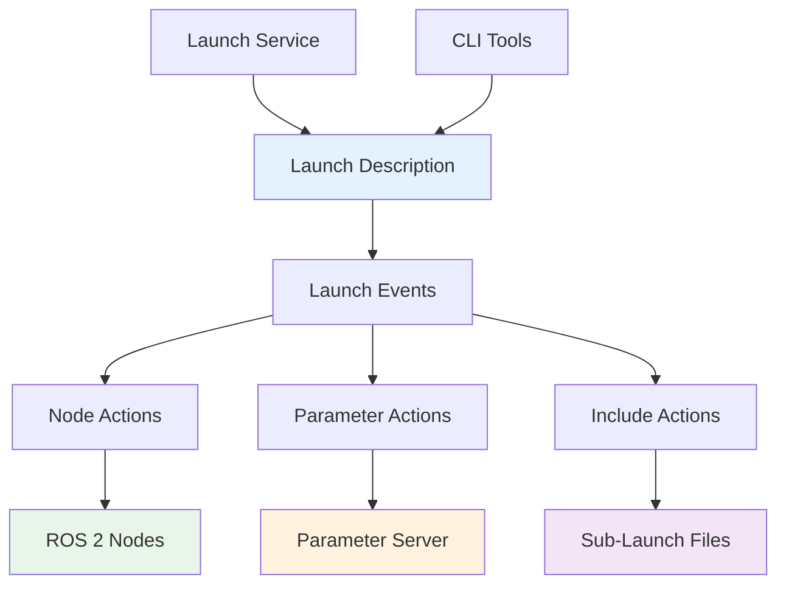

## Learning Objectives

- Master ROS 2 launch file creation and management
- Implement sophisticated parameter configuration strategies
- Understand node lifecycle management
- Create robust multi-robot and multi-process systems
- Apply best practices for production deployment

## 5.1 ROS 2 Launch System Overview

ROS 2 launch files provide a powerful way to start and manage multiple nodes, configure their parameters, and establish their relationships. Unlike ROS 1's XML-based launch files, ROS 2 launch files can be written in Python, providing much greater flexibility and programmatic control.

### 5.1.1 Launch System Architecture



### 5.1.2 Basic Launch File Structure

```python
# Basic ROS 2 launch file template
from launch import LaunchDescription
from launch_ros.actions import Node
from launch.actions import DeclareLaunchArgument, ExecuteProcess
from launch.substitutions import LaunchConfiguration, EnvironmentVariable
from ament_index_python.packages import get_package_share_directory
import os

def generate_launch_description():
    """Generate launch description with nodes and parameters"""

    # Declare launch arguments
    robot_name_arg = DeclareLaunchArgument(
        'robot_name',
        default_value='robot_1',
        description='Name of the robot'
    )

    use_sim_time_arg = DeclareLaunchArgument(
        'use_sim_time',
        default_value='false',
        description='Use simulation time'
    )

    # Get package directory
    pkg_dir = get_package_share_directory('my_robot_package')

    # Create node
    robot_node = Node(
        package='my_robot_package',
        executable='robot_driver',
        name='robot_driver',
        namespace=LaunchConfiguration('robot_name'),
        parameters=[
            {'use_sim_time': LaunchConfiguration('use_sim_time')},
            os.path.join(pkg_dir, 'config', 'robot_params.yaml')
        ],
        output='screen',
        emulate_tty=True
    )

    return LaunchDescription([
        robot_name_arg,
        use_sim_time_arg,
        robot_node
    ])
```

## 5.2 Advanced Launch Patterns

### 5.2.1 Conditional Node Launching

```python
from launch import LaunchDescription
from launch.conditions import IfCondition
from launch_ros.actions import Node, ComposableNodeContainer
from launch_ros.descriptions import ComposableNode

def generate_launch_description():
    # Launch arguments
    use_camera_arg = DeclareLaunchArgument(
        'use_camera',
        default_value='true',
        description='Enable camera driver'
    )

    use_lidar_arg = DeclareLaunchArgument(
        'use_lidar',
        default_value='true',
        description='Enable LiDAR driver'
    )

    simulation_mode_arg = DeclareLaunchArgument(
        'simulation_mode',
        default_value='false',
        description='Run in simulation mode'
    )

    # Conditional nodes
    camera_node = Node(
        package='my_robot_package',
        executable='camera_driver',
        name='camera_driver',
        condition=IfCondition(LaunchConfiguration('use_camera')),
        parameters=[{
            'simulation_mode': LaunchConfiguration('simulation_mode')
        }]
    )

    lidar_node = Node(
        package='my_robot_package',
        executable='lidar_driver',
        name='lidar_driver',
        condition=IfCondition(LaunchConfiguration('use_lidar'))
    )

    # Composable node container for performance
    container = ComposableNodeContainer(
        name='my_container',
        namespace='',
        package='rclcpp_components',
        executable='component_container',
        output='screen',
        composable_node_descriptions=[
            ComposableNode(
                package='my_robot_package',
                plugin='my_robot::SensorProcessor',
                name='sensor_processor',
                condition=IfCondition(LaunchConfiguration('use_camera'))
            ),
            ComposableNode(
                package='my_robot_package',
                plugin='my_robot::MotionController',
                name='motion_controller'
            )
        ]
    )

    return LaunchDescription([
        use_camera_arg,
        use_lidar_arg,
        simulation_mode_arg,
        camera_node,
        lidar_node,
        container
    ])
```

### 5.2.2 Multi-Robot Launch System

```python
from launch import LaunchDescription
from launch.actions import GroupAction, SetEnvironmentVariable
from launch_ros.actions import Node
from launch_ros.actions import PushRosNamespace
import yaml

def generate_robot_launch(robot_config):
    """Generate launch description for a single robot"""

    # Extract robot configuration
    robot_name = robot_config['name']
    robot_id = robot_config['id']
    robot_pose = robot_config.get('initial_pose', {'x': 0.0, 'y': 0.0, 'yaw': 0.0})

    nodes = []

    # Robot-specific configuration
    robot_params = {
        'robot_name': robot_name,
        'robot_id': robot_id,
        'initial_pose': robot_pose,
        'use_sim_time': True
    }

    # Navigation stack
    navigation_nodes = [
        Node(
            package='nav2_amcl',
            executable='amcl',
            name='amcl',
            output='screen',
            parameters=[robot_params],
            respawn=True,
            respawn_delay=2.0
        ),

        Node(
            package='nav2_controller',
            executable='controller_server',
            name='controller_server',
            output='screen',
            parameters=[os.path.join(
                get_package_share_directory('my_robot_package'),
                'config', 'nav2_params.yaml'
            )],
            respawn=True,
            respawn_delay=2.0
        ),

        Node(
            package='nav2_planner',
            executable='planner_server',
            name='planner_server',
            output='screen',
            parameters=[robot_params],
            respawn=True,
            respawn_delay=2.0
        )
    ]

    # Sensor drivers
    if 'camera' in robot_config:
        camera_node = Node(
            package='my_robot_package',
            executable='camera_driver',
            name='camera_driver',
            parameters=[{
                'camera_id': robot_config['camera']['id'],
                'frame_id': f'{robot_name}/camera_link'
            }]
        )
        navigation_nodes.append(camera_node)

    if 'lidar' in robot_config:
        lidar_node = Node(
            package='my_robot_package',
            executable='lidar_driver',
            name='lidar_driver',
            parameters=[{
                'port': robot_config['lidar']['port'],
                'frame_id': f'{robot_name}/laser'
            }]
        )
        navigation_nodes.append(lidar_node)

    # Group with namespace
    robot_group = GroupAction([
        PushRosNamespace(robot_name),
        *navigation_nodes
    ])

    return robot_group

def generate_launch_description():
    """Generate multi-robot launch description"""

    # Load robot configurations
    robots_file = LaunchConfiguration('robots_file')

    # Default robot configurations (can be loaded from file)
    default_robots = [
        {
            'name': 'robot_1',
            'id': 1,
            'initial_pose': {'x': 0.0, 'y': 0.0, 'yaw': 0.0},
            'camera': {'id': 0},
            'lidar': {'port': '/dev/ttyUSB0'}
        },
        {
            'name': 'robot_2',
            'id': 2,
            'initial_pose': {'x': 2.0, 'y': 1.0, 'yaw': 1.57},
            'camera': {'id': 1},
            'lidar': {'port': '/dev/ttyUSB1'}
        }
    ]

    # Load configurations from file or use defaults
    try:
        with open('/tmp/robots_config.yaml', 'w') as f:
            yaml.dump({'robots': default_robots}, f)

        robots_file_arg = DeclareLaunchArgument(
            'robots_file',
            default_value='/tmp/robots_config.yaml',
            description='Path to robots configuration file'
        )

        # In practice, you would parse the YAML file here
        robot_configs = default_robots

    except Exception as e:
        robot_configs = default_robots

    # Generate launch groups for each robot
    robot_groups = []
    for robot_config in robot_configs:
        robot_group = generate_robot_launch(robot_config)
        robot_groups.append(robot_group)

    # Common nodes (not robot-specific)
    rviz_node = Node(
        package='rviz2',
        executable='rviz2',
        name='rviz2',
        arguments=['-d', os.path.join(
            get_package_share_directory('my_robot_package'),
            'rviz', 'multi_robot.rviz'
        )]
    )

    return LaunchDescription([
        DeclareLaunchArgument('robots_file', default_value=''),
        *robot_groups,
        rviz_node
    ])
```

## 5.3 Parameter Management Strategies

### 5.3.1 Hierarchical Parameter Configuration

```python
# config/parameter_hierarchy.py
from launch import LaunchDescription
from launch_ros.actions import Node
from launch.substitutions import FindExecutable, Command
import yaml
import os

class ParameterManager:
    """Manages hierarchical parameter configuration"""

    def __init__(self, config_dir):
        self.config_dir = config_dir
        self.parameters = {}

    def load_parameters(self, robot_name, environment):
        """Load parameters based on robot and environment"""

        # Base parameters
        base_params = self._load_yaml('base_params.yaml')

        # Robot-specific parameters
        robot_params = self._load_yaml(f'robots/{robot_name}_params.yaml')

        # Environment-specific parameters
        env_params = self._load_yaml(f'environments/{environment}_params.yaml')

        # Merge parameters with precedence: env > robot > base
        merged_params = {}
        merged_params.update(base_params)
        merged_params.update(robot_params)
        merged_params.update(env_params)

        return merged_params

    def _load_yaml(self, filename):
        """Load YAML configuration file"""
        filepath = os.path.join(self.config_dir, filename)

        if not os.path.exists(filepath):
            return {}

        with open(filepath, 'r') as f:
            return yaml.safe_load(f) or {}

    def get_node_parameters(self, node_name, merged_params):
        """Extract parameters for specific node"""
        return merged_params.get(node_name, {})

def generate_launch_description():
    """Generate launch with hierarchical parameter management"""

    # Launch arguments
    robot_name_arg = DeclareLaunchArgument(
        'robot_name',
        default_value='humanoid_robot',
        description='Robot configuration name'
    )

    environment_arg = DeclareLaunchArgument(
        'environment',
        default_value='lab',
        description='Environment configuration'
    )

    config_dir_arg = DeclareLaunchArgument(
        'config_dir',
        default_value=os.path.join(
            get_package_share_directory('my_robot_package'), 'config'
        ),
        description='Configuration directory'
    )

    # Initialize parameter manager
    config_dir = LaunchConfiguration('config_dir').perform(None)
    param_manager = ParameterManager(config_dir)

    # Load hierarchical parameters
    robot_name = LaunchConfiguration('robot_name').perform(None)
    environment = LaunchConfiguration('environment').perform(None)

    # Create nodes with merged parameters
    sensor_node = Node(
        package='my_robot_package',
        executable='sensor_driver',
        name='sensor_driver',
        parameters=[param_manager.get_node_parameters(
            'sensor_driver',
            param_manager.load_parameters(robot_name, environment)
        )],
        output='screen'
    )

    control_node = Node(
        package='my_robot_package',
        executable='motion_controller',
        name='motion_controller',
        parameters=[param_manager.get_node_parameters(
            'motion_controller',
            param_manager.load_parameters(robot_name, environment)
        )],
        output='screen'
    )

    return LaunchDescription([
        robot_name_arg,
        environment_arg,
        config_dir_arg,
        sensor_node,
        control_node
    ])
```

### 5.3.2 Dynamic Parameter Reconfiguration

```python
# Dynamic parameter server node
import rclpy
from rclpy.node import Node
from rcl_interfaces.msg import ParameterDescriptor, SetParametersResult
from rcl_interfaces.srv import ListParameters
import threading

class DynamicParameterServer(Node):
    """Node for managing dynamic parameters with validation"""

    def __init__(self):
        super().__init__('dynamic_parameter_server')

        # Parameter descriptors with constraints
        self.declare_parameter(
            'max_velocity',
            2.0,
            ParameterDescriptor(
                description='Maximum linear velocity (m/s)',
                floating_point_range=[(0.1, 5.0, 0.1)],
                read_only=False
            )
        )

        self.declare_parameter(
            'safety_zone_radius',
            1.5,
            ParameterDescriptor(
                description='Safety zone radius around robot (m)',
                floating_point_range=[(0.5, 3.0, 0.1)],
                read_only=False
            )
        )

        self.declare_parameter(
            'emergency_stop_enabled',
            True,
            ParameterDescriptor(
                description='Enable emergency stop functionality',
                read_only=False
            )
        )

        self.declare_parameter(
            'robot_serial_number',
            'HR001',
            ParameterDescriptor(
                description='Robot serial number (read-only)',
                read_only=True
            )
        )

        # Parameter callback
        self.add_on_set_parameters_callback(self.parameter_callback)

        # Parameter listing service
        self.list_params_service = self.create_service(
            ListParameters,
            'list_parameters',
            self.list_parameters_callback
        )

        # Parameter change subscribers
        self.parameter_subscribers = []

        # Thread-safe parameter updates
        self.parameter_lock = threading.Lock()

        self.get_logger().info('Dynamic parameter server initialized')

    def parameter_callback(self, parameters):
        """Handle parameter change requests"""
        results = []

        for param in parameters:
            result = SetParametersResult()

            try:
                # Validate parameter
                if param.name == 'max_velocity':
                    if param.type_ == Parameter.Type.DOUBLE:
                        if 0.1 <= param.value <= 5.0:
                            result.successful = True
                            self.get_logger().info(
                                f'Updated max_velocity to {param.value}'
                            )
                        else:
                            result.successful = False
                            result.reason = 'Value out of range [0.1, 5.0]'

                elif param.name == 'safety_zone_radius':
                    if param.type_ == Parameter.Type.DOUBLE:
                        if 0.5 <= param.value <= 3.0:
                            result.successful = True
                            self.get_logger().info(
                                f'Updated safety_zone_radius to {param.value}'
                            )
                        else:
                            result.successful = False
                            result.reason = 'Value out of range [0.5, 3.0]'

                elif param.name == 'emergency_stop_enabled':
                    if param.type_ == Parameter.Type.BOOL:
                        result.successful = True
                        self.get_logger().info(
                            f'Emergency stop enabled: {param.value}'
                        )
                        # Trigger emergency stop if disabled
                        if not param.value:
                            self.handle_emergency_stop_release()

                elif param.name == 'robot_serial_number':
                    # Read-only parameter
                    result.successful = False
                    result.reason = 'Parameter is read-only'

                else:
                    # Unknown parameter
                    result.successful = False
                    result.reason = f'Unknown parameter: {param.name}'

            except Exception as e:
                result.successful = False
                result.reason = str(e)

            results.append(result)

        return results

    def list_parameters_callback(self, request, response):
        """List available parameters"""
        with self.parameter_lock:
            parameter_list = self.list_parameters({})
            response.names = parameter_list.names
            response.prefixes = parameter_list.prefixes

        return response

    def handle_emergency_stop_release(self):
        """Handle emergency stop release with safety checks"""
        self.get_logger().warn(
            'Emergency stop disabled! Performing safety checks...'
        )

        # Implement safety checks before allowing operation
        # This is a placeholder for actual safety logic
        pass
```

## 5.4 Lifecycle Management

### 5.4.1 Managed Node Launch

```python
# launch/managed_robot_launch.py
from launch import LaunchDescription
from launch_ros.actions import Node
from launch_ros.actions import LifecycleNode
from lifecycle_msgs.msg import Transition
from launch.actions import ExecuteProcess
import time

def generate_launch_description():
    """Launch with managed lifecycle nodes"""

    # Lifecycle sensor node
    lifecycle_sensor_node = LifecycleNode(
        package='my_robot_package',
        executable='lifecycle_sensor_driver',
        name='lifecycle_sensor_driver',
        namespace='robot_1',
        output='screen',
        parameters=[{
            'sensor_type': 'lidar',
            'update_rate': 10.0
        }]
    )

    # Lifecycle control node
    lifecycle_controller_node = LifecycleNode(
        package='my_robot_package',
        executable='lifecycle_controller',
        name='lifecycle_controller',
        namespace='robot_1',
        output='screen',
        parameters=[{
            'control_mode': 'autonomous',
            'safety_enabled': True
        }]
    )

    # Lifecycle management actions
    configure_sensor = ExecuteProcess(
        cmd=[
            'ros2', 'lifecycle', 'set', '/robot_1/lifecycle_sensor_driver',
            'configure'
        ],
        name='configure_sensor'
    )

    activate_sensor = ExecuteProcess(
        cmd=[
            'ros2', 'lifecycle', 'set', '/robot_1/lifecycle_sensor_driver',
            'activate'
        ],
        name='activate_sensor'
    )

    configure_controller = ExecuteProcess(
        cmd=[
            'ros2', 'lifecycle', 'set', '/robot_1/lifecycle_controller',
            'configure'
        ],
        name='configure_controller'
    )

    activate_controller = ExecuteProcess(
        cmd=[
            'ros2', 'lifecycle', 'set', '/robot_1/lifecycle_controller',
            'activate'
        ],
        name='activate_controller'
    )

    # Lifecycle manager node
    lifecycle_manager_node = Node(
        package='my_robot_package',
        executable='lifecycle_manager',
        name='lifecycle_manager',
        namespace='robot_1',
        parameters=[{
            'managed_nodes': [
                '/robot_1/lifecycle_sensor_driver',
                '/robot_1/lifecycle_controller'
            ],
            'startup_transitions': [
                {'node': '/robot_1/lifecycle_sensor_driver', 'transition': 'configure'},
                {'node': '/robot_1/lifecycle_sensor_driver', 'transition': 'activate'},
                {'node': '/robot_1/lifecycle_controller', 'transition': 'configure'},
                {'node': '/robot_1/lifecycle_controller', 'transition': 'activate'}
            ]
        }],
        output='screen'
    )

    return LaunchDescription([
        lifecycle_sensor_node,
        lifecycle_controller_node,
        lifecycle_manager_node
    ])
```

### 5.4.2 Lifecycle Manager Implementation

```python
# lifecycle_manager.py
import rclpy
from rclpy.node import Node
from lifecycle_msgs.srv import GetState, ChangeState, GetAvailableStates
from lifecycle_msgs.msg import Transition
from threading import Thread, Event
import time

class LifecycleManager(Node):
    """Manages lifecycle states of multiple nodes"""

    def __init__(self):
        super().__init__('lifecycle_manager')

        # Node configuration
        self.declare_parameter('managed_nodes', [])
        self.declare_parameter('startup_transitions', [])
        self.declare_parameter('shutdown_timeout', 10.0)

        self.managed_nodes = self.get_parameter('managed_nodes').value
        self.startup_transitions = self.get_parameter('startup_transitions').value
        self.shutdown_timeout = self.get_parameter('shutdown_timeout').value

        # State tracking
        self.node_states = {}
        self.transition_queue = []

        # Create service clients for each managed node
        self.state_clients = {}
        self.transition_clients = {}

        for node_name in self.managed_nodes:
            self.state_clients[node_name] = self.create_client(
                GetState, f'{node_name}/get_state'
            )
            self.transition_clients[node_name] = self.create_client(
                ChangeState, f'{node_name}/change_state'
            )

        # Startup thread
        self.startup_complete = Event()
        self.startup_thread = Thread(target=self.startup_sequence)
        self.startup_thread.start()

        # Shutdown handler
        self.create_timer(1.0, self.monitor_nodes)

        self.get_logger().info(f'Lifecycle manager initialized for {len(self.managed_nodes)} nodes')

    def startup_sequence(self):
        """Execute startup sequence for managed nodes"""
        self.get_logger().info('Starting lifecycle node sequence...')

        # Wait for all services to be available
        for node_name in self.managed_nodes:
            if not self.state_clients[node_name].wait_for_service(timeout_sec=5.0):
                self.get_logger().error(f'State service not available for {node_name}')
                continue

            if not self.transition_clients[node_name].wait_for_service(timeout_sec=5.0):
                self.get_logger().error(f'Transition service not available for {node_name}')
                continue

        # Execute startup transitions
        for transition_config in self.startup_transitions:
            node_name = transition_config['node']
            transition_name = transition_config['transition']

            if node_name not in self.managed_nodes:
                continue

            # Get transition ID
            transition_id = self.get_transition_id(transition_name)
            if transition_id is None:
                self.get_logger().error(f'Unknown transition: {transition_name}')
                continue

            # Execute transition
            success = self.execute_transition(node_name, transition_id)

            if success:
                self.get_logger().info(f'Successfully executed {transition_name} on {node_name}')
            else:
                self.get_logger().error(f'Failed to execute {transition_name} on {node_name}')

            time.sleep(1.0)  # Wait between transitions

        self.startup_complete.set()
        self.get_logger().info('Lifecycle startup sequence complete')

    def get_transition_id(self, transition_name):
        """Get transition ID from name"""
        transition_map = {
            'configure': Transition.TRANSITION_CONFIGURE,
            'activate': Transition.TRANSITION_ACTIVATE,
            'deactivate': Transition.TRANSITION_DEACTIVATE,
            'cleanup': Transition.TRANSITION_CLEANUP,
            'shutdown': Transition.TRANSITION_UNCONFIGURED_SHUTDOWN
        }

        return transition_map.get(transition_name.lower())

    def execute_transition(self, node_name, transition_id):
        """Execute transition on a managed node"""
        if node_name not in self.transition_clients:
            return False

        request = ChangeState.Request()
        request.transition.id = transition_id

        future = self.transition_clients[node_name].call_async(request)

        try:
            rclpy.spin_until_future_complete(self, future, timeout_sec=5.0)

            if future.result():
                if future.result().success:
                    return True
                else:
                    self.get_logger().error(
                        f'Transition failed for {node_name}: {future.result().error_code}'
                    )
            else:
                self.get_logger().error(f'Transition timeout for {node_name}')

        except Exception as e:
            self.get_logger().error(f'Exception during transition: {e}')

        return False

    def monitor_nodes(self):
        """Monitor states of managed nodes"""
        for node_name in self.managed_nodes:
            if node_name not in self.state_clients:
                continue

            try:
                future = self.state_clients[node_name].call_async(
                    GetState.Request()
                )
                rclpy.spin_until_future_complete(self, future, timeout_sec=1.0)

                if future.result():
                    state = future.result().current_state
                    self.node_states[node_name] = state

                    # Log state changes
                    if node_name not in self.node_states or \
                       self.node_states[node_name].id != state.id:
                        self.get_logger().info(
                            f'{node_name} state: {state.label} ({state.id})'
                        )

            except Exception as e:
                self.get_logger().debug(f'Failed to get state for {node_name}: {e}')

    def shutdown_all_nodes(self):
        """Gracefully shutdown all managed nodes"""
        self.get_logger().info('Initiating graceful shutdown sequence...')

        shutdown_order = [
            ('deactivate', Transition.TRANSITION_DEACTIVATE),
            ('cleanup', Transition.TRANSITION_CLEANUP),
            ('shutdown', Transition.TRANSITION_UNCONFIGURED_SHUTDOWN)
        ]

        for transition_name, transition_id in shutdown_order:
            for node_name in self.managed_nodes:
                self.execute_transition(node_name, transition_id)
                time.sleep(0.5)  # Wait between nodes

        self.get_logger().info('Shutdown sequence complete')
```

## 5.5 Configuration Management

### 5.5.1 Environment-Specific Configurations

```yaml
# config/environments/lab_params.yaml
# Laboratory environment configuration

simulation:
  enabled: false
  gazebo_world: "empty_world.world"

sensors:
  camera:
    enabled: true
    device_id: 0
    resolution: [640, 480]
    frame_rate: 30

  lidar:
    enabled: true
    port: "/dev/ttyUSB0"
    baud_rate: 115200
    frame_id: "laser"
    scan_frequency: 10.0

navigation:
  map_server:
    map_file: "maps/lab_map.yaml"

  amcl:
    initial_pose_x: 0.0
    initial_pose_y: 0.0
    initial_pose_a: 0.0

  global_planner:
    plugin: "nav2_planner/SmacPlanner"

  local_planner:
    plugin: "dwb_core/DWBLocalPlanner"
    max_vel_x: 0.5
    max_vel_theta: 1.0

safety:
  emergency_stop:
    enabled: true
    activation_distance: 0.5

  collision_detection:
    enabled: true
    time_buffer: 2.0

logging:
  level: "INFO"
  log_to_file: true
  log_file_path: "/tmp/robot_logs/"
```

```yaml
# config/environments/production_params.yaml
# Production environment configuration

simulation:
  enabled: false

sensors:
  camera:
    enabled: true
    device_id: 0
    resolution: [1920, 1080]
    frame_rate: 60

  lidar:
    enabled: true
    port: "/dev/ttyACM0"
    baud_rate: 115200
    frame_id: "laser"
    scan_frequency: 20.0

navigation:
  map_server:
    map_file: "maps/production_map.yaml"

  amcl:
    initial_pose_x: 0.0
    initial_pose_y: 0.0
    initial_pose_a: 0.0
    min_particles: 500
    max_particles: 2000

  global_planner:
    plugin: "nav2_planner/SmacPlanner"
    tolerance: 0.1

  local_planner:
    plugin: "dwb_core/DWBLocalPlanner"
    max_vel_x: 1.0
    max_vel_theta: 2.0
    prune_distance: 0.5

safety:
  emergency_stop:
    enabled: true
    activation_distance: 1.0

  collision_detection:
    enabled: true
    time_buffer: 3.0

  power_management:
    enabled: true
    low_battery_threshold: 0.2

logging:
  level: "WARN"
  log_to_file: true
  log_file_path: "/var/log/robot/"
  log_rotation: true
  max_log_size_mb: 100
```

### 5.5.2 Configuration Validation

```python
# config_validator.py
import yaml
import jsonschema
from typing import Dict, Any, List

class ConfigurationValidator:
    """Validates robot configuration files"""

    def __init__(self):
        self.schema = {
            "type": "object",
            "properties": {
                "sensors": {
                    "type": "object",
                    "properties": {
                        "camera": {
                            "type": "object",
                            "properties": {
                                "enabled": {"type": "boolean"},
                                "device_id": {"type": "integer", "minimum": 0},
                                "resolution": {
                                    "type": "array",
                                    "items": {"type": "integer"},
                                    "minItems": 2,
                                    "maxItems": 2
                                },
                                "frame_rate": {
                                    "type": "number",
                                    "minimum": 1,
                                    "maximum": 120
                                }
                            },
                            "required": ["enabled"]
                        },
                        "lidar": {
                            "type": "object",
                            "properties": {
                                "enabled": {"type": "boolean"},
                                "port": {"type": "string"},
                                "baud_rate": {"type": "integer"},
                                "scan_frequency": {
                                    "type": "number",
                                    "minimum": 1,
                                    "maximum": 50
                                }
                            },
                            "required": ["enabled"]
                        }
                    }
                },
                "navigation": {
                    "type": "object",
                    "properties": {
                        "max_vel_x": {"type": "number", "minimum": 0, "maximum": 10},
                        "max_vel_theta": {"type": "number", "minimum": 0, "maximum": 10}
                    }
                },
                "safety": {
                    "type": "object",
                    "properties": {
                        "emergency_stop": {
                            "type": "object",
                            "properties": {
                                "enabled": {"type": "boolean"},
                                "activation_distance": {"type": "number", "minimum": 0.1}
                            },
                            "required": ["enabled"]
                        }
                    }
                }
            },
            "required": ["sensors"]
        }

    def validate_config(self, config_path: str) -> tuple[bool, List[str]]:
        """Validate configuration file"""
        errors = []

        try:
            # Load configuration
            with open(config_path, 'r') as f:
                config = yaml.safe_load(f)

            # Validate against schema
            jsonschema.validate(config, self.schema)

            # Custom validation rules
            self._validate_custom_rules(config, errors)

        except jsonschema.ValidationError as e:
            errors.append(f"Schema validation error: {e.message}")

        except Exception as e:
            errors.append(f"Configuration loading error: {str(e)}")

        return len(errors) == 0, errors

    def _validate_custom_rules(self, config: Dict[str, Any], errors: List[str]):
        """Apply custom validation rules"""

        # Rule: If LiDAR is enabled, port must be specified
        if config.get('sensors', {}).get('lidar', {}).get('enabled', False):
            lidar_config = config['sensors']['lidar']
            if 'port' not in lidar_config:
                errors.append("LiDAR port must be specified when LiDAR is enabled")

        # Rule: Camera resolution must be reasonable
        if config.get('sensors', {}).get('camera', {}).get('enabled', False):
            camera_config = config['sensors']['camera']
            if 'resolution' in camera_config:
                width, height = camera_config['resolution']
                if width < 320 or height < 240:
                    errors.append("Camera resolution too small (minimum 320x240)")
                if width > 4096 or height > 4096:
                    errors.append("Camera resolution too large (maximum 4096x4096)")

        # Rule: Safety configuration consistency
        safety_config = config.get('safety', {})
        if safety_config.get('emergency_stop', {}).get('enabled', False):
            if 'collision_detection' in safety_config:
                if not safety_config['collision_detection'].get('enabled', False):
                    errors.append(
                        "Collision detection should be enabled when emergency stop is active"
                    )
```

## 5.6 Production Deployment

### 5.6.1 Systemd Service Files

```ini
# /etc/systemd/system/robot-stack.service
[Unit]
Description=ROS 2 Robot Stack
After=network.target

[Service]
Type=forking
User=robot
Group=robot
WorkingDirectory=/opt/robot_ws
Environment=ROS_DOMAIN_ID=42
Environment=RMW_IMPLEMENTATION=rmw_fastrtps_cpp
Environment=ROS_SECURITY_ENABLE=true
Environment=ROS_SECURITY_ROOT_DIRECTORY=/opt/robot/security

# Start the launch service
ExecStart=/usr/bin/python3 /opt/robot_ws/launch/robot_stack_launcher.py
ExecReload=/bin/kill -HUP $MAINPID
KillMode=mixed
TimeoutStopSec=5
PrivateTmp=true

[Install]
WantedBy=multi-user.target
```

```python
# launch/robot_stack_launcher.py
import os
import sys
import signal
import subprocess
import time
from pathlib import Path

class RobotStackLauncher:
    """Production launcher for robot stack"""

    def __init__(self):
        self.processes = []
        self.running = True

        # Configuration
        self.workspace_dir = Path('/opt/robot_ws')
        self.launch_file = self.workspace_dir / 'launch' / 'robot_production.py'
        self.log_file = Path('/var/log/robot/robot_stack.log')

        # Ensure log directory exists
        self.log_file.parent.mkdir(parents=True, exist_ok=True)

        # Setup signal handlers
        signal.signal(signal.SIGTERM, self.signal_handler)
        signal.signal(signal.SIGINT, self.signal_handler)

    def start(self):
        """Start the robot stack"""
        print("Starting ROS 2 robot stack...")

        # Source workspace
        source_cmd = f"source {self.workspace_dir}/install/setup.bash"

        # Build ros2 launch command
        launch_cmd = [
            'bash', '-c',
            f"{source_cmd} && ros2 launch {self.launch_file}"
        ]

        # Start process
        with open(self.log_file, 'w') as f:
            self.process = subprocess.Popen(
                launch_cmd,
                stdout=f,
                stderr=subprocess.STDOUT,
                cwd=self.workspace_dir,
                preexec_fn=os.setsid
            )

        print(f"Robot stack started with PID {self.process.pid}")

        # Monitor process
        self.monitor_process()

    def monitor_process(self):
        """Monitor the running process"""
        while self.running and self.process.poll() is None:
            time.sleep(1)

        if self.process.poll() is not None:
            print(f"Robot stack process exited with code {self.process.returncode}")
            self.handle_crash()

    def handle_crash(self):
        """Handle process crash"""
        if self.running:
            print("Robot stack crashed, attempting restart...")

            # Wait before restart
            time.sleep(5)

            # Clear logs if too large
            if self.log_file.stat().st_size > 100 * 1024 * 1024:  # 100MB
                self.log_file.unlink()

            # Restart
            self.start()

    def stop(self):
        """Stop the robot stack"""
        print("Stopping ROS 2 robot stack...")

        self.running = False

        if self.process:
            # Send SIGTERM to process group
            os.killpg(os.getpgid(self.process.pid), signal.SIGTERM)

            # Wait for graceful shutdown
            try:
                self.process.wait(timeout=10)
            except subprocess.TimeoutExpired:
                # Force kill
                os.killpg(os.getpgid(self.process.pid), signal.SIGKILL)

            print("Robot stack stopped")

    def signal_handler(self, signum, frame):
        """Handle system signals"""
        print(f"Received signal {signum}")
        self.stop()

if __name__ == '__main__':
    launcher = RobotStackLauncher()

    try:
        launcher.start()
    except KeyboardInterrupt:
        launcher.stop()
```

## 5.7 Summary

This chapter covered advanced ROS 2 launch systems and parameter management:

1. **Launch System Architecture**: Understanding how ROS 2 launch files work
2. **Advanced Patterns**: Conditional launching, multi-robot systems, and composable nodes
3. **Parameter Management**: Hierarchical configuration, dynamic reconfiguration
4. **Lifecycle Management**: Managed nodes with state machines
5. **Configuration Strategies**: Environment-specific configurations and validation
6. **Production Deployment**: Systemd services and robust launchers

Key takeaways:

- Use Python launch files for maximum flexibility and programmatic control
- Implement hierarchical parameter management for maintainable configurations
- Leverage lifecycle nodes for robust system startup and shutdown
- Validate configurations to catch errors early
- Use systemd and proper signal handling for production deployments

Proper launch and parameter management is crucial for creating reliable, maintainable robotics systems that work consistently across different environments and deployments.

## Knowledge Check

### Multiple Choice Questions

1. **What is the main advantage of Python launch files over XML launch files in ROS 2?**
   - a) Better performance
   - b) Greater flexibility and programmatic control
   - c) Smaller file size
   - d) Built-in parameter validation

2. **Which lifecycle state comes after 'configured'?**
   - a) active
   - b) unconfigured
   - c) final
   - d) cleanup

3. **What is the purpose of hierarchical parameter configuration?**
   - a) To improve parameter loading performance
   - b) To allow environment-specific overrides
   - c) To reduce parameter file size
   - d) To enable automatic parameter validation

### Short Answer Questions

1. Explain how conditional node launching works in ROS 2 launch files.

2. Describe the benefits of using lifecycle nodes in a production system.

3. What are the key components of a robust production deployment strategy?

### Practical Exercise

Create a launch system for a mobile warehouse robot that:

1. Launches different sensor configurations based on environment (simulation vs. real)
2. Implements lifecycle management for all nodes
3. Uses hierarchical parameters with environment-specific overrides
4. Includes configuration validation
5. Provides graceful shutdown and error handling

Write the complete launch files and supporting configuration structure.

---

*Next Chapter: Simulation with Gazebo (URDF/SDF) - We'll explore creating digital twins of robots in simulation environments.*