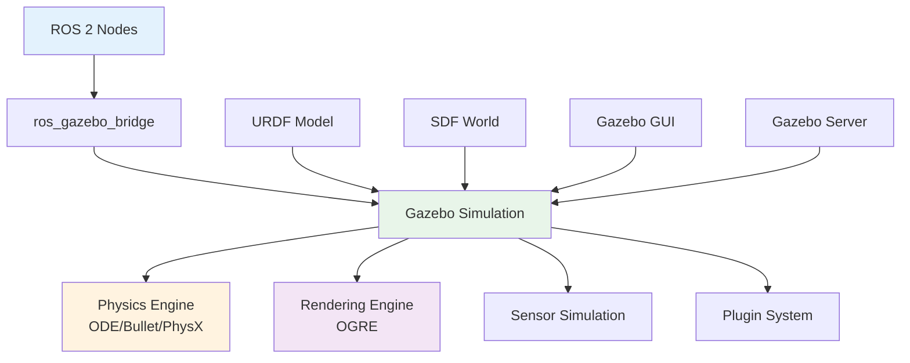

## Learning Objectives

- Understand Gazebo simulation architecture and integration with ROS 2
- Master URDF (Unified Robot Description Format) for robot modeling
- Create SDF (Simulation Description Format) worlds for simulation environments
- Implement accurate physics simulation with proper material properties
- Develop sensor and actuator plugins for realistic simulation

## 6.1 Gazebo Simulation Overview

Gazebo is a multi-robot simulator for outdoor environments that offers realistic physics simulation, sensor simulation, and robot control integration. In ROS 2, Gazebo serves as the primary simulation environment for testing and developing robot algorithms.

### 6.1.1 Gazebo-ROS 2 Integration Architecture



### 6.1.2 Setting Up Gazebo with ROS 2

```bash
# Install Gazebo and ROS 2 integration
sudo apt update
sudo apt install ros-humble-gazebo-ros-pkgs
sudo apt install ros-humble-gazebo-ros2-control
sudo apt install ros-humble-ros2-control-demos

# Set environment variables
echo 'source /usr/share/gazebo/setup.sh' >> ~/.bashrc
echo 'export GAZEBO_MODEL_PATH=$GAZEBO_MODEL_PATH:/path/to/your/models' >> ~/.bashrc
```

## 6.2 URDF: Unified Robot Description Format

URDF is an XML format that describes a robot's geometry, kinematics, and dynamics. It's the standard format for representing robot models in ROS.

### 6.2.1 Basic URDF Structure

```xml
<!-- robot_description.urdf -->
<?xml version="1.0"?>
<robot name="humanoid_robot" xmlns:xacro="http://www.ros.org/wiki/xacro">

  <!-- Base Link -->
  <link name="base_link">
    <inertial>
      <origin xyz="0 0 0.5" rpy="0 0 0"/>
      <mass value="10.0"/>
      <inertia ixx="1.0" ixy="0.0" ixz="0.0" iyy="1.0" iyz="0.0" izz="1.0"/>
    </inertial>

    <visual>
      <origin xyz="0 0 0.5" rpy="0 0 0"/>
      <geometry>
        <box size="0.4 0.3 0.1"/>
      </geometry>
      <material name="gray">
        <color rgba="0.5 0.5 0.5 1"/>
      </material>
    </visual>

    <collision>
      <origin xyz="0 0 0.5" rpy="0 0 0"/>
      <geometry>
        <box size="0.4 0.3 0.1"/>
      </geometry>
    </collision>
  </link>

  <!-- Base to Hip Joint -->
  <joint name="base_to_hip" type="continuous">
    <parent link="base_link"/>
    <child link="hip_link"/>
    <origin xyz="0 0 0.8" rpy="0 0 0"/>
    <axis xyz="0 0 1"/>
    <limit effort="100" velocity="3.14"/>
  </joint>

  <!-- Hip Link -->
  <link name="hip_link">
    <inertial>
      <origin xyz="0 0 0.1" rpy="0 0 0"/>
      <mass value="2.0"/>
      <inertia ixx="0.1" ixy="0.0" ixz="0.0" iyy="0.1" iyz="0.0" izz="0.1"/>
    </inertial>

    <visual>
      <origin xyz="0 0 0.1" rpy="0 0 0"/>
      <geometry>
        <cylinder radius="0.1" length="0.2"/>
      </geometry>
      <material name="red">
        <color rgba="1 0 0 1"/>
      </material>
    </visual>

    <collision>
      <origin xyz="0 0 0.1" rpy="0 0 0"/>
      <geometry>
        <cylinder radius="0.1" length="0.2"/>
      </geometry>
    </collision>
  </link>

</robot>
```

### 6.2.2 Xacro for Modular URDF

Xacro (XML Macros) allows for modular, reusable URDF definitions:

```xml
<!-- xacro/properties.xacro -->
<?xml version="1.0"?>
<robot xmlns:xacro="http://www.ros.org/wiki/xacro">

  <!-- Material definitions -->
  <xacro:property name="body_material">
    <material name="body_material">
      <color rgba="0.2 0.2 0.2 1"/>
    </material>
  </xacro:property>

  <!-- Joint properties -->
  <xacro:property name="max_effort" value="100.0"/>
  <xacro:property name="max_velocity" value="3.14"/>
  <xacro:property name="joint_damping" value="0.1"/>
  <xacro:property name="joint_friction" value="0.0"/>

</robot>
```

```xml
<!-- xacro/joint_macros.xacro -->
<?xml version="1.0"?>
<robot xmlns:xacro="http://www.ros.org/wiki/xacro">

  <!-- Revolute joint macro -->
  <xacro:macro name="revolute_joint" params="name parent child origin_xyz origin_rpy axis_xyz lower upper">
    <joint name="${name}" type="revolute">
      <parent link="${parent}"/>
      <child link="${child}"/>
      <origin xyz="${origin_xyz}" rpy="${origin_rpy}"/>
      <axis xyz="${axis_xyz}"/>
      <limit lower="${lower}" upper="${upper}" effort="${max_effort}" velocity="${max_velocity}"/>
      <dynamics damping="${joint_damping}" friction="${joint_friction}"/>
    </joint>
  </xacro:macro>

  <!-- Continuous joint macro -->
  <xacro:macro name="continuous_joint" params="name parent child origin_xyz origin_rpy axis_xyz">
    <joint name="${name}" type="continuous">
      <parent link="${parent}"/>
      <child link="${child}"/>
      <origin xyz="${origin_xyz}" rpy="${origin_rpy}"/>
      <axis xyz="${axis_xyz}"/>
      <limit effort="${max_effort}" velocity="${max_velocity}"/>
      <dynamics damping="${joint_damping}" friction="${joint_friction}"/>
    </joint>
  </xacro:macro>

</robot>
```

```xml
<!-- xacro/link_macros.xacro -->
<?xml version="1.0"?>
<robot xmlns:xacro="http://www.ros.org/wiki/xacro">

  <!-- Box link macro -->
  <xacro:macro name="box_link" params="name origin_xyz origin_rpy size mass material">
    <link name="${name}">
      <inertial>
        <origin xyz="${origin_xyz}" rpy="${origin_rpy}"/>
        <mass value="${mass}"/>
        <inertia ixx="${mass * (size[1]*size[1] + size[2]*size[2]) / 12.0}"
                 ixy="0.0" ixz="0.0"
                 iyy="${mass * (size[0]*size[0] + size[2]*size[2]) / 12.0}"
                 iyz="0.0"
                 izz="${mass * (size[0]*size[0] + size[1]*size[1]) / 12.0}"/>
      </inertial>

      <visual>
        <origin xyz="${origin_xyz}" rpy="${origin_rpy}"/>
        <geometry>
          <box size="${size[0]} ${size[1]} ${size[2]}"/>
        </geometry>
        <xacro:insert_block name="${material}"/>
      </visual>

      <collision>
        <origin xyz="${origin_xyz}" rpy="${origin_rpy}"/>
        <geometry>
          <box size="${size[0]} ${size[1]} ${size[2]}"/>
        </geometry>
      </collision>
    </link>
  </xacro:macro>

  <!-- Cylinder link macro -->
  <xacro:macro name="cylinder_link" params="name origin_xyz origin_rpy radius length mass material">
    <link name="${name}">
      <inertial>
        <origin xyz="${origin_xyz}" rpy="${origin_rpy}"/>
        <mass value="${mass}"/>
        <inertia ixx="${mass * (3*radius*radius + length*length) / 12.0}"
                 ixy="0.0" ixz="0.0"
                 iyy="${mass * (3*radius*radius + length*length) / 12.0}"
                 iyz="0.0"
                 izz="${mass * radius*radius / 2.0}"/>
      </inertial>

      <visual>
        <origin xyz="${origin_xyz}" rpy="${origin_rpy}"/>
        <geometry>
          <cylinder radius="${radius}" length="${length}"/>
        </geometry>
        <xacro:insert_block name="${material}"/>
      </visual>

      <collision>
        <origin xyz="${origin_xyz}" rpy="${origin_rpy}"/>
        <geometry>
          <cylinder radius="${radius}" length="${length}"/>
        </geometry>
      </collision>
    </link>
  </xacro:macro>

</robot>
```

### 6.2.3 Complete Humanoid Robot URDF

```xml
<!-- humanoid_robot.urdf.xacro -->
<?xml version="1.0"?>
<robot name="humanoid_robot" xmlns:xacro="http://www.ros.org/wiki/xacro">

  <!-- Include macros -->
  <xacro:include filename="$(find humanoid_robot_description)/urdf/xacro/properties.xacro"/>
  <xacro:include filename="$(find humanoid_robot_description)/urdf/xacro/joint_macros.xacro"/>
  <xacro:include filename="$(find humanoid_robot_description)/urdf/xacro/link_macros.xacro"/>

  <!-- Define properties -->
  <xacro:property name="torso_height" value="0.6"/>
  <xacro:property name="torso_width" value="0.3"/>
  <xacro:property name="torso_depth" value="0.2"/>
  <xacro:property name="arm_length" value="0.3"/>
  <xacro:property name="leg_length" value="0.4"/>
  <xacro:property name="foot_length" value="0.2"/>
  <xacro:property name="foot_width" value="0.1"/>

  <!-- Base/Torso -->
  <xacro:box_link name="torso"
                  origin_xyz="0 0 ${torso_height/2}"
                  origin_rpy="0 0 0"
                  size="${torso_width} ${torso_depth} ${torso_height}"
                  mass="15.0"
                  material="body_material"/>

  <!-- Left Arm -->
  <xacro:continuous_joint name="torso_to_left_shoulder"
                          parent="torso"
                          child="left_upper_arm"
                          origin_xyz="-${torso_width/2 + 0.05} 0 ${torso_height - 0.05}"
                          origin_rpy="0 1.5708 0"
                          axis_xyz="0 0 1"/>

  <xacro:cylinder_link name="left_upper_arm"
                       origin_xyz="0 0 ${arm_length/2}"
                       origin_rpy="0 0 0"
                       radius="0.05"
                       length="${arm_length}"
                       mass="1.5"
                       material="body_material"/>

  <xacro:revolute_joint name="left_shoulder_to_forearm"
                        parent="left_upper_arm"
                        child="left_forearm"
                        origin_xyz="0 0 ${arm_length}"
                        origin_rpy="0 0 0"
                        axis_xyz="0 1 0"
                        lower="-2.09"
                        upper="2.09"/>

  <xacro:cylinder_link name="left_forearm"
                       origin_xyz="0 0 ${arm_length/2}"
                       origin_rpy="0 0 0"
                       radius="0.04"
                       length="${arm_length}"
                       mass="1.2"
                       material="body_material"/>

  <!-- Right Arm (mirrored) -->
  <xacro:continuous_joint name="torso_to_right_shoulder"
                          parent="torso"
                          child="right_upper_arm"
                          origin_xyz="${torso_width/2 + 0.05} 0 ${torso_height - 0.05}"
                          origin_rpy="0 -1.5708 0"
                          axis_xyz="0 0 1"/>

  <xacro:cylinder_link name="right_upper_arm"
                       origin_xyz="0 0 ${arm_length/2}"
                       origin_rpy="0 0 0"
                       radius="0.05"
                       length="${arm_length}"
                       mass="1.5"
                       material="body_material"/>

  <xacro:revolute_joint name="right_shoulder_to_forearm"
                        parent="right_upper_arm"
                        child="right_forearm"
                        origin_xyz="0 0 ${arm_length}"
                        origin_rpy="0 0 0"
                        axis_xyz="0 1 0"
                        lower="-2.09"
                        upper="2.09"/>

  <xacro:cylinder_link name="right_forearm"
                       origin_xyz="0 0 ${arm_length/2}"
                       origin_rpy="0 0 0"
                       radius="0.04"
                       length="${arm_length}"
                       mass="1.2"
                       material="body_material"/>

  <!-- Left Leg -->
  <xacro:revolute_joint name="torso_to_left_hip"
                        parent="torso"
                        child="left_hip"
                        origin_xyz="-${torso_width/4} 0 0"
                        origin_rpy="0 0 0"
                        axis_xyz="0 1 0"
                        lower="-1.57"
                        upper="1.57"/>

  <xacro:cylinder_link name="left_hip"
                       origin_xyz="0 0 0.05"
                       origin_rpy="0 0 0"
                       radius="0.06"
                       length="0.1"
                       mass="1.0"
                       material="body_material"/>

  <xacro:revolute_joint name="left_hip_to_thigh"
                        parent="left_hip"
                        child="left_thigh"
                        origin_xyz="0 0 0"
                        origin_rpy="0 0 0"
                        axis_xyz="0 0 1"
                        lower="-1.57"
                        upper="1.57"/>

  <xacro:cylinder_link name="left_thigh"
                       origin_xyz="0 0 ${leg_length/2}"
                       origin_rpy="0 0 0"
                       radius="0.07"
                       length="${leg_length}"
                       mass="3.0"
                       material="body_material"/>

  <xacro:revolute_joint name="left_thigh_to_shin"
                        parent="left_thigh"
                        child="left_shin"
                        origin_xyz="0 0 ${leg_length}"
                        origin_rpy="0 0 0"
                        axis_xyz="0 1 0"
                        lower="-0.1"
                        upper="2.79"/>

  <xacro:cylinder_link name="left_shin"
                       origin_xyz="0 0 ${leg_length/2}"
                       origin_rpy="0 0 0"
                       radius="0.06"
                       length="${leg_length}"
                       mass="2.5"
                       material="body_material"/>

  <xacro:revolute_joint name="left_shin_to_foot"
                        parent="left_shin"
                        child="left_foot"
                        origin_xyz="0 0 ${leg_length}"
                        origin_rpy="0 0 0"
                        axis_xyz="0 1 0"
                        lower="-1.57"
                        upper="0.5"/>

  <xacro:box_link name="left_foot"
                  origin_xyz="0 ${foot_width/2} 0.02"
                  origin_rpy="0 0 0"
                  size="${foot_width} ${foot_length} 0.04"
                  mass="0.5"
                  material="body_material"/>

  <!-- Right Leg (mirrored) -->
  <xacro:revolute_joint name="torso_to_right_hip"
                        parent="torso"
                        child="right_hip"
                        origin_xyz="${torso_width/4} 0 0"
                        origin_rpy="0 0 0"
                        axis_xyz="0 1 0"
                        lower="-1.57"
                        upper="1.57"/>

  <!-- ... (similar structure for right leg) -->

  <!-- Gazebo-specific elements -->
  <gazebo reference="torso">
    <material>Gazebo/Gray</material>
  </gazebo>

  <gazebo reference="left_upper_arm">
    <material>Gazebo/Red</material>
  </gazebo>

  <gazebo reference="right_upper_arm">
    <material>Gazebo/Red</material>
  </gazebo>

</robot>
```

## 6.3 SDF: Simulation Description Format

SDF is a more comprehensive format used by Gazebo to describe not just robots, but entire simulation worlds including physics, sensors, and environment properties.

### 6.3.1 SDF World File

```xml
<!-- worlds/humanoid_robot_world.world -->
<?xml version="1.0" ?>
<sdf version="1.7">
  <world name="humanoid_robot_world">

    <!-- Physics configuration -->
    <physics name="1ms" type="ignored">
      <max_step_size>0.001</max_step_size>
      <real_time_factor>1.0</real_time_factor>
      <real_time_update_rate>1000</real_time_update_rate>
      <gravity>0 0 -9.8066</gravity>

      <!-- ODE physics engine configuration -->
      <ode>
        <solver>
          <type>quick</type>
          <iters>20</iters>
          <sor>1.3</sor>
          <use_dynamic_moi_rescaling>0</use_dynamic_moi_rescaling>
        </solver>
        <constraints>
          <cfm>0</cfm>
          <erp>0.2</erp>
          <contact_max_correcting_vel>100</contact_max_correcting_vel>
          <contact_surface_layer>0.001</contact_surface_layer>
        </constraints>
      </ode>
    </physics>

    <!-- Scene configuration -->
    <scene>
      <ambient>0.4 0.4 0.4 1</ambient>
      <background>0.7 0.7 0.7 1</background>
      <shadows>true</shadows>
    </scene>

    <!-- GUI configuration -->
    <gui fullscreen='0'>
      <camera name='user_camera'>
        <pose>5 -5 2 0 1.27 1.57</pose>
        <view_controller>orbit</view_controller>
      </camera>
    </gui>

    <!-- Lighting -->
    <light type="directional" name="sun">
      <cast_shadows>1</cast_shadows>
      <pose>0 0 10 0 -0 0</pose>
      <diffuse>0.8 0.8 0.8 1</diffuse>
      <specular>0.2 0.2 0.2 1</specular>
      <attenuation>
        <range>1000</range>
        <constant>0.9</constant>
        <linear>0.01</linear>
        <quadratic>0.001</quadratic>
      </attenuation>
      <direction>-0.5 0.5 -1</direction>
    </light>

    <!-- Include robot model -->
    <include>
      <uri>model://humanoid_robot</uri>
      <pose>0 0 1.0 0 0 0</pose>
    </include>

    <!-- Ground plane -->
    <include>
      <uri>model://ground_plane</uri>
    </include>

    <!-- Building walls -->
    <model name="building">
      <static>true</static>

      <!-- Floor -->
      <link name="floor">
        <collision name="floor_collision">
          <geometry>
            <box>
              <size>20 20 0.1</size>
            </box>
          </geometry>
          <surface>
            <friction>
              <ode>
                <mu>0.8</mu>
                <mu2>0.6</mu2>
              </ode>
            </friction>
            <contact>
              <ode>
                <kp>1000.0</kp>
                <kd>100.0</kd>
                <max_vel>0.01</max_vel>
                <min_depth>0.001</min_depth>
              </ode>
            </contact>
          </surface>
        </collision>
        <visual name="floor_visual">
          <geometry>
            <box>
              <size>20 20 0.1</size>
            </box>
          </geometry>
          <material>
            <script>
              <uri>file://media/materials/scripts/gazebo.material</uri>
              <name>Gazebo/Grey</name>
            </script>
          </material>
        </visual>
      </link>

      <!-- Walls -->
      <link name="north_wall">
        <pose>0 -10 1.5 0 0 0</pose>
        <collision name="wall_collision">
          <geometry>
            <box>
              <size>20 0.2 3</size>
            </box>
          </geometry>
        </collision>
        <visual name="wall_visual">
          <geometry>
            <box>
              <size>20 0.2 3</size>
            </box>
          </geometry>
          <material>
            <script>
              <uri>file://media/materials/scripts/gazebo.material</uri>
              <name>Gazebo/Bricks</name>
            </script>
          </material>
        </visual>
      </link>

      <link name="south_wall">
        <pose>0 10 1.5 0 0 0</pose>
        <collision name="wall_collision">
          <geometry>
            <box>
              <size>20 0.2 3</size>
            </box>
          </geometry>
        </collision>
        <visual name="wall_visual">
          <geometry>
            <box>
              <size>20 0.2 3</size>
            </box>
          </geometry>
          <material>
            <script>
              <uri>file://media/materials/scripts/gazebo.material</uri>
              <name>Gazebo/Bricks</name>
            </script>
          </material>
        </visual>
      </link>

      <link name="east_wall">
        <pose>10 0 1.5 0 0 1.57</pose>
        <collision name="wall_collision">
          <geometry>
            <box>
              <size>20 0.2 3</size>
            </box>
          </geometry>
        </collision>
        <visual name="wall_visual">
          <geometry>
            <box>
              <size>20 0.2 3</size>
            </box>
          </geometry>
          <material>
            <script>
              <uri>file://media/materials/scripts/gazebo.material</uri>
              <name>Gazebo/Bricks</name>
            </script>
          </material>
        </visual>
      </link>

      <link name="west_wall">
        <pose>-10 0 1.5 0 0 1.57</pose>
        <collision name="wall_collision">
          <geometry>
            <box>
              <size>20 0.2 3</size>
            </box>
          </geometry>
        </collision>
        <visual name="wall_visual">
          <geometry>
            <box>
              <size>20 0.2 3</size>
            </box>
          </geometry>
          <material>
            <script>
              <uri>file://media/materials/scripts/gazebo.material</uri>
              <name>Gazebo/Bricks</name>
            </script>
          </material>
        </visual>
      </link>
    </model>

    <!-- Obstacles -->
    <model name="table">
      <pose>3 3 0.4 0 0 0</pose>
      <static>true</static>

      <link name="table_top">
        <pose>0 0 0.4 0 0 0</pose>
        <collision name="collision">
          <geometry>
            <box>
              <size>1.0 0.6 0.05</size>
            </box>
          </geometry>
          <surface>
            <friction>
              <ode>
                <mu>0.5</mu>
                <mu2>0.5</mu2>
              </ode>
            </friction>
          </surface>
        </collision>
        <visual name="visual">
          <geometry>
            <box>
              <size>1.0 0.6 0.05</size>
            </box>
          </geometry>
          <material>
            <script>
              <uri>file://media/materials/scripts/gazebo.material</uri>
              <name>Gazebo/Wood</name>
            </script>
          </material>
        </visual>
      </link>

      <!-- Table legs -->
      <link name="leg1">
        <pose>0.45 0.25 0.2 0 0 0</pose>
        <collision name="collision">
          <geometry>
            <cylinder>
              <radius>0.02</radius>
              <length>0.4</length>
            </cylinder>
          </geometry>
        </collision>
        <visual name="visual">
          <geometry>
            <cylinder>
              <radius>0.02</radius>
              <length>0.4</length>
            </cylinder>
          </geometry>
          <material>
            <script>
              <uri>file://media/materials/scripts/gazebo.material</uri>
              <name>Gazebo/Black</name>
            </script>
          </material>
        </visual>
      </link>

      <!-- Other legs (similar) -->
    </model>

  </world>
</sdf>
```

## 6.4 Gazebo Plugins

Gazebo plugins extend simulation capabilities with custom physics, sensors, and control interfaces.

### 6.4.1 Sensor Plugins

```xml
<!-- Adding sensors to URDF -->
<gazebo reference="torso">
  <!-- RGB Camera -->
  <sensor type="camera" name="rgb_camera">
    <pose>0.2 0 0.1 0 0 0</pose>
    <camera>
      <horizontal_fov>1.047</horizontal_fov>
      <image>
        <width>640</width>
        <height>480</height>
        <format>R8G8B8</format>
      </image>
      <clip>
        <near>0.1</near>
        <far>100</far>
      </clip>
    </camera>
    <plugin name="camera_controller" filename="libgazebo_ros_camera.so">
      <ros>
        <namespace>/humanoid_robot</namespace>
        <remapping>~/image_raw:=/camera/image_raw</remapping>
        <remapping>~/camera_info:=/camera/camera_info</remapping>
      </ros>
      <camera_name>rgb_camera</camera_name>
      <frame_name>camera_link</frame_name>
      <hack_baseline>0.07</hack_baseline>
    </plugin>
    <always_on>true</always_on>
    <update_rate>30</update_rate>
    <visualize>true</visualize>
  </sensor>

  <!-- LiDAR -->
  <sensor type="ray" name="laser_scanner">
    <pose>0 0 0.3 0 0 0</pose>
    <ray>
      <scan>
        <horizontal>
          <samples>720</samples>
          <resolution>1</resolution>
          <min_angle>-3.14159</min_angle>
          <max_angle>3.14159</max_angle>
        </horizontal>
      </scan>
      <range>
        <min>0.1</min>
        <max>30.0</max>
        <resolution>0.02</resolution>
      </range>
    </ray>
    <plugin name="laser_scanner_controller" filename="libgazebo_ros_ray_sensor.so">
      <ros>
        <namespace>/humanoid_robot</namespace>
        <remapping>~/out:=/scan</remapping>
      </ros>
      <output_type>sensor_msgs/LaserScan</output_type>
      <frame_name>laser_link</frame_name>
    </plugin>
    <always_on>true</always_on>
    <update_rate>10</update_rate>
    <visualize>true</visualize>
  </sensor>

  <!-- IMU -->
  <sensor type="imu" name="imu_sensor">
    <pose>0 0 0.5 0 0 0</pose>
    <plugin name="imu_controller" filename="libgazebo_ros_imu.so">
      <ros>
        <namespace>/humanoid_robot</namespace>
        <remapping>~/out:=/imu/data</remapping>
      </ros>
      <initial_orientation_as_reference>false</initial_orientation_as_reference>
    </plugin>
    <always_on>true</always_on>
    <update_rate>100</update_rate>
    <visualize>true</visualize>
  </sensor>
</gazebo>
```

### 6.4.2 Custom Plugin Development

```cpp
// humanoid_controller_plugin.cpp
#include <gazebo/common/Plugin.hh>
#include <gazebo/physics/Model.hh>
#include <gazebo/physics/JointController.hh>
#include <gazebo/physics/World.hh>
#include <gazebo/ros/node.hh>
#include <rclcpp/rclcpp.hpp>
#include <std_msgs/msg/float64.hpp>
#include <sensor_msgs/msg/joint_state.hpp>
#include <nav_msgs/msg/odometry.hpp>
#include <geometry_msgs/msg/pose_with_covariance_stamped.hpp>
#include <tf2_ros/transform_broadcaster.h>
#include <tf2_geometry_msgs/tf2_geometry_msgs.hpp>

namespace gazebo
{
class HumanoidControllerPlugin : public ModelPlugin
{
public:
  HumanoidControllerPlugin() {}

  virtual void Load(physics::ModelPtr _model, sdf::ElementPtr _sdf)
  {
    // Store the model pointer
    this->model = _model;
    this->world = _model->GetWorld();

    // ROS node
    this->ros_node_ = gazebo_ros::Node::Get(_sdf);

    // Get joint names from SDF
    if (_sdf->HasElement("joint_names"))
    {
      sdf::ElementPtr joint_elem = _sdf->GetElement("joint_names");
      std::string joint_names_str = joint_elem->Get<std::string>();

      // Parse joint names
      std::stringstream ss(joint_names_str);
      std::string joint_name;
      while (std::getline(ss, joint_name, ','))
      {
        this->joint_names_.push_back(joint_name);
        physics::JointPtr joint = this->model->GetJoint(joint_name);
        if (joint)
        {
          this->joints_[joint_name] = joint;
          this->model->GetJointController()->SetPositionPID(
            joint->GetScopedName(), common::PID(100, 0.1, 10));
        }
      }
    }

    // Initialize state publishers
    this->joint_state_pub_ = this->ros_node_->create_publisher<sensor_msgs::msg::JointState>(
      "joint_states", 10);

    this->odom_pub_ = this->ros_node_->create_publisher<nav_msgs::msg::Odometry>(
      "odom", 10);

    // Initialize TF broadcaster
    this->tf_broadcaster_ = std::make_shared<tf2_ros::TransformBroadcaster>(this->ros_node_);

    // Initialize command subscribers
    this->joint_cmd_sub_ = this->ros_node_->create_subscription<std_msgs::msg::Float64>(
      "joint_command", 10,
      std::bind(&HumanoidControllerPlugin::OnJointCommand, this, std::placeholders::_1));

    // Connect to the world update event
    this->update_connection_ = event::Events::ConnectWorldUpdateBegin(
      std::bind(&HumanoidControllerPlugin::OnUpdate, this));

    RCLCPP_INFO(this->ros_node_->get_logger(), "Humanoid controller plugin loaded");
  }

private:
  void OnJointCommand(const std_msgs::msg::Float64::SharedPtr msg)
  {
    // For simplicity, apply command to first joint
    // In practice, you'd have separate topics or multi-array messages
    if (!this->joints_.empty())
    {
      std::string joint_name = this->joint_names_[0];
      double target_position = msg->data;

      // Apply position command with PID control
      this->model->GetJointController()->SetPositionTarget(
        this->joints_[joint_name]->GetScopedName(), target_position);
    }
  }

  void OnUpdate()
  {
    // Update simulation
    common::Time current_time = this->world->SimTime();
    double dt = (current_time - this->last_update_time).Double();

    if (dt < 0.01) // Limit update rate to 100Hz
      return;

    // Publish joint states
    this->PublishJointStates(current_time);

    // Publish odometry
    this->PublishOdometry(current_time);

    // Publish TF transforms
    this->PublishTransforms(current_time);

    this->last_update_time = current_time;
  }

  void PublishJointStates(const common::Time& _time)
  {
    sensor_msgs::msg::JointState joint_state;
    joint_state.header.stamp = this->ros_node_->now();

    for (const auto& joint_name : this->joint_names_)
    {
      physics::JointPtr joint = this->joints_[joint_name];
      if (joint)
      {
        joint_state.name.push_back(joint_name);
        joint_state.position.push_back(joint->Position(0));
        joint_state.velocity.push_back(joint->GetVelocity(0));
        joint_state.effort.push_back(joint->GetForce(0));
      }
    }

    this->joint_state_pub_->publish(joint_state);
  }

  void PublishOdometry(const common::Time& _time)
  {
    // Get robot pose
    ignition::math::Pose3d pose = this->model->WorldPose();

    nav_msgs::msg::Odometry odom;
    odom.header.stamp = this->ros_node_->now();
    odom.header.frame_id = "odom";
    odom.child_frame_id = "base_link";

    // Position
    odom.pose.pose.position.x = pose.Pos().X();
    odom.pose.pose.position.y = pose.Pos().Y();
    odom.pose.pose.position.z = pose.Pos().Z();

    // Orientation
    odom.pose.pose.orientation.x = pose.Rot().X();
    odom.pose.pose.orientation.y = pose.Rot().Y();
    odom.pose.pose.orientation.z = pose.Rot().Z();
    odom.pose.pose.orientation.w = pose.Rot().W();

    // Velocity (would need to calculate from previous pose)
    odom.twist.twist.linear.x = 0.0;
    odom.twist.twist.angular.z = 0.0;

    this->odom_pub_->publish(odom);
  }

  void PublishTransforms(const common::Time& _time)
  {
    // Publish odom -> base_link transform
    geometry_msgs::msg::TransformStamped odom_trans;
    odom_trans.header.stamp = this->ros_node_->now();
    odom_trans.header.frame_id = "odom";
    odom_trans.child_frame_id = "base_link";

    ignition::math::Pose3d pose = this->model->WorldPose();
    odom_trans.transform.translation.x = pose.Pos().X();
    odom_trans.transform.translation.y = pose.Pos().Y();
    odom_trans.transform.translation.z = pose.Pos().Z();

    odom_trans.transform.rotation.x = pose.Rot().X();
    odom_trans.transform.rotation.y = pose.Rot().Y();
    odom_trans.transform.rotation.z = pose.Rot().Z();
    odom_trans.transform.rotation.w = pose.Rot().W();

    this->tf_broadcaster_->sendTransform(odom_trans);

    // Publish joint transforms
    // (Iterate through links and publish their relative transforms)
  }

private:
  // Pointers to model, world, and joints
  physics::ModelPtr model;
  physics::WorldPtr world;
  std::map<std::string, physics::JointPtr> joints_;
  std::vector<std::string> joint_names_;

  // ROS node and interfaces
  gazebo_ros::Node::SharedPtr ros_node_;
  rclcpp::Publisher<sensor_msgs::msg::JointState>::SharedPtr joint_state_pub_;
  rclcpp::Publisher<nav_msgs::msg::Odometry>::SharedPtr odom_pub_;
  rclcpp::Subscription<std_msgs::msg::Float64>::SharedPtr joint_cmd_sub_;
  std::shared_ptr<tf2_ros::TransformBroadcaster> tf_broadcaster_;

  // Connection and timing
  event::ConnectionPtr update_connection_;
  common::Time last_update_time;
};

// Register this plugin with the simulator
GZ_REGISTER_MODEL_PLUGIN(HumanoidControllerPlugin)
}
```

## 6.5 Launch File for Simulation

```python
# launch/humanoid_robot_simulation.py
from launch import LaunchDescription
from launch_ros.actions import Node
from launch.actions import ExecuteProcess, IncludeLaunchDescription
from launch_ros.substitutions import FindPackageShare
from launch.substitutions import PathJoinSubstitution, LaunchConfiguration
from launch import LaunchDescription
from launch.actions import DeclareLaunchArgument

def generate_launch_description():

    # Declare launch arguments
    use_sim_time_arg = DeclareLaunchArgument(
        'use_sim_time',
        default_value='true',
        description='Use simulation time'
    )

    world_name_arg = DeclareLaunchArgument(
        'world_name',
        default_value='humanoid_robot_world.world',
        description='Gazebo world file name'
    )

    gui_arg = DeclareLaunchArgument(
        'gui',
        default_value='true',
        description='Start Gazebo GUI'
    )

    # Get package directories
    pkg_gazebo_ros = FindPackageShare('gazebo_ros')
    pkg_robot_description = FindPackageShare('humanoid_robot_description')

    # Gazebo launch
    gazebo_launch = ExecuteProcess(
        cmd=[
            'gazebo',
            '--verbose',
            '-s', 'libgazebo_ros_factory.so',
            LaunchConfiguration('world_name'),
            ['--gui' if LaunchConfiguration('gui') == 'true' else '--headless']
        ],
        output='screen'
    )

    # Robot state publisher
    robot_state_publisher = Node(
        package='robot_state_publisher',
        executable='robot_state_publisher',
        name='robot_state_publisher',
        parameters=[{
            'use_sim_time': LaunchConfiguration('use_sim_time'),
            'robot_description': Command([
                'xacro',
                PathJoinSubstitution([
                    pkg_robot_description,
                    'urdf',
                    'humanoid_robot.urdf.xacro'
                ])
            ])
        }]
    )

    # Spawn robot in Gazebo
    spawn_entity = Node(
        package='gazebo_ros',
        executable='spawn_entity.py',
        arguments=[
            '-entity', 'humanoid_robot',
            '-topic', 'robot_description',
            '-x', '0', '-y', '0', '-z', '1.0',
            '-Y', '0'  # yaw
        ],
        output='screen'
    )

    # Joint state publisher
    joint_state_publisher = Node(
        package='joint_state_publisher',
        executable='joint_state_publisher',
        name='joint_state_publisher',
        parameters=[{
            'use_sim_time': LaunchConfiguration('use_sim_time'),
            'rate': 30
        }]
    )

    # Controller manager
    controller_manager = Node(
        package='controller_manager',
        executable='ros2_control_node',
        name='controller_manager',
        parameters=[{
            'use_sim_time': LaunchConfiguration('use_sim_time'),
            'robot_description': Command([
                'xacro',
                PathJoinSubstitution([
                    pkg_robot_description,
                    'urdf',
                    'humanoid_robot.urdf.xacro'
                ])
            ])
        }]
    )

    # Load controllers
    load_joint_state_broadcaster = ExecuteProcess(
        cmd=[
            'ros2', 'control', 'load_controller',
            'joint_state_broadcaster'
        ],
        output='screen'
    )

    load_robot_controller = ExecuteProcess(
        cmd=[
            'ros2', 'control', 'load_controller',
            'humanoid_controller'
        ],
        output='screen'
    )

    start_robot_controller = ExecuteProcess(
        cmd=[
            'ros2', 'control', 'start_controller',
            'humanoid_controller'
        ],
        output='screen'
    )

    # RViz
    rviz_node = Node(
        package='rviz2',
        executable='rviz2',
        name='rviz2',
        arguments=['-d', PathJoinSubstitution([
            pkg_robot_description,
            'rviz',
            'humanoid_robot.rviz'
        ])],
        condition=IfCondition(LaunchConfiguration('gui'))
    )

    return LaunchDescription([
        use_sim_time_arg,
        world_name_arg,
        gui_arg,
        gazebo_launch,
        robot_state_publisher,
        spawn_entity,
        joint_state_publisher,
        controller_manager,
        load_joint_state_broadcaster,
        load_robot_controller,
        start_robot_controller,
        rviz_node
    ])
```

## 6.6 Simulation Best Practices

### 6.6.1 Performance Optimization

1. **Physics Tuning**
   - Adjust time step based on requirements
   - Use appropriate solvers for your use case
   - Limit contact points for complex geometries

2. **Model Simplification**
   - Use collision meshes simpler than visual meshes
   - Combine rigid links where possible
   - Reduce polygon count for visual meshes

3. **Sensor Configuration**
   - Update sensors at appropriate rates
   - Disable unused sensors
   - Use appropriate resolution

### 6.6.2 Accuracy Considerations

1. **Inertia Properties**
   - Calculate accurate mass properties
   - Use proper center of mass locations
   - Include realistic friction coefficients

2. **Contact Modeling**
   - Configure appropriate restitution
   - Set proper contact stiffness/damping
   - Use collision filtering efficiently

3. **Actuator Dynamics**
   - Model motor saturation and limits
   - Include gear ratio effects
   - Consider actuator bandwidth

## 6.7 Summary

This chapter covered the essential aspects of robot simulation with Gazebo:

1. **URDF Modeling**: Creating accurate robot models with proper kinematics and dynamics
2. **SDF Worlds**: Building complex simulation environments
3. **Gazebo Plugins**: Extending simulation capabilities with custom plugins
4. **Sensor Simulation**: Realistic sensor modeling in simulation
5. **Launch Integration**: Combining ROS 2 nodes with Gazebo simulation

Key takeaways:

- URDF provides the standard format for robot model description in ROS
- Xacro enables modular, maintainable robot model definitions
- SDF extends URDF capabilities for complete simulation environments
- Gazebo plugins allow custom physics, sensors, and control interfaces
- Proper simulation setup is crucial for algorithm development and testing

Creating accurate digital twins requires careful attention to both robot modeling and environment simulation. When done correctly, simulation provides a safe, cost-effective environment for developing and testing robot algorithms before deployment on physical hardware.

## Knowledge Check

### Multiple Choice Questions

1. **What is the primary purpose of URDF?**
   - a) To define physics engine parameters
   - b) To describe robot geometry, kinematics, and dynamics
   - c) To configure sensor plugins
   - d) To specify world environment

2. **Which format is more suitable for complete simulation environments?**
   - a) URDF
   - b) XACRO
   - c) SDF
   - d) XML

3. **What is the advantage of using Xacro in URDF files?**
   - a) Better physics simulation
   - b) Modular, reusable definitions with parameters
   - c) Automatic sensor calibration
   - d) Built-in collision detection

### Short Answer Questions

1. Explain the difference between collision and visual geometries in URDF.

2. Why are inertia properties important for accurate simulation?

3. What are the key components of a Gazebo plugin?

### Practical Exercise

Create a complete simulation setup for a simple mobile robot that includes:

1. URDF model with differential drive kinematics
2. Sensor simulation (camera, LiDAR, IMU)
3. Custom controller plugin
4. Launch file that spawns the robot and starts all necessary nodes
5. Simple world with obstacles for navigation testing

Submit the complete code for all components.

---

*Next Chapter: Physics Simulation & Unity Integration - We'll explore advanced physics simulation and integrating with Unity for high-fidelity visualization.*