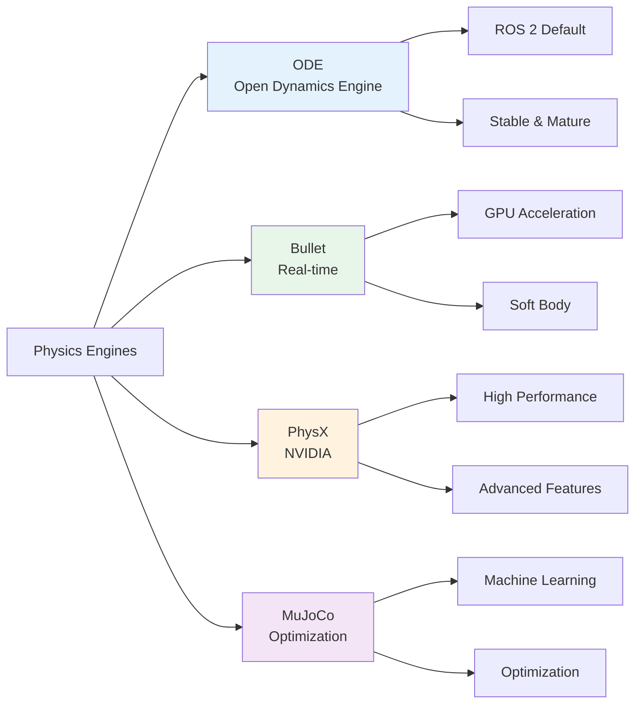
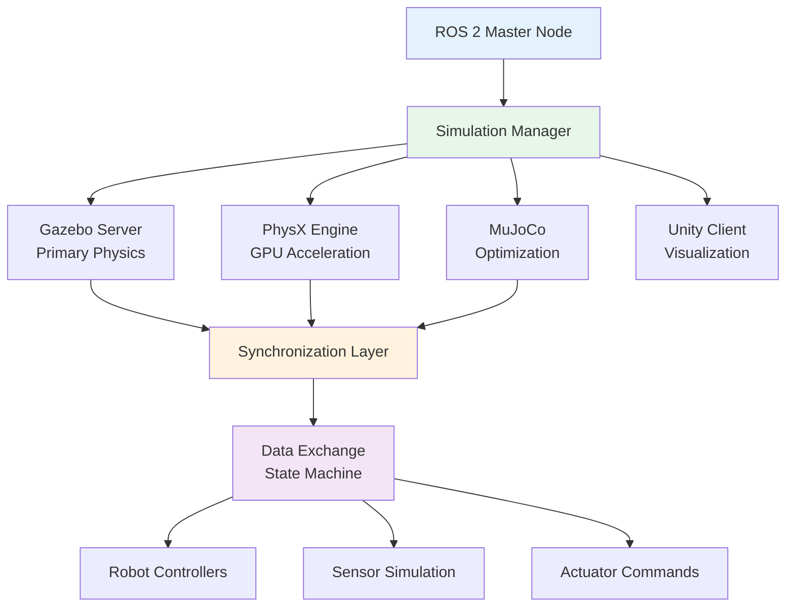

---
slug: /module-2/part3-digital-twin/chapter-7-physics-simulation-unity
title: "Chapter 7: Physics Simulation & Unity Integration"
description: "Advanced physics simulation techniques, multi-engine simulation, and Unity integration for high-fidelity robotics digital twins."
tags:
  - physics-simulation
  - unity
  - digital-twin
  - high-fidelity
  - robotics-simulation
  - multi-engine
---

## Learning Objectives

- Understand advanced physics simulation concepts for robotics
- Master multi-engine simulation architectures
- Implement Unity integration for high-fidelity visualization
- Learn about digital twin synchronization and consistency
- Apply best practices for accurate physics modeling

## 7.1 Advanced Physics Simulation

Accurate physics simulation is crucial for developing reliable robot controllers. Understanding the underlying physics engines and their capabilities enables better simulation fidelity.

### 7.1.1 Physics Engine Comparison



### 7.1.2 Contact Physics and Friction Modeling

```cpp
// advanced_contact_model.cpp
#include <gazebo/physics/physics.hh>
#include <gazebo/common/Events.hh>

namespace gazebo
{
class AdvancedContactPlugin : public WorldPlugin
{
public:
  void Load(physics::WorldPtr _world, sdf::ElementPtr _sdf)
  {
    this->world = _world;
    this->sdf = _sdf;

    // Contact manager setup
    this->contactManager = this->world->Physics()->GetContactManager();

    // Configure contact parameters
    this->ConfigureContactPhysics();

    // Connect to update event
    this->updateConnection = event::Events::ConnectWorldUpdateBegin(
      std::bind(&AdvancedContactPlugin::OnUpdate, this));

    // Connect to contact event
    this->contactConnection = event::Events::ConnectCollision(
      std::bind(&AdvancedContactPlugin::OnContact, this,
                std::placeholders::_1));

    gzmsg << "Advanced Contact Plugin loaded" << std::endl;
  }

private:
  void ConfigureContactPhysics()
  {
    // Configure surface properties
    physics::SurfaceParamsPtr surface = std::make_shared<physics::SurfaceParams>();

    // Advanced friction model
    surface->friction.SetODEMu(0.8);  // Static friction
    surface->friction.SetODEMu2(0.6); // Dynamic friction
    surface->friction.SetSlip1(0.1);
    surface->friction.SetSlip2(0.1);

    // Contact properties
    surface->contact.SetSoftCFM(0.0);
    surface->contact.SetSoftERP(0.2);
    surface->contact.SetSoftCfm(0.0);
    surface->contact.SetMinDepth(0.001);
    surface->contact.SetMaxVel(0.01);

    // Bounce/restitution
    surface->bounce.SetRestitutionCoefficient(0.3);
    surface->bounce.SetThresholdVelocity(0.1);

    // Apply to all models
    for (auto& model : this->world->Models())
    {
      for (auto& link : model->GetLinks())
      {
        for (auto& collision : link->GetCollisions())
        {
          collision->SetSurface(surface);
        }
      }
    }
  }

  void OnUpdate()
  {
    // Update contact forces
    this->UpdateContactForces();

    // Analyze contact stability
    this->AnalyzeContactStability();
  }

  void OnContact(const std::string& _collision1, const std::string& _collision2)
  {
    // Advanced contact handling
    physics::CollisionPtr col1 = this->world->Physics()->GetCollision(_collision1);
    physics::CollisionPtr col2 = this->world->Physics()->GetCollision(_collision2);

    if (col1 && col2)
    {
      // Get contact information
      physics::Contact contact = this->GetContactInfo(col1, col2);

      // Process contact
      this->ProcessContact(contact);
    }
  }

  void UpdateContactForces()
  {
    // Get all contacts
    const auto& contacts = this->contactManager->GetContacts();

    for (const auto& contact : contacts)
    {
      // Calculate normal force distribution
      double normal_force = this->CalculateNormalForce(contact);

      // Calculate friction force
      ignition::math::Vector3d friction_force =
        this->CalculateFrictionForce(contact, normal_force);

      // Apply forces
      this->ApplyContactForces(contact, normal_force, friction_force);
    }
  }

  double CalculateNormalForce(const physics::Contact& _contact)
  {
    // Advanced normal force calculation
    double depth = _contact.depth;
    double velocity = _contact.relative_speed;

    // Spring-damper model with nonlinear stiffness
    double k = 10000.0 * (1.0 + 2.0 * depth); // Variable stiffness
    double c = 100.0; // Damping coefficient

    double normal_force = k * depth - c * velocity;
    return std::max(0.0, normal_force); // No pulling
  }

  ignition::math::Vector3d CalculateFrictionForce(
    const physics::Contact& _contact, double _normal_force)
  {
    // Coulomb friction with Stribeck effect
    double mu_s = 0.8; // Static friction
    double mu_d = 0.6; // Dynamic friction
    double v_s = 0.1;  // Stribeck velocity

    ignition::math::Vector3d relative_velocity = _contact.relative_vel;
    double tangential_speed = relative_velocity.Length();

    // Calculate friction coefficient
    double mu;
    if (tangential_speed < v_s)
    {
      // Stribeck effect
      mu = mu_s - (mu_s - mu_d) * (tangential_speed / v_s);
    }
    else
    {
      mu = mu_d;
    }

    // Calculate friction force
    ignition::math::Vector3d friction_force;
    if (tangential_speed > 0.001)
    {
      friction_force = -mu * _normal_force * relative_velocity.Normalized();
    }

    return friction_force;
  }

  void ProcessContact(const physics::Contact& _contact)
  {
    // Advanced contact processing
    // 1. Contact stability analysis
    this->AnalyzeContactStability(_contact);

    // 2. Impact force calculation
    this->CalculateImpactForce(_contact);

    // 3. Wear modeling (if needed)
    this->ModelContactWear(_contact);

    // 4. Vibration generation
    this->GenerateContactVibration(_contact);
  }

private:
  physics::WorldPtr world;
  physics::ContactManagerPtr contactManager;
  sdf::ElementPtr sdf;
  event::ConnectionPtr updateConnection;
  event::ConnectionPtr contactConnection;
};

GZ_REGISTER_WORLD_PLUGIN(AdvancedContactPlugin)
}
```

### 7.1.3 Soft Body Physics for Compliance

```cpp
// soft_body_robot_plugin.cpp
#include <gazebo/physics/physics.hh>
#include <gazebo/common/MeshManager.hh>

namespace gazebo
{
class SoftBodyRobotPlugin : public ModelPlugin
{
public:
  void Load(physics::ModelPtr _model, sdf::ElementPtr _sdf)
  {
    this->model = _model;
    this->sdf = _sdf;

    // Initialize soft body parameters
    this->InitializeSoftBody();

    // Create soft body elements
    this->CreateSoftBodyElements();

    // Connect to physics update
    this->updateConnection = event::Events::ConnectWorldUpdateBegin(
      std::bind(&SoftBodyRobotPlugin::OnUpdate, this));

    gzmsg << "Soft Body Robot Plugin loaded" << std::endl;
  }

private:
  void InitializeSoftBody()
  {
    // Soft body physics parameters
    this->youngsModulus = 1e6;      // Young's modulus (Pa)
    this->poissonRatio = 0.45;      // Poisson's ratio
    this->density = 1000.0;         // Material density (kg/m³)
    this->damping = 0.05;           // Damping ratio
    this->stiffness = 1000.0;       // Spring stiffness
    this->restLength = 0.1;         // Rest length of springs

    // Mass-spring system parameters
    this->nodeMass = 0.1;           // Mass per node (kg)
    this->springK = 100.0;          // Spring constant (N/m)
    this->springD = 0.5;            // Spring damping (N·s/m)
  }

  void CreateSoftBodyElements()
  {
    // Create soft body nodes (mass points)
    this->CreateSoftBodyNodes();

    // Create springs between nodes
    this->CreateSoftBodySprings();

    // Create collision shapes
    this->CreateSoftBodyCollisions();
  }

  void CreateSoftBodyNodes()
  {
    // Create grid of nodes for soft body
    int gridSize = 10;
    double spacing = 0.02; // 2cm between nodes

    for (int i = 0; i < gridSize; i++)
    {
      for (int j = 0; j < gridSize; j++)
      {
        // Create node position
        ignition::math::Vector3d position(
          (i - gridSize/2) * spacing,
          (j - gridSize/2) * spacing,
          0.0);

        // Create mass point
        physics::CollisionPtr node_collision = this->CreateMassPoint(position);
        this->softNodes.push_back(node_collision);
      }
    }
  }

  void CreateSoftBodySprings()
  {
    // Create structural springs
    for (size_t i = 0; i < this->softNodes.size(); i++)
    {
      for (size_t j = i + 1; j < this->softNodes.size(); j++)
      {
        if (this->ShouldCreateSpring(this->softNodes[i], this->softNodes[j]))
        {
          this->CreateSpring(this->softNodes[i], this->softNodes[j]);
        }
      }
    }
  }

  bool ShouldCreateSpring(physics::CollisionPtr _node1, physics::CollisionPtr _node2)
  {
    // Check distance between nodes
    ignition::math::Vector3d pos1 = _node1->GetLink()->WorldPose().Pos();
    ignition::math::Vector3d pos2 = _node2->GetLink()->WorldPose().Pos();

    double distance = pos1.Distance(pos2);

    // Create springs for nearby nodes
    return distance < 0.05; // 5cm threshold
  }

  void CreateSpring(physics::CollisionPtr _node1, physics::CollisionPtr _node2)
  {
    // Create spring between two nodes
    Spring spring;
    spring.node1 = _node1;
    spring.node2 = _node2;
    spring.restLength = spring.restLength;
    spring.k = this->springK;
    spring.d = this->springD;

    this->springs.push_back(spring);
  }

  void OnUpdate()
  {
    // Update soft body physics
    double dt = this->model->GetWorld()->Physics()->GetMaxStepSize();

    // Calculate spring forces
    this->CalculateSpringForces();

    // Apply damping
    this->ApplyDamping();

    // Integrate dynamics
    this->IntegrateDynamics(dt);

    // Update collision shapes
    this->UpdateSoftBodyCollisions();
  }

  void CalculateSpringForces()
  {
    for (const auto& spring : this->springs)
    {
      // Get current positions
      ignition::math::Vector3d pos1 = spring.node1->GetLink()->WorldPose().Pos();
      ignition::math::Vector3d pos2 = spring.node2->GetLink()->WorldPose().Pos();

      // Calculate spring vector and length
      ignition::math::Vector3d spring_vec = pos2 - pos1;
      double current_length = spring_vec.Length();

      // Calculate spring force (Hooke's law)
      double extension = current_length - spring.restLength;
      double force_magnitude = spring.k * extension;

      // Calculate force direction
      ignition::math::Vector3d force_direction = spring_vec.Normalized();
      ignition::math::Vector3d force = force_magnitude * force_direction;

      // Apply forces to nodes
      spring.node1->GetLink()->AddForce(force);
      spring.node2->GetLink()->AddForce(-force);

      // Add damping force
      ignition::math::Vector3d vel1 = spring.node1->GetLink()->WorldLinearVel();
      ignition::math::Vector3d vel2 = spring.node2->GetLink()->WorldLinearVel();
      ignition::math::Vector3d relative_vel = vel2 - vel1;

      ignition::math::Vector3d damping_force =
        spring.d * relative_vel.Dot(force_direction) * force_direction;

      spring.node1->GetLink()->AddForce(damping_force);
      spring.node2->GetLink()->AddForce(-damping_force);
    }
  }

  struct Spring
  {
    physics::CollisionPtr node1;
    physics::CollisionPtr node2;
    double restLength;
    double k;  // Spring constant
    double d;  // Damping coefficient
  };

  std::vector<physics::CollisionPtr> softNodes;
  std::vector<Spring> springs;

  double youngsModulus;
  double poissonRatio;
  double density;
  double damping;
  double stiffness;
  double restLength;
  double nodeMass;
  double springK;
  double springD;

  physics::ModelPtr model;
  sdf::ElementPtr sdf;
  event::ConnectionPtr updateConnection;
};

GZ_REGISTER_MODEL_PLUGIN(SoftBodyRobotPlugin)
}
```

## 7.2 Multi-Engine Simulation Architecture

Different physics engines excel at different aspects of simulation. A multi-engine architecture allows leveraging the strengths of each engine for optimal results.

### 7.2.1 Simulation Architecture



### 7.2.2 Simulation Manager

```cpp
// simulation_manager.cpp
#include <rclcpp/rclcpp.hpp>
#include <gazebo/physics/physics.hh>
#include <std_msgs/msg/float32.hpp>
#include <geometry_msgs/msg/pose_stamped.hpp>
#include <sensor_msgs/msg/joint_state.hpp>
#include <nav_msgs/msg/odometry.hpp>
#include <chrono>
#include <thread>
#include <mutex>
#include <condition_variable>

class SimulationManager : public rclcpp::Node
{
public:
  SimulationManager()
    : Node("simulation_manager"),
      simulation_time_(0.0),
      real_time_factor_(1.0),
      running_(false)
  {
    // Initialize publishers
    gazebo_state_pub_ = this->create_publisher<sensor_msgs::msg::JointState>(
      "/gazebo/state", 10);

    physx_state_pub_ = this->create_publisher<sensor_msgs::msg::JointState>(
      "/physx/state", 10);

    mujoco_state_pub_ = this->create_publisher<sensor_msgs::msg::JointState>(
      "/mujoco/state", 10);

    // Initialize subscribers
    control_sub_ = this->create_subscription<sensor_msgs::msg::JointState>(
      "/control/commands", 10,
      std::bind(&SimulationManager::ControlCallback, this, std::placeholders::_1));

    // Parameters
    this->declare_parameter("update_rate", 1000.0);
    this->declare_parameter("real_time_factor", 1.0);
    this->declare_parameter("sync_tolerance", 0.001);

    update_rate_ = this->get_parameter("update_rate").as_double();
    real_time_factor_ = this->get_parameter("real_time_factor").as_double();
    sync_tolerance_ = this->get_parameter("sync_tolerance").as_double();

    // Initialize simulation engines
    this->InitializeEngines();

    // Start simulation threads
    this->StartSimulationThreads();

    // Main synchronization timer
    sync_timer_ = this->create_wall_timer(
      std::chrono::duration<double>(1.0 / 100.0),  // 100 Hz sync rate
      std::bind(&SimulationManager::SynchronizeEngines, this));

    RCLCPP_INFO(this->get_logger(), "Simulation manager initialized");
  }

  ~SimulationManager()
  {
    running_ = false;
    if (gazebo_thread_.joinable()) gazebo_thread_.join();
    if (physx_thread_.joinable()) physx_thread_.join();
    if (mujoco_thread_.joinable()) mujoco_thread_.join();
  }

private:
  void InitializeEngines()
  {
    // Initialize Gazebo connection
    gazebo_initialized_ = this->ConnectToGazebo();

    // Initialize PhysX connection
    physx_initialized_ = this->ConnectToPhysX();

    // Initialize MuJoCo connection
    mujoco_initialized_ = this->ConnectToMuJoCo();

    if (!gazebo_initialized_ || !physx_initialized_ || !mujoco_initialized_)
    {
      RCLCPP_ERROR(this->get_logger(), "Failed to initialize one or more simulation engines");
    }
  }

  bool ConnectToGazebo()
  {
    // Connect to Gazebo master
    try
    {
      // Create transport node
      gazebo::transport::NodePtr node(new gazebo::transport::Node());
      node->Init();

      // Subscribe to world updates
      gazebo_sub_ = node->Subscribe("~/world_stats", &SimulationManager::GazeboCallback, this);

      // Create publisher for world control
      gazebo_pub_ = node->Advertise<gazebo::msgs::WorldControl>("~/world_control");

      // Wait for connection
      gazebo_pub_->WaitForConnection();

      return true;
    }
    catch (const std::exception& e)
    {
      RCLCPP_ERROR(this->get_logger(), "Gazebo connection failed: %s", e.what());
      return false;
    }
  }

  bool ConnectToPhysX()
  {
    // Initialize PhysX SDK (simplified)
    try
    {
      // Create PhysX foundation
      physx_foundation_ = PxCreateFoundation(PX_PHYSICS_VERSION,
                                            gDefaultAllocatorCallback,
                                            gDefaultErrorCallback);

      if (!physx_foundation_)
        return false;

      // Create physics instance
      physx_physics_ = PxCreatePhysics(PX_PHYSICS_VERSION,
                                       *physx_foundation_,
                                       PxTolerancesScale(),
                                       nullptr,
                                       nullptr);

      if (!physx_physics_)
        return false;

      // Create scene descriptor
      PxSceneDesc sceneDesc(physx_physics_->getTolerancesScale());
      sceneDesc.gravity = PxVec3(0.0f, 0.0f, -9.81f);
      sceneDesc.cpuDispatcher = PxDefaultCpuDispatcherCreate(4);
      sceneDesc.filterShader = PxDefaultSimulationFilterShader;

      // Create scene
      physx_scene_ = physx_physics_->createScene(sceneDesc);

      return physx_scene_ != nullptr;
    }
    catch (const std::exception& e)
    {
      RCLCPP_ERROR(this->get_logger(), "PhysX initialization failed: %s", e.what());
      return false;
    }
  }

  bool ConnectToMuJoCo()
  {
    // Initialize MuJoCo (simplified)
    try
    {
      // Load MuJoCo model
      std::string model_path = "/path/to/robot.xml";
      mujoco_model_ = mj_loadModel(model_path.c_str(), nullptr);

      if (!mujoco_model_)
        return false;

      // Create data structure
      mujoco_data_ = mj_makeData(mujoco_model_);

      if (!mujoco_data_)
        return false;

      return true;
    }
    catch (const std::exception& e)
    {
      RCLCPP_ERROR(this->get_logger(), "MuJoCo initialization failed: %s", e.what());
      return false;
    }
  }

  void StartSimulationThreads()
  {
    running_ = true;

    // Start Gazebo simulation thread
    gazebo_thread_ = std::thread(&SimulationManager::RunGazeboSimulation, this);

    // Start PhysX simulation thread
    physx_thread_ = std::thread(&SimulationManager::RunPhysXSimulation, this);

    // Start MuJoCo simulation thread
    mujoco_thread_ = std::thread(&SimulationManager::RunMuJoCoSimulation, this);
  }

  void RunGazeboSimulation()
  {
    double update_period = 1.0 / update_rate_;

    while (running_ && gazebo_initialized_)
    {
      auto start_time = std::chrono::high_resolution_clock::now();

      // Step Gazebo simulation
      this->StepGazebo(update_period);

      // Calculate actual update time
      auto end_time = std::chrono::high_resolution_clock::now();
      auto actual_duration = std::chrono::duration<double>(end_time - start_time);

      // Sleep to maintain update rate
      std::this_thread::sleep_for(
        std::chrono::duration<double>(update_period) - actual_duration);
    }
  }

  void RunPhysXSimulation()
  {
    double update_period = 1.0 / update_rate_;

    while (running_ && physx_initialized_)
    {
      auto start_time = std::chrono::high_resolution_clock::now();

      // Step PhysX simulation
      this->StepPhysX(update_period);

      // Calculate actual update time
      auto end_time = std::chrono::high_resolution_clock::now();
      auto actual_duration = std::chrono::duration<double>(end_time - start_time);

      // Sleep to maintain update rate
      std::this_thread::sleep_for(
        std::chrono::duration<double>(update_period) - actual_duration);
    }
  }

  void RunMuJoCoSimulation()
  {
    double update_period = 1.0 / update_rate_;

    while (running_ && mujoco_initialized_)
    {
      auto start_time = std::chrono::high_resolution_clock::now();

      // Step MuJoCo simulation
      this->StepMuJoCo(update_period);

      // Calculate actual update time
      auto end_time = std::chrono::high_resolution_clock::now();
      auto actual_duration = std::chrono::duration<double>(end_time - start_time);

      // Sleep to maintain update rate
      std::this_thread::sleep_for(
        std::chrono::duration<double>(update_period) - actual_duration);
    }
  }

  void StepGazebo(double _dt)
  {
    // Send world control message
    gazebo::msgs::WorldControl msg;
    msg.set_multi_step(1);
    gazebo_pub_->Publish(msg);

    // Update Gazebo state
    std::lock_guard<std::mutex> lock(gazebo_mutex_);
    gazebo_state_.timestamp = this->now();
    // Update state based on Gazebo simulation
  }

  void StepPhysX(double _dt)
  {
    // Step PhysX simulation
    if (physx_scene_)
    {
      physx_scene_->simulate(_dt);
      physx_scene_->fetchResults(true);

      // Update PhysX state
      std::lock_guard<std::mutex> lock(physx_mutex_);
      physx_state_.timestamp = this->now();
      // Update state based on PhysX simulation
    }
  }

  void StepMuJoCo(double _dt)
  {
    // Step MuJoCo simulation
    if (mujoco_model_ && mujoco_data_)
    {
      mj_step(mujoco_model_, mujoco_data_);

      // Update MuJoCo state
      std::lock_guard<std::mutex> lock(mujoco_mutex_);
      mujoco_state_.timestamp = this->now();
      // Update state based on MuJoCo simulation
    }
  }

  void SynchronizeEngines()
  {
    // Get current time
    auto current_time = this->now();

    // Check engine synchronization
    bool gazebo_synced = this->CheckEngineSync(gazebo_state_, current_time);
    bool physx_synced = this->CheckEngineSync(physx_state_, current_time);
    bool mujoco_synced = this->CheckEngineSync(mujoco_state_, current_time);

    if (gazebo_synced && physx_synced && mujoco_synced)
    {
      // All engines synchronized
      this->PublishSynchronizedState();
    }
    else
    {
      // Synchronization error
      RCLCPP_WARN(this->get_logger(), "Engine synchronization error detected");
      this->HandleSyncError();
    }
  }

  bool CheckEngineSync(const SimulationState& _state, const rclcpp::Time& _current_time)
  {
    if (_state.timestamp.nanoseconds() == 0)
      return true; // No data yet

    auto time_diff = (_current_time - _state.timestamp).seconds();
    return std::abs(time_diff) < sync_tolerance_;
  }

  void PublishSynchronizedState()
  {
    // Create merged state from all engines
    sensor_msgs::msg::JointState merged_state;
    merged_state.header.stamp = this->now();

    // Merge states (simplified)
    {
      std::lock_guard<std::mutex> lock(gazebo_mutex_);
      // Add Gazebo state to merged_state
    }

    {
      std::lock_guard<std::mutex> lock(physx_mutex_);
      // Add PhysX state to merged_state
    }

    {
      std::lock_guard<std::mutex> lock(mujoco_mutex_);
      // Add MuJoCo state to merged_state
    }

    // Publish synchronized state
    gazebo_state_pub_->publish(merged_state);
  }

  struct SimulationState
  {
    rclcpp::Time timestamp;
    // Add state variables as needed
  };

  // ROS interfaces
  rclcpp::Publisher<sensor_msgs::msg::JointState>::SharedPtr gazebo_state_pub_;
  rclcpp::Publisher<sensor_msgs::msg::JointState>::SharedPtr physx_state_pub_;
  rclcpp::Publisher<sensor_msgs::msg::JointState>::SharedPtr mujoco_state_pub_;
  rclcpp::Subscription<sensor_msgs::msg::JointState>::SharedPtr control_sub_;
  rclcpp::TimerBase::SharedPtr sync_timer_;

  // Simulation engines
  SimulationState gazebo_state_;
  SimulationState physx_state_;
  SimulationState mujoco_state_;

  // Gazebo interfaces
  gazebo::transport::NodePtr gazebo_node_;
  gazebo::transport::SubscriberPtr gazebo_sub_;
  gazebo::transport::PublisherPtr gazebo_pub_;

  // PhysX interfaces
  physx::PxFoundation* physx_foundation_;
  physx::PxPhysics* physx_physics_;
  physx::PxScene* physx_scene_;

  // MuJoCo interfaces
  mjModel* mujoco_model_;
  mjData* mujoco_data_;

  // Synchronization
  std::mutex gazebo_mutex_;
  std::mutex physx_mutex_;
  std::mutex mujoco_mutex_;

  // Threads
  std::thread gazebo_thread_;
  std::thread physx_thread_;
  std::thread mujoco_thread_;

  // Parameters
  double update_rate_;
  double real_time_factor_;
  double sync_tolerance_;
  double simulation_time_;

  // State
  bool running_;
  bool gazebo_initialized_;
  bool physx_initialized_;
  bool mujoco_initialized_;
};
```

## 7.3 Unity Integration

Unity provides high-fidelity visualization and rendering capabilities that complement Gazebo's physics simulation. Integrating Unity with ROS 2 creates a powerful simulation platform.

### 7.3.1 Unity-ROS 2 Bridge

```csharp
// UnityROS2Bridge.cs
using UnityEngine;
using System.Collections.Generic;
using System.Threading;
using System;
using RosMessageTypes.Sensor;
using RosMessageTypes.Geometry;
using RosMessageTypes.Std;
using RosMessageTypes.Nav;
using Unity.Robotics.ROSTCPConnector;

public class UnityROS2Bridge : MonoBehaviour
{
    [Header("ROS Connection Settings")]
    public string rosIP = "127.0.0.1";
    public int rosPort = 10000;

    [Header("Robot Configuration")]
    public GameObject robotPrefab;
    public Transform robotSpawnPoint;

    [Header("Simulation Settings")]
    public float updateRate = 60f;
    public bool enableVisualization = true;

    // ROS connections
    private ROSConnection rosConnection;
    private List<Subscription> subscriptions = new List<Subscription>();
    private List<Publisher> publishers = new List<Publisher>();

    // Robot state
    private GameObject robotInstance;
    private RobotController robotController;
    private SensorManager sensorManager;

    // Thread synchronization
    private Thread updateThread;
    private bool isRunning = false;
    private readonly object stateLock = new object();

    // Performance tracking
    private float lastUpdateTime = 0f;
    private int frameCount = 0;
    private float fps = 0f;

    void Start()
    {
        InitializeROS();
        InitializeRobot();
        InitializeSensors();
        StartSimulation();
    }

    void OnDestroy()
    {
        StopSimulation();
        CleanupROS();
    }

    void Update()
    {
        UpdateVisualization();
        CalculateFPS();
    }

    private void InitializeROS()
    {
        // Initialize ROS connection
        rosConnection = new ROSConnection(rosIP, rosPort);

        // Register publishers
        RegisterPublishers();

        // Register subscribers
        RegisterSubscribers();

        // Wait for connection
        if (!rosConnection.Wait(5000))
        {
            Debug.LogError("Failed to connect to ROS");
            return;
        }

        Debug.Log("Connected to ROS");
    }

    private void RegisterPublishers()
    {
        // Joint state publisher
        var jointStatePublisher = new Publisher<JointStateMsg>("/unity/joint_states");
        publishers.Add(jointStatePublisher);
        rosConnection.RegisterPublisher(jointStatePublisher);

        // Odometry publisher
        var odometryPublisher = new Publisher<OdometryMsg>("/unity/odometry");
        publishers.Add(odometryPublisher);
        rosConnection.RegisterPublisher(odometryPublisher);

        // Camera image publisher
        var imagePublisher = new Publisher<ImageMsg>("/unity/camera/image_raw");
        publishers.Add(imagePublisher);
        rosConnection.RegisterPublisher(imagePublisher);

        // Point cloud publisher
        var pointCloudPublisher = new Publisher<PointCloud2Msg>("/unity/point_cloud");
        publishers.Add(pointCloudPublisher);
        rosConnection.RegisterPublisher(pointCloudPublisher);
    }

    private void RegisterSubscribers()
    {
        // Joint command subscriber
        var jointCommandSub = new Subscription<JointStateMsg>("/joint_commands");
        jointCommandSub.Callback = JointCommandCallback;
        subscriptions.Add(jointCommandSub);
        rosConnection.Subscribe(jointCommandSub);

        // Twist command subscriber
        var twistCommandSub = new Subscription<TwistMsg>("/cmd_vel");
        twistCommandSub.Callback = TwistCommandCallback;
        subscriptions.Add(twistCommandSub);
        rosConnection.Subscribe(twistCommandSub);

        // Robot pose subscriber
        var poseSub = new Subscription<PoseStampedMsg>("/robot_pose");
        poseSub.Callback = RobotPoseCallback;
        subscriptions.Add(poseSub);
        rosConnection.Subscribe(poseSub);
    }

    private void InitializeRobot()
    {
        // Spawn robot
        if (robotPrefab != null && robotSpawnPoint != null)
        {
            robotInstance = Instantiate(robotPrefab, robotSpawnPoint.position, robotSpawnPoint.rotation);
            robotController = robotInstance.GetComponent<RobotController>();

            if (robotController == null)
            {
                robotController = robotInstance.AddComponent<RobotController>();
            }

            Debug.Log("Robot initialized");
        }
        else
        {
            Debug.LogError("Robot prefab or spawn point not set");
        }
    }

    private void InitializeSensors()
    {
        // Initialize sensor manager
        sensorManager = gameObject.GetComponent<SensorManager>();

        if (sensorManager == null)
        {
            sensorManager = gameObject.AddComponent<SensorManager>();
        }

        // Configure sensors
        sensorManager.Initialize();

        Debug.Log("Sensors initialized");
    }

    private void StartSimulation()
    {
        isRunning = true;

        // Start update thread
        updateThread = new Thread(UpdateSimulation);
        updateThread.IsBackground = true;
        updateThread.Start();

        Debug.Log("Simulation started");
    }

    private void StopSimulation()
    {
        isRunning = false;

        if (updateThread != null && updateThread.IsAlive)
        {
            updateThread.Join(1000);
        }

        Debug.Log("Simulation stopped");
    }

    private void UpdateSimulation()
    {
        float updateInterval = 1f / updateRate;

        while (isRunning)
        {
            var startTime = DateTime.UtcNow;

            // Update simulation state
            UpdateSimulationState();

            // Publish sensor data
            PublishSensorData();

            // Process ROS messages
            rosConnection.Update();

            // Calculate time spent
            var endTime = DateTime.UtcNow;
            var elapsedTime = (endTime - startTime).TotalSeconds;

            // Sleep to maintain update rate
            var sleepTime = updateInterval - elapsedTime;
            if (sleepTime > 0)
            {
                Thread.Sleep((int)(sleepTime * 1000));
            }
        }
    }

    private void UpdateSimulationState()
    {
        lock (stateLock)
        {
            if (robotController != null)
            {
                robotController.UpdatePhysics();
            }

            if (sensorManager != null)
            {
                sensorManager.UpdateSensors();
            }
        }
    }

    private void PublishSensorData()
    {
        lock (stateLock)
        {
            if (robotController != null && sensorManager != null)
            {
                // Publish joint states
                PublishJointStates();

                // Publish odometry
                PublishOdometry();

                // Publish camera data
                PublishCameraData();

                // Publish point cloud data
                PublishPointCloudData();
            }
        }
    }

    private void PublishJointStates()
    {
        var jointState = new JointStateMsg();
        jointState.header.stamp = new TimeMsg(Clock.Now);
        jointState.header.frame_id = "base_link";

        if (robotController != null)
        {
            var jointNames = robotController.GetJointNames();
            var jointPositions = robotController.GetJointPositions();
            var jointVelocities = robotController.GetJointVelocities();

            jointState.name = jointNames;
            jointState.position = jointPositions;
            jointState.velocity = jointVelocities;
            jointState.effort = new double[jointNames.Length]; // Not tracked
        }

        // Publish joint states
        foreach (var publisher in publishers)
        {
            if (publisher is Publisher<JointStateMsg> jointPub)
            {
                jointPub.Publish(jointState);
                break;
            }
        }
    }

    private void PublishOdometry()
    {
        if (robotInstance == null) return;

        var odometry = new OdometryMsg();
        odometry.header.stamp = new TimeMsg(Clock.Now);
        odometry.header.frame_id = "odom";
        odometry.child_frame_id = "base_link";

        // Position
        var position = robotInstance.transform.position;
        odometry.pose.pose.position.x = position.x;
        odometry.pose.pose.position.y = position.z; // Unity Z is ROS Y
        odometry.pose.pose.position.z = position.y; // Unity Y is ROS Z

        // Orientation
        var rotation = robotInstance.transform.rotation;
        odometry.pose.pose.orientation.x = rotation.x;
        odometry.pose.pose.orientation.y = rotation.y;
        odometry.pose.pose.orientation.z = rotation.z;
        odometry.pose.pose.orientation.w = rotation.w;

        // Velocity (would need to be calculated)
        odometry.twist.twist.linear.x = 0f;
        odometry.twist.twist.angular.z = 0f;

        // Publish odometry
        foreach (var publisher in publishers)
        {
            if (publisher is Publisher<OdometryMsg> odomPub)
            {
                odomPub.Publish(odometry);
                break;
            }
        }
    }

    private void PublishCameraData()
    {
        if (sensorManager == null) return;

        var imageData = sensorManager.GetCameraData();
        if (imageData == null) return;

        var imageMsg = new ImageMsg();
        imageMsg.header.stamp = new TimeMsg(Clock.Now);
        imageMsg.header.frame_id = "camera_link";
        imageMsg.width = imageData.width;
        imageMsg.height = imageData.height;
        imageMsg.encoding = "bgr8";
        imageMsg.is_bigendian = 0;
        imageMsg.step = imageData.width * 3; // BGR format
        imageMsg.data = imageData.data;

        // Publish image
        foreach (var publisher in publishers)
        {
            if (publisher is Publisher<ImageMsg> imagePub)
            {
                imagePub.Publish(imageMsg);
                break;
            }
        }
    }

    private void PublishPointCloudData()
    {
        if (sensorManager == null) return;

        var pointCloudData = sensorManager.GetPointCloudData();
        if (pointCloudData == null) return;

        var pointCloudMsg = new PointCloud2Msg();
        pointCloudMsg.header.stamp = new TimeMsg(Clock.Now);
        pointCloudMsg.header.frame_id = "laser_link";
        pointCloudMsg.height = 1;
        pointCloudMsg.width = (uint)pointCloudData.points.Length;
        pointCloudMsg.is_bigendian = false;
        pointCloudMsg.is_dense = true;

        // Point field definition
        pointCloudMsg.fields = new PointFieldMsg[]
        {
            new PointFieldMsg { name = "x", offset = 0, datatype = 7, count = 1 },
            new PointFieldMsg { name = "y", offset = 4, datatype = 7, count = 1 },
            new PointFieldMsg { name = "z", offset = 8, datatype = 7, count = 1 },
            new PointFieldMsg { name = "intensity", offset = 12, datatype = 7, count = 1 }
        };

        pointCloudMsg.point_step = 16; // 4 bytes per field * 4 fields
        pointCloudMsg.row_step = pointCloudMsg.point_step * pointCloudMsg.width;

        // Convert point cloud data
        pointCloudMsg.data = new byte[pointCloudData.points.Length * 16];
        Buffer.BlockCopy(pointCloudData.points, 0, pointCloudMsg.data, 0, pointCloudMsg.data.Length);

        // Publish point cloud
        foreach (var publisher in publishers)
        {
            if (publisher is Publisher<PointCloud2Msg> pointCloudPub)
            {
                pointCloudPub.Publish(pointCloudMsg);
                break;
            }
        }
    }

    private void UpdateVisualization()
    {
        if (!enableVisualization) return;

        // Update robot visualization
        if (robotController != null)
        {
            robotController.UpdateVisualization();
        }

        // Update sensor visualization
        if (sensorManager != null)
        {
            sensorManager.UpdateVisualization();
        }
    }

    private void CalculateFPS()
    {
        frameCount++;
        var currentTime = Time.realtimeSinceStartup;

        if (currentTime - lastUpdateTime >= 1f)
        {
            fps = frameCount / (currentTime - lastUpdateTime);
            frameCount = 0;
            lastUpdateTime = currentTime;

            // Display FPS (could be shown in UI)
            if (frameCount % 60 == 0) // Every second
            {
                Debug.Log($"FPS: {fps:F1}");
            }
        }
    }

    // ROS callback functions
    private void JointCommandCallback(JointStateMsg msg)
    {
        lock (stateLock)
        {
            if (robotController != null)
            {
                robotController.SetJointCommands(msg.name, msg.position);
            }
        }
    }

    private void TwistCommandCallback(TwistMsg msg)
    {
        lock (stateLock)
        {
            if (robotController != null)
            {
                robotController.SetVelocityCommand(msg.linear.x, msg.angular.z);
            }
        }
    }

    private void RobotPoseCallback(PoseStampedMsg msg)
    {
        lock (stateLock)
        {
            if (robotInstance != null)
            {
                var position = new Vector3(
                    (float)msg.pose.position.x,
                    (float)msg.pose.position.z,
                    (float)msg.pose.position.y
                );

                var rotation = new Quaternion(
                    (float)msg.pose.orientation.x,
                    (float)msg.pose.orientation.y,
                    (float)msg.pose.orientation.z,
                    (float)msg.pose.orientation.w
                );

                robotInstance.transform.position = position;
                robotInstance.transform.rotation = rotation;
            }
        }
    }

    private void CleanupROS()
    {
        // Unsubscribe from all topics
        foreach (var subscription in subscriptions)
        {
            rosConnection.Unsubscribe(subscription);
        }

        // Unregister all publishers
        foreach (var publisher in publishers)
        {
            rosConnection.UnregisterPublisher(publisher);
        }

        // Disconnect
        rosConnection.Disconnect();
    }
}
```

### 7.3.2 Digital Twin Synchronization

```python
# digital_twin_sync.py
import rclpy
from rclpy.node import Node
from std_msgs.msg import Header
from geometry_msgs.msg import TransformStamped, Twist
from sensor_msgs.msg import JointState
from nav_msgs.msg import Odometry
import tf2_ros
import numpy as np
import threading
import time

class DigitalTwinSynchronizer(Node):
    """Synchronizes physical and simulated robot states"""

    def __init__(self):
        super().__init__('digital_twin_synchronizer')

        # Configuration
        self.declare_parameter('sync_rate', 100.0)
        self.declare_parameter('sync_tolerance', 0.01)
        self.declare_parameter('enable_physical_robot', False)
        self.declare_parameter('enable_simulation', True)

        self.sync_rate = self.get_parameter('sync_rate').value
        self.sync_tolerance = self.get_parameter('sync_tolerance').value
        self.enable_physical_robot = self.get_parameter('enable_physical_robot').value
        self.enable_simulation = self.get_parameter('enable_simulation').value

        # State storage
        self.physical_state = RobotState()
        self.simulated_state = RobotState()
        self.authoritative_state = RobotState()

        # Synchronization state
        self.sync_count = 0
        self.last_sync_time = time.time()
        self.sync_active = False

        # TF broadcaster
        self.tf_broadcaster = tf2_ros.TransformBroadcaster(self)

        # Publishers
        self.authoritative_joint_pub = self.create_publisher(
            JointState, 'robot/joint_states_authoritative', 10
        )

        self.authoritative_odom_pub = self.create_publisher(
            Odometry, 'robot/odometry_authoritative', 10
        )

        # Subscribers for physical robot
        if self.enable_physical_robot:
            self.physical_joint_sub = self.create_subscription(
                JointState, 'physical_robot/joint_states',
                self.PhysicalJointCallback, 10
            )

            self.physical_odom_sub = self.create_subscription(
                Odometry, 'physical_robot/odometry',
                self.PhysicalOdometryCallback, 10
            )

        # Subscribers for simulation
        if self.enable_simulation:
            self.sim_joint_sub = self.create_subscription(
                JointState, 'simulation/joint_states',
                self.SimulationJointCallback, 10
            )

            self.sim_odom_sub = self.create_subscription(
                Odometry, 'simulation/odometry',
                self.SimulationOdometryCallback, 10
            )

        # Synchronization timer
        sync_period = 1.0 / self.sync_rate
        self.sync_timer = self.create_timer(
            sync_period, self.SynchronizeStates
        )

        # Synchronization thread
        self.sync_thread = threading.Thread(target=self.SyncThread, daemon=True)
        self.sync_thread.start()

        self.get_logger().info('Digital Twin Synchronizer initialized')

    class RobotState:
        def __init__(self):
            self.joint_names = []
            self.joint_positions = []
            self.joint_velocities = []
            self.joint_efforts = []

            self.pose = None
            self.twist = None

            self.timestamp = None
            self.confidence = 0.0

    def PhysicalJointCallback(self, msg):
        """Handle physical robot joint state updates"""
        self.physical_state.joint_names = msg.name
        self.physical_state.joint_positions = msg.position
        self.physical_state.joint_velocities = msg.velocity
        self.physical_state.joint_efforts = msg.effort
        self.physical_state.timestamp = msg.header.stamp.sec + msg.header.stamp.nanosec * 1e-9

        # Increase confidence in physical state
        self.physical_state.confidence = min(1.0, self.physical_state.confidence + 0.1)

    def PhysicalOdometryCallback(self, msg):
        """Handle physical robot odometry updates"""
        self.physical_state.pose = msg.pose.pose
        self.physical_state.twist = msg.twist.twist
        self.physical_state.timestamp = msg.header.stamp.sec + msg.header.stamp.nanosec * 1e-9

    def SimulationJointCallback(self, msg):
        """Handle simulation joint state updates"""
        self.simulated_state.joint_names = msg.name
        self.simulated_state.joint_positions = msg.position
        self.simulated_state.joint_velocities = msg.velocity
        self.simulated_state.joint_efforts = msg.effort
        self.simulated_state.timestamp = msg.header.stamp.sec + msg.header.stamp.nanosec * 1e-9

        # Decrease physical confidence as simulation provides updates
        if self.enable_physical_robot:
            self.physical_state.confidence = max(0.0, self.physical_state.confidence - 0.05)

    def SimulationOdometryCallback(self, msg):
        """Handle simulation odometry updates"""
        self.simulated_state.pose = msg.pose.pose
        self.simulated_state.twist = msg.twist.twist
        self.simulated_state.timestamp = msg.header.stamp.sec + msg.header.stamp.nanosec * 1e-9

    def SynchronizeStates(self):
        """Main synchronization callback"""
        self.sync_count += 1

        # Determine authoritative state source
        if self.enable_physical_robot and self.physical_state.confidence > 0.5:
            # Physical robot is authoritative
            self.UpdateAuthoritativeFromPhysical()
        else:
            # Simulation is authoritative
            self.UpdateAuthoritativeFromSimulation()

        # Publish authoritative state
        self.PublishAuthoritativeState()

        # Publish TF transforms
        self.PublishTfTransforms()

        # Log synchronization status
        if self.sync_count % 100 == 0:  # Every 1 second at 100Hz
            self.LogSyncStatus()

    def UpdateAuthoritativeFromPhysical(self):
        """Update authoritative state from physical robot"""
        # Copy joint states
        self.authoritative_state.joint_names = self.physical_state.joint_names.copy()
        self.authoritative_state.joint_positions = self.physical_state.joint_positions.copy()
        self.authoritative_state.joint_velocities = self.physical_state.joint_velocities.copy()
        self.authoritative_state.joint_efforts = self.physical_state.joint_efforts.copy()

        # Copy pose
        self.authoritative_state.pose = self.physical_state.pose
        self.authoritative_state.twist = self.physical_state.twist

        # Update timestamp
        self.authoritative_state.timestamp = self.physical_state.timestamp

        # Apply corrections to simulation
        if self.enable_simulation:
            self.ApplySimulationCorrections()

    def UpdateAuthoritativeFromSimulation(self):
        """Update authoritative state from simulation"""
        # Copy joint states
        self.authoritative_state.joint_names = self.simulated_state.joint_names.copy()
        self.authoritative_state.joint_positions = self.simulated_state.joint_positions.copy()
        self.authoritative_state.joint_velocities = self.simulated_state.joint_velocities.copy()
        self.authoritative_state.joint_efforts = self.simulated_state.joint_efforts.copy()

        # Copy pose
        self.authoritative_state.pose = self.simulated_state.pose
        self.authoritative_state.twist = self.simulated_state.twist

        # Update timestamp
        self.authoritative_state.timestamp = self.simulated_state.timestamp

    def ApplySimulationCorrections(self):
        """Apply corrections to simulation based on physical state"""
        # Calculate position correction
        if self.physical_state.pose and self.simulated_state.pose:
            delta_pos = np.array([
                self.physical_state.pose.position.x - self.simulated_state.pose.position.x,
                self.physical_state.pose.position.y - self.simulated_state.pose.position.y,
                self.physical_state.pose.position.z - self.simulated_state.pose.position.z
            ])

            # Apply correction if significant
            pos_error = np.linalg.norm(delta_pos)
            if pos_error > self.sync_tolerance:
                self.PublishSimulationCorrection(delta_pos)

        # Calculate joint position corrections
        if (len(self.physical_state.joint_positions) > 0 and
            len(self.simulated_state.joint_positions) > 0):

            joint_corrections = []
            for i, (phys_pos, sim_pos) in enumerate(zip(
                self.physical_state.joint_positions,
                self.simulated_state.joint_positions
            )):
                delta_joint = phys_pos - sim_pos
                if abs(delta_joint) > self.sync_tolerance:
                    joint_corrections.append((i, delta_joint))

            if joint_corrections:
                self.PublishJointCorrections(joint_corrections)

    def PublishSimulationCorrection(self, delta_pos):
        """Publish simulation position correction"""
        # This would typically be a custom message type
        correction_msg = {
            'delta_x': delta_pos[0],
            'delta_y': delta_pos[1],
            'delta_z': delta_pos[2]
        }

        # Publish correction to simulation
        # self.sim_correction_pub.publish(correction_msg)

    def PublishJointCorrections(self, joint_corrections):
        """Publish joint position corrections"""
        # Create correction message
        correction_msg = JointState()
        correction_msg.header.stamp = self.get_clock().now().to_msg()
        correction_msg.header.frame_id = "correction"

        # Fill with corrections
        for joint_idx, delta in joint_corrections:
            if joint_idx < len(self.simulated_state.joint_names):
                correction_msg.name.append(self.simulated_state.joint_names[joint_idx])
                correction_msg.position.append(delta)
                correction_msg.velocity.append(0.0)
                correction_msg.effort.append(0.0)

        # Publish correction
        # self.joint_correction_pub.publish(correction_msg)

    def PublishAuthoritativeState(self):
        """Publish the authoritative robot state"""
        # Publish joint states
        joint_state = JointState()
        joint_state.header.stamp = self.get_clock().now().to_msg()
        joint_state.header.frame_id = "base_link"
        joint_state.name = self.authoritative_state.joint_names
        joint_state.position = self.authoritative_state.joint_positions
        joint_state.velocity = self.authoritative_state.joint_velocities
        joint_state.effort = self.authoritative_state.joint_efforts

        self.authoritative_joint_pub.publish(joint_state)

        # Publish odometry
        if self.authoritative_state.pose and self.authoritative_state.twist:
            odom = Odometry()
            odom.header.stamp = self.get_clock().now().to_msg()
            odom.header.frame_id = "odom"
            odom.child_frame_id = "base_link"
            odom.pose.pose = self.authoritative_state.pose
            odom.twist.twist = self.authoritative_state.twist

            self.authoritative_odom_pub.publish(odom)

    def PublishTfTransforms(self):
        """Publish TF transforms"""
        if self.authoritative_state.pose:
            transform = TransformStamped()
            transform.header.stamp = self.get_clock().now().to_msg()
            transform.header.frame_id = "odom"
            transform.child_frame_id = "base_link"

            transform.transform.translation.x = self.authoritative_state.pose.position.x
            transform.transform.translation.y = self.authoritative_state.pose.position.y
            transform.transform.translation.z = self.authoritative_state.pose.position.z
            transform.transform.rotation = self.authoritative_state.pose.orientation

            self.tf_broadcaster.sendTransform(transform)

    def SyncThread(self):
        """Background synchronization thread"""
        while rclpy.ok():
            # Advanced synchronization logic
            self.AdvancedSynchronization()

            # Sleep to maintain rate
            time.sleep(1.0 / self.sync_rate)

    def AdvancedSynchronization(self):
        """Advanced synchronization with prediction and filtering"""
        # Predictive synchronization
        self.PredictiveSync()

        # Kalman filtering for state estimation
        self.KalmanFilterUpdate()

        # Consistency checking
        self.CheckStateConsistency()

    def PredictiveSync(self):
        """Use prediction to compensate for network delays"""
        # Implement predictive synchronization
        # This would use robot dynamics to predict future states
        pass

    def KalmanFilterUpdate(self):
        """Update state estimate using Kalman filtering"""
        # Implement Kalman filter for sensor fusion
        # Combines multiple sensor inputs for optimal state estimate
        pass

    def CheckStateConsistency(self):
        """Check for inconsistencies between physical and simulated states"""
        if (self.enable_physical_robot and
            self.physical_state.timestamp and
            self.simulated_state.timestamp):

            # Check time synchronization
            time_diff = abs(self.physical_state.timestamp - self.simulated_state.timestamp)
            if time_diff > self.sync_tolerance:
                self.get_logger().warn(f"Time synchronization error: {time_diff:.3f}s")

            # Check position consistency
            if self.physical_state.pose and self.simulated_state.pose:
                pos_error = np.sqrt(
                    (self.physical_state.pose.position.x - self.simulated_state.pose.position.x)**2 +
                    (self.physical_state.pose.position.y - self.simulated_state.pose.position.y)**2 +
                    (self.physical_state.pose.position.z - self.simulated_state.pose.position.z)**2
                )

                if pos_error > self.sync_tolerance:
                    self.get_logger().warn(f"Position inconsistency: {pos_error:.3f}m")

    def LogSyncStatus(self):
        """Log synchronization status"""
        status_msg = f"Sync count: {self.sync_count}, "

        if self.enable_physical_robot:
            status_msg += f"Physical confidence: {self.physical_state.confidence:.2f}, "

        status_msg += f"Sync rate: {self.sync_rate:.1f}Hz"

        self.get_logger().info(status_msg)

def main(args=None):
    rclpy.init(args=args)

    try:
        synchronizer = DigitalTwinSynchronizer()
        rclpy.spin(synchronizer)
    except KeyboardInterrupt:
        pass
    finally:
        synchronizer.destroy_node()
        rclpy.shutdown()

if __name__ == '__main__':
    main()
```

## 7.4 High-Fidelity Visualization Techniques

### 7.4.1 Real-time Rendering Optimization

```csharp
// HighFidelityRenderer.cs
using UnityEngine;
using UnityEngine.Rendering;
using UnityEngine.Rendering.Universal;

[RequireComponent(typeof(Camera))]
public class HighFidelityRenderer : MonoBehaviour
{
    [Header("Rendering Settings")]
    public int targetFrameRate = 60;
    public bool enableVSync = false;
    public float renderScale = 1.0f;

    [Header("Quality Settings")]
    public ShadowQuality shadowQuality = ShadowQuality.All;
    public bool enableAntiAliasing = true;
    public int msaaSampleCount = 4;
    public TextureQuality textureQuality = TextureQuality.FullRes;

    [Header("Advanced Features")]
    public bool enableMotionBlur = true;
    public bool enableAmbientOcclusion = true;
    public bool enableBloom = true;
    public bool enableColorGrading = true;

    private Camera targetCamera;
    private UniversalAdditionalCameraData cameraData;
    private Volume postProcessVolume;
    private PerformanceMonitor performanceMonitor;

    void Start()
    {
        InitializeRenderer();
        ConfigureQualitySettings();
        SetupPostProcessing();
        InitializePerformanceMonitoring();
    }

    void Update()
    {
        AdjustQualityBasedOnPerformance();
        UpdateRenderScale();
    }

    private void InitializeRenderer()
    {
        targetCamera = GetComponent<Camera>();
        cameraData = targetCamera.GetUniversalAdditionalCameraData();

        // Set target frame rate
        Application.targetFrameRate = targetFrameRate;
        QualitySettings.vSyncCount = enableVSync ? 1 : 0;

        // Configure URP camera
        if (cameraData != null)
        {
            cameraData.antialiasing = enableAntiAliasing ? AntialiasingMode.SubpixelMorphologicalAntiAliasing : AntialiasingMode.None;
            cameraData.antialiasingQuality = (AntialiasingQuality)msaaSampleCount;
        }
    }

    private void ConfigureQualitySettings()
    {
        // Shadow settings
        QualitySettings.shadows = shadowQuality != ShadowQuality.Disable;
        QualitySettings.shadowResolution = GetShadowResolution(shadowQuality);
        QualitySettings.shadowDistance = 50f;
        QualitySettings.shadowCascadeCount = 4;

        // Texture settings
        QualitySettings.masterTextureLimit = GetTextureLimit(textureQuality);
        QualitySettings.anisotropicFiltering = AnisotropicFiltering.Enable;

        // LOD bias for performance
        QualitySettings.lodBias = 1.5f;
    }

    private void SetupPostProcessing()
    {
        // Create post-processing volume
        postProcessVolume = gameObject.AddComponent<Volume>();
        postProcessVolume.isGlobal = true;
        postProcessVolume.priority = 100;

        // Create profile
        VolumeProfile profile = ScriptableObject.CreateInstance<VolumeProfile>();
        postProcessVolume.profile = profile;

        // Add motion blur
        if (enableMotionBlur)
        {
            var motionBlur = ScriptableObject.CreateInstance<MotionBlur>();
            motionBlur.active = true;
            motionBlur.shutterAngle.value = 270f;
            motionBlur.sampleCount.value = 10;
            profile.Add(motionBlur);
        }

        // Add ambient occlusion
        if (enableAmbientOcclusion)
        {
            var ao = ScriptableObject.CreateInstance<AmbientOcclusion>();
            ao.active = true;
            ao.intensity.value = 1f;
            ao.radius.value = 0.3f;
            ao.quality.value = AmbientOcclusionQuality.High;
            profile.Add(ao);
        }

        // Add bloom
        if (enableBloom)
        {
            var bloom = ScriptableObject.CreateInstance<Bloom>();
            bloom.active = true;
            bloom.threshold.value = 1f;
            bloom.intensity.value = 1f;
            bloom.color.value = Color.white;
            profile.Add(bloom);
        }

        // Add color grading
        if (enableColorGrading)
        {
            var colorGrading = ScriptableObject.CreateInstance<ColorGrading>();
            colorGrading.active = true;
            colorGrading.contrast.value = 10f;
            colorGrading.saturation.value = 10f;
            profile.Add(colorGrading);
        }
    }

    private void InitializePerformanceMonitoring()
    {
        performanceMonitor = gameObject.AddComponent<PerformanceMonitor>();
        performanceMonitor.targetFrameRate = targetFrameRate;
        performanceMonitor.qualityAdjustmentThreshold = 0.1f;
    }

    private void AdjustQualityBasedOnPerformance()
    {
        if (performanceMonitor == null) return;

        float currentFPS = performanceMonitor.GetCurrentFPS();
        float targetFPS = targetFrameRate;
        float performanceRatio = currentFPS / targetFPS;

        // Adjust quality if performance is poor
        if (performanceRatio < 0.8f)
        {
            // Decrease quality
            AdjustRenderScale(0.9f);
        }
        else if (performanceRatio > 1.2f && renderScale < 1.0f)
        {
            // Increase quality
            AdjustRenderScale(1.1f);
        }
    }

    private void UpdateRenderScale()
    {
        if (URPAsset.current != null)
        {
            URPAsset.current.renderScale = renderScale;
        }
    }

    private void AdjustRenderScale(float factor)
    {
        renderScale = Mathf.Clamp(renderScale * factor, 0.5f, 2.0f);
    }

    private ShadowResolution GetShadowResolution(ShadowQuality quality)
    {
        switch (quality)
        {
            case ShadowQuality.All: return ShadowResolution.High;
            case ShadowQuality.HardOnly: return ShadowResolution.Medium;
            case ShadowQuality.Disable: return ShadowResolution.Low;
            default: return ShadowResolution.High;
        }
    }

    private int GetTextureLimit(TextureQuality quality)
    {
        switch (quality)
        {
            case TextureQuality.FullRes: return 0;
            case TextureQuality.HalfRes: return 1;
            case TextureQuality.QuarterRes: return 2;
            default: return 0;
        }
    }
}

public class PerformanceMonitor : MonoBehaviour
{
    public float targetFrameRate = 60f;
    public float qualityAdjustmentThreshold = 0.1f;

    private float[] frameRates = new float[60];
    private int frameRateIndex = 0;
    private float averageFrameRate;

    void Update()
    {
        // Track frame rate
        float currentFrameRate = 1f / Time.unscaledDeltaTime;
        frameRates[frameRateIndex] = currentFrameRate;
        frameRateIndex = (frameRateIndex + 1) % frameRates.Length;

        // Calculate average
        if (frameRateIndex == 0)
        {
            float sum = 0f;
            foreach (float rate in frameRates)
            {
                sum += rate;
            }
            averageFrameRate = sum / frameRates.Length;
        }
    }

    public float GetCurrentFPS()
    {
        return 1f / Time.unscaledDeltaTime;
    }

    public float GetAverageFPS()
    {
        return averageFrameRate;
    }

    public float GetPerformanceRatio()
    {
        return GetAverageFPS() / targetFrameRate;
    }
}
```

## 7.5 Best Practices for Digital Twin Development

### 7.5.1 Performance Optimization

1. **Physics Optimization**
   - Use appropriate time steps for your use case
   - Simplify collision geometry
   - Implement efficient broad-phase collision detection
   - Use spatial partitioning for large simulations

2. **Rendering Optimization**
   - Implement LOD (Level of Detail) systems
   - Use efficient materials and shaders
   - Optimize draw calls
   - Implement occlusion culling

3. **Network Optimization**
   - Compress state data
   - Use delta compression for updates
   - Implement priority-based message scheduling
   - Use UDP for high-frequency data

### 7.5.2 Accuracy vs. Performance Trade-offs

1. **Physics Accuracy**
   - Higher accuracy: Smaller time steps, complex collision models
   - Higher performance: Larger time steps, simplified models
   - Solution: Adaptive time stepping based on simulation needs

2. **Visual Fidelity**
   - Higher fidelity: Complex materials, advanced lighting
   - Higher performance: Simplified materials, basic lighting
   - Solution: Dynamic quality adjustment based on performance

3. **Sensor Simulation**
   - Higher accuracy: Ray casting, physical sensor models
   - Higher performance: Simplified sensor models
   - Solution: Level-based sensor accuracy

## 7.6 Summary

This chapter explored advanced physics simulation and Unity integration for creating high-fidelity digital twins:

1. **Advanced Physics**: Contact modeling, friction, soft body physics
2. **Multi-Engine Architecture**: Leveraging multiple physics engines
3. **Unity Integration**: High-fidelity visualization and rendering
4. **Digital Twin Synchronization**: Maintaining consistency across systems
5. **Performance Optimization**: Balancing accuracy and performance

Key takeaways:

- Multi-engine simulation allows leveraging the strengths of different physics engines
- Unity provides superior visualization capabilities for digital twins
- Synchronization between physical and simulated systems requires careful design
- Performance optimization is crucial for real-time applications
- Digital twins enable safe testing and development of robot systems

Creating accurate digital twins requires careful attention to physics simulation, synchronization, and visualization. When properly implemented, they provide invaluable tools for developing, testing, and deploying robot systems in real-world applications.

## Knowledge Check

### Multiple Choice Questions

1. **What is the primary advantage of multi-engine simulation?**
   - a) Reduced computational requirements
   - b) Leveraging strengths of different physics engines
   - c) Simplified configuration
   - d) Automatic synchronization

2. **Which Unity feature is most important for high-fidelity robotics visualization?**
   - a) Basic lighting
   - b) Advanced post-processing and effects
   - c) Simple shaders
   - d) Low poly models

3. **What is the purpose of digital twin synchronization?**
   - a) To increase simulation speed
   - b) To maintain consistency between physical and simulated systems
   - c) To reduce network traffic
   - d) To simplify robot programming

### Short Answer Questions

1. Explain the trade-offs between physics accuracy and simulation performance.

2. Why is contact modeling important for accurate robot simulation?

3. Describe the role of synchronization in digital twin systems.

### Practical Exercise

Design a complete digital twin system for a mobile manipulator that includes:

1. Multi-engine physics simulation (Gazebo + PhysX)
2. Unity integration for visualization
3. Synchronization between simulation and (hypothetical) physical robot
4. Sensor simulation with realistic physics
5. Performance optimization for real-time operation

Submit the system architecture and key implementation details.

---

*Next Chapter: NVIDIA Isaac Sim & SDK - We'll explore NVIDIA's robotics simulation platform and its advanced features.*