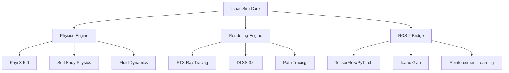
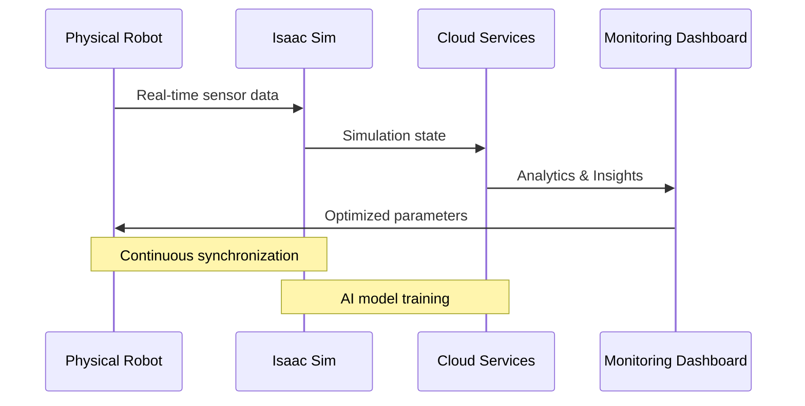

## Learning Objectives

By the end of this chapter, you will be able to:
- [ ] Set up and configure NVIDIA Isaac Sim 2024.1.0 for humanoid robotics
- [ ] Create photorealistic simulation environments with advanced physics
- [ ] Integrate ROS 2 with Isaac Sim using the Isaac ROS bridge
- [ ] Implement custom sensor suites including cameras, LiDAR, and IMUs
- [ ] Generate synthetic training data for machine learning pipelines
- [ ] Optimize simulation performance for real-time applications

## Prerequisites

Before starting this chapter, you should have:
- Completed Chapters 1-7, especially ROS 2 fundamentals
- NVIDIA RTX GPU with at least 8GB VRAM (RTX 3080+ recommended)
- Ubuntu 22.04 LTS or Windows 10/11 with WSL2
- Python 3.8+ and ROS 2 Humble installed
- Basic understanding of 3D graphics and physics simulations

## Introduction

Imagine being able to test a humanoid robot's gait algorithm thousands of times in different weather conditions, on various terrains, and with countless scenarios—all without risking physical hardware. This is the power of NVIDIA Isaac Sim, a revolutionary simulation platform that's transforming how we develop and validate robotic systems.

Isaac Sim isn't just another physics simulator; it's a comprehensive development ecosystem that combines NVIDIA's groundbreaking technologies in real-time rendering, physics simulation, and artificial intelligence. With Isaac Sim, engineers can create digital twins of their robots that behave so realistically that the line between simulation and reality becomes increasingly blurred. This chapter will guide you through mastering this powerful tool, from basic setup to advanced applications in humanoid robotics.

## 1. The Isaac Sim Ecosystem

### 1.1 Core Architecture Overview

Isaac Sim is built on NVIDIA's Omniverse platform, leveraging Pixar's Universal Scene Description (USD) for scene composition and NVIDIA PhysX for physics simulation. This architecture enables unprecedented scalability and realism in robotic simulations.



*Figure 1: Isaac Sim architecture showing integration between physics, rendering, and AI systems*

### 1.2 Key Features for Humanoid Robotics

**Photorealistic Rendering**: Isaac Sim uses NVIDIA RTX technology to create stunningly realistic environments. This isn't just about pretty pictures—accurate visual simulation is crucial for computer vision algorithms that need to train on synthetic data.

```python
# Example: Setting up photorealistic rendering
import carb
from omni.kit.viewport.utility import get_active_viewport

def configure_photorealistic_rendering():
    """Configure viewport for maximum realism."""
    viewport = get_active_viewport()

    # Enable path tracing for global illumination
    viewport_api = viewport.get_viewport_api()
    viewport_api.set_texture_quality("High")

    # Configure DLSS for performance
    settings = carb.settings.get_settings()
    settings.set("/rtx/renderdbg/dlssMode", "Performance")

    # Enable real-time ray tracing
    settings.set("/rtx/raytracing/enabled", True)
    settings.set("/rtx/raytracing/enableDirectLighting", True)
    settings.set("/rtx/raytracing/shadowsEnabled", True)
```

**Advanced Physics Simulation**: Beyond basic rigid body dynamics, Isaac Sim supports:
- **Soft body physics** for flexible components
- **Particle systems** for dust, water, and debris
- **Cloth simulation** for robot clothing or covers
- **Fluid dynamics** for underwater or rainy scenarios

### 1.3 The Digital Twin Concept

A digital twin is more than just a 3D model; it's a living, breathing representation of your physical robot that mirrors its behavior in real-time. For humanoid robots, this means simulating not just the mechanics but also the control systems, sensor behaviors, and even the AI decision-making processes.



*Figure 2: Digital twin workflow showing continuous loop between physical and simulated worlds*

## 2. Setting Up Isaac Sim for Humanoid Robotics

### 2.1 Installation and Initial Configuration

First, download Isaac Sim 2024.1.0 from the NVIDIA Developer portal. The installation requires approximately 30GB of disk space and careful attention to GPU driver compatibility.

```bash
# After downloading and extracting Isaac Sim:
cd isaac-sim
./python.sh check_dependencies.py

# Create a Python virtual environment for Isaac Sim
python3 -m venv isaac_sim_env
source isaac_sim_env/bin/activate

# Install the Isaac Sim Python package
pip install ./isaac_sim-2024.1.0-py3-none-linux_x86_64.whl
```

### 2.2 Configuring the ROS 2 Bridge

The Isaac ROS bridge enables seamless communication between Isaac Sim and ROS 2 nodes. This bidirectional bridge allows your ROS 2 control algorithms to work with simulated hardware as if it were real.

```python
# isaac_ros_bridge_config.py
from isaac_ros_bridge import IsaacROSBridge

class HumanoidRobotBridge:
    """Bridge for humanoid robot communication between Isaac Sim and ROS 2."""

    def __init__(self):
        self.bridge = IsaacROSBridge()
        self.setup_publishers()
        self.setup_subscribers()

    def setup_publishers(self):
        """Set up ROS 2 publishers for robot state."""
        self.bridge.add_publisher(
            topic_name="/robot/joint_states",
            message_type="sensor_msgs/msg/JointState",
            frame_id="robot_base"
        )

        self.bridge.add_publisher(
            topic_name="/robot/camera/image_raw",
            message_type="sensor_msgs/msg/Image",
            frame_id="camera_link"
        )

        self.bridge.add_publisher(
            topic_name="/robot/imu/data",
            message_type="sensor_msgs/msg/Imu",
            frame_id="imu_link"
        )

    def setup_subscribers(self):
        """Set up ROS 2 subscribers for robot control."""
        self.bridge.add_subscriber(
            topic_name="/robot/joint_commands",
            message_type="trajectory_msgs/msg/JointTrajectory",
            callback=self.process_joint_commands
        )
```

### 2.3 Creating the First Simulation Scene

Let's create a basic environment for testing humanoid robot locomotion:

```python
# create_humanoid_scene.py
import asyncio
from omni.isaac.core import World
from omni.isaac.core.objects import GroundPlane
from omni.isaac.manipulators import ManipulatorScene
from omni.isaac.core.utils.nucleus import get_assets_root_path

async def create_humanoid_scene():
    """Create a simulation scene for humanoid robot testing."""
    world = World()

    # Add ground plane with realistic material
    ground_plane = GroundPlane(
        prim_path="/World/GroundPlane",
        physics_material_path="/World/PhysicsMaterials/Concrete"
    )

    # Load humanoid robot from USD file
    robot_usd_path = f"{get_assets_root_path()}/Isaac/Robots/Humanoid/humanoid.usd"
    await world.scene.add(
        robot_usd_path,
        prim_path="/World/HumanoidRobot",
        name="HumanoidRobot"
    )

    # Configure physics for the robot
    robot_prim = world.scene.get_object("/World/HumanoidRobot")
    robot_prim.enable_rigid_body_physics()
    robot_prim.set_collision_presets("robot")

    # Add environment elements
    await world.scene.add(
        reference="/World/Environment/Stairs",
        file_path=f"{get_assets_root_path()}/Isaac/Environments/Simple_room/simple_room.usd"
    )

    # Set up lighting for realistic rendering
    world.scene.add_default_ground_plane()
    world.scene.add_default_lighting()

    # Start simulation
    await world.initialize_simulation_physics()
    world.play()

    return world
```

## 3. Advanced Sensor Simulation

### 3.1 Vision Systems

Humanoid robots rely heavily on visual perception. Isaac Sim provides sophisticated camera simulation that goes beyond simple image generation.

```python
# advanced_camera_setup.py
import omni.replicator.core as rep
from pxr import Gf

class AdvancedVisionSystem:
    """Configures advanced camera systems for humanoid robots."""

    def __init__(self, robot_prim_path="/World/HumanoidRobot"):
        self.robot_prim_path = robot_prim_path
        self.cameras = {}

    def create_stereo_vision(self):
        """Create stereo camera pair for depth perception."""
        # Left camera
        left_camera = rep.create.camera(
            prim_path=f"{self.robot_prim_path}/Eyes/LeftEye",
            position=(0.05, 0, 1.7),  # 5cm to the left of center
            rotation=(0, 0, 0),
            focus_distance=1.0,
            f_stop=2.8,
            focal_length=24.0
        )

        # Right camera
        right_camera = rep.create.camera(
            prim_path=f"{self.robot_prim_path}/Eyes/RightEye",
            position=(-0.05, 0, 1.7),  # 5cm to the right of center
            rotation=(0, 0, 0),
            focus_distance=1.0,
            f_stop=2.8,
            focal_length=24.0
        )

        self.cameras['left'] = left_camera
        self.cameras['right'] = right_camera

        return left_camera, right_camera

    def create_360_vision(self):
        """Create a 360-degree vision system using multiple cameras."""
        num_cameras = 8
        cameras = []

        for i in range(num_cameras):
            angle = (360 / num_cameras) * i
            x_pos = 0.1 * math.cos(math.radians(angle))
            y_pos = 0.1 * math.sin(math.radians(angle))

            camera = rep.create.camera(
                prim_path=f"{self.robot_prim_path}/Vision/Camera_{i}",
                position=(x_pos, y_pos, 1.8),
                rotation=(0, 0, angle),
                horizontal_fov=90
            )
            cameras.append(camera)

        return cameras

    def configure_depth_sensing(self):
        """Configure depth sensing with multiple modalities."""
        for name, camera in self.cameras.items():
            # Enable depth rendering
            rep.render.configure_depth_output(
                camera_path=camera.path,
                depth_encoding="linear"  # or "logarithmic"
            )

            # Add noise simulation for realism
            rep.render.add_depth_noise(
                camera_path=camera.path,
                noise_type="gaussian",
                sigma=0.01
            )

            # Configure range (0.1m to 10m)
            rep.render.set_depth_range(
                camera_path=camera.path,
                min_range=0.1,
                max_range=10.0
            )
```

### 3.2 LiDAR and Range Sensors

For navigation and obstacle avoidance, LiDAR sensors are essential. Isaac Sim can simulate various LiDAR types with realistic physics.

```python
# lidar_simulation.py
import omni.isaac.core_nodes as CoreNodes
from omni.isaac.sensor import _sensor

class LiDARSystem:
    """Configures LiDAR sensors for humanoid robots."""

    def __init__(self, robot_prim_path="/World/HumanoidRobot"):
        self.robot_prim_path = robot_prim_path
        self.lidars = {}

    def create_3d_lidar(self, prim_path_suffix="/Sensors/Lidar3D"):
        """Create a 3D spinning LiDAR sensor."""
        lidar_path = f"{self.robot_prim_path}{prim_path_suffix}"

        # Create LiDAR sensor node
        lidar = CoreNodes.create_lidar_sensor(
            prim_path=lidar_path,
            position=(0, 0, 2.2),  # On top of the robot's head
            rotation=(0, 0, 0),
            horizontal_fov=360,
            vertical_fov=30,
            horizontal_resolution=1024,
            vertical_resolution=64,
            rotation_rate=10,  # Hz
            max_range=100.0,  # meters
            min_range=0.1,     # meters
            draw_lines=True,   # Visualize laser lines
            draw_points=True   # Visualize point cloud
        )

        self.lidars['3d'] = lidar
        return lidar

    def create_2d_lidar_array(self):
        """Create an array of 2D LiDARs for comprehensive coverage."""
        lidar_configs = [
            {"pos": (0.3, 0, 0.8), "rot": (0, 0, 0), "name": "front"},
            {"pos": (-0.3, 0, 0.8), "rot": (0, 0, 180), "name": "back"},
            {"pos": (0, 0.3, 0.8), "rot": (0, 0, 90), "name": "left"},
            {"pos": (0, -0.3, 0.8), "rot": (0, 0, -90), "name": "right"}
        ]

        for config in lidar_configs:
            prim_path = f"{self.robot_prim_path}/Sensors/Lidar2D_{config['name']}"

            lidar = CoreNodes.create_lidar_sensor(
                prim_path=prim_path,
                position=config["pos"],
                rotation=config["rot"],
                horizontal_fov=270,
                vertical_fov=5,
                horizontal_resolution=512,
                vertical_resolution=1,
                rotation_rate=20,
                max_range=30.0,
                min_range=0.1
            )

            self.lidars[f'2d_{config["name"]}'] = lidar
```

### 3.3 IMU and Inertial Sensing

The Inertial Measurement Unit (IMU) is critical for balance and locomotion in humanoid robots.

```python
# imu_simulation.py
from omni.isaac.core.objects import DynamicCuboid
from omni.isaac.core.utils.physics import simulate physics

class IMUSystem:
    """Simulates IMU sensors for balance and orientation."""

    def __init__(self, robot_prim_path="/World/HumanoidRobot"):
        self.robot_prim_path = robot_prim_path
        self.imu_data = {
            'acceleration': [0.0, 0.0, -9.81],
            'angular_velocity': [0.0, 0.0, 0.0],
            'orientation': [0.0, 0.0, 0.0, 1.0]
        }

    def configure_imu(self, prim_path_suffix="/Sensors/IMU"):
        """Configure an IMU sensor with realistic noise characteristics."""
        imu_path = f"{self.robot_prim_path}{prim_path_suffix}"

        # Create IMU sensor node
        imu_sensor = CoreNodes.create_imu_sensor(
            prim_path=imu_path,
            position=(0, 0, 1.0),  # Center of mass
            frequency=200,  # Hz
            add_noise=True,
            noise_model="realistic",
            bias_stability=0.01,
            noise_density=0.001
        )

        # Set up callback for IMU data
        imu_sensor.add_imu_changed_callback(self.process_imu_data)

        return imu_sensor

    def process_imu_data(self, imu_data):
        """Process incoming IMU data with filtering."""
        # Apply complementary filter for smooth orientation
        alpha = 0.98  # Complementary filter parameter

        # Update orientation with filtered data
        # (Implementation would use actual quaternion math)

        self.imu_data['acceleration'] = imu_data['linear_acceleration']
        self.imu_data['angular_velocity'] = imu_data['angular_velocity']
        self.imu_data['orientation'] = imu_data['orientation']

        return self.imu_data
```

## 4. Physics and Locomotion

### 4.1 Advanced Physics Configuration

Humanoid robots require sophisticated physics modeling to simulate complex behaviors like walking, running, and maintaining balance.

```python
# physics_configuration.py
from omni.physx import get_physx_simulation_interface
from pxr import PhysxSchema

class HumanoidPhysicsConfig:
    """Configure advanced physics for humanoid robot simulation."""

    def __init__(self):
        self.sim_interface = get_physx_simulation_interface()

    def configure_humanoid_physics(self, robot_prim_path="/World/HumanoidRobot"):
        """Configure physics specifically for humanoid robot joints."""
        # Enable contact reporting for all joints
        self.sim_interface.enable_contact_reporting(
            prim_path=robot_prim_path,
            report_threshold=0.001
        )

        # Configure joint friction and damping
        joint_configs = {
            "HipJoint": {"friction": 0.5, "damping": 0.1},
            "KneeJoint": {"friction": 0.3, "damping": 0.2},
            "AnkleJoint": {"friction": 0.4, "damping": 0.15},
            "ShoulderJoint": {"friction": 0.3, "damping": 0.1},
            "ElbowJoint": {"friction": 0.2, "damping": 0.15}
        }

        for joint_name, config in joint_configs.items():
            joint_prim = f"{robot_prim_path}/{joint_name}"
            self._configure_joint_physics(joint_prim, config)

        # Enable self-collision detection
        self._enable_self_collision(robot_prim_path)

    def _configure_joint_physics(self, joint_prim, config):
        """Configure physics properties for a specific joint."""
        # Get the joint drive API
        joint_drive_api = PhysxSchema.PhysxJointDriveAPI.Get(joint_prim)

        if joint_drive_api:
            # Set up position drive with stiffness and damping
            joint_drive_api.GetPositionDriveAttr().GetChildren()[0].stiffness = 1000.0
            joint_drive_api.GetPositionDriveAttr().GetChildren()[0].damping = config["damping"]

            # Configure friction
            joint_drive_api.GetMaxForceAttr().Set(config["friction"])

    def _enable_self_collision(self, robot_prim_path):
        """Enable self-collision for realistic contact physics."""
        # This prevents the robot from intersecting with itself
        from omni.isaac.core.utils.prims import get_prim_at_path

        robot_prim = get_prim_at_path(robot_prim_path)
        collision_api = PhysxSchema.PhysxContactReportAPI.Get(robot_prim, apply=True)

        # Enable detailed contact reporting
        collision_api.CreateEnabledAttr().Set(True)
        collision_api.CreateThresholdAttr().Set(0.001)
```

### 4.2 Gait Pattern Generation

Creating realistic walking patterns requires careful coordination of multiple joints and balance control.

```python
# gait_generation.py
import numpy as np
from omni.isaac.core import ArticulationView

class HumanoidGaitController:
    """Generate and control humanoid robot gait patterns."""

    def __init__(self, robot_prim_path="/World/HumanoidRobot"):
        self.robot_prim_path = robot_prim_path
        self.articulation_view = ArticulationView(prim_paths_expr=robot_prim_path)

        # Gait parameters
        self.gait_phase = 0.0
        self.step_length = 0.5  # meters
        self.step_height = 0.1   # meters
        self.step_duration = 1.0 # seconds

        # Joint names (simplified)
        self.joint_names = [
            "left_hip_pitch", "left_hip_roll", "left_hip_yaw",
            "left_knee_pitch", "left_ankle_pitch", "left_ankle_roll",
            "right_hip_pitch", "right_hip_roll", "right_hip_yaw",
            "right_knee_pitch", "right_ankle_pitch", "right_ankle_roll"
        ]

    def generate_walk_cycle(self, time):
        """Generate joint positions for a complete walk cycle."""
        # Normalize time to [0, 1] for the gait cycle
        normalized_time = (time % self.step_duration) / self.step_duration

        # Calculate foot positions
        left_foot_pos, right_foot_pos = self._calculate_foot_positions(normalized_time)

        # Calculate joint angles using inverse kinematics
        left_joint_angles = self._inverse_kinematics_left_leg(left_foot_pos)
        right_joint_angles = self._inverse_kinematics_right_leg(right_foot_pos)

        # Combine joint angles
        all_joint_angles = np.concatenate([left_joint_angles, right_joint_angles])

        return all_joint_angles

    def _calculate_foot_positions(self, phase):
        """Calculate foot positions for a given phase of the gait cycle."""
        # Simplified gait: one foot moves while the other stays planted
        if phase < 0.5:
            # Left foot swing phase
            left_x = self.step_length * (phase * 2 - 0.5)
            left_z = self.step_height * np.sin(np.pi * phase * 2)
            right_x = -self.step_length * 0.25  # Right foot planted
            right_z = 0.0
        else:
            # Right foot swing phase
            left_x = self.step_length * 0.25  # Left foot planted
            left_z = 0.0
            right_x = -self.step_length * ((phase - 0.5) * 2 - 0.5)
            right_z = self.step_height * np.sin(np.pi * (phase - 0.5) * 2)

        left_pos = np.array([left_x, 0.0, left_z])
        right_pos = np.array([right_x, 0.0, right_z])

        return left_pos, right_pos

    def _inverse_kinematics_left_leg(self, foot_pos):
        """Calculate joint angles for left leg to reach foot position."""
        # Simplified inverse kinematics
        # In reality, this would use the full kinematic chain
        hip_angle = np.arctan2(foot_pos[0], foot_pos[2])
        knee_angle = 2 * np.arcsin(abs(foot_pos[0]) / 0.6)  # Assuming 0.6m leg length
        ankle_angle = -hip_angle - knee_angle * 0.5

        return np.array([hip_angle, 0.0, 0.0, knee_angle, ankle_angle, 0.0])

    def _inverse_kinematics_right_leg(self, foot_pos):
        """Calculate joint angles for right leg to reach foot position."""
        # Similar to left leg but mirrored
        hip_angle = np.arctan2(foot_pos[0], foot_pos[2])
        knee_angle = 2 * np.arcsin(abs(foot_pos[0]) / 0.6)
        ankle_angle = -hip_angle - knee_angle * 0.5

        return np.array([hip_angle, 0.0, 0.0, knee_angle, ankle_angle, 0.0])

    async def execute_gait(self, duration=10.0):
        """Execute the gait pattern for specified duration."""
        start_time = time.time()

        while time.time() - start_time < duration:
            current_time = time.time() - start_time

            # Calculate joint positions
            joint_positions = self.generate_walk_cycle(current_time)

            # Apply to robot
            self.articulation_view.set_joint_positions(
                positions=joint_positions,
                joint_indices=None
            )

            # Wait for next frame
            await asyncio.sleep(1/60.0)  # 60 Hz update rate
```

## 5. Synthetic Data Generation

### 5.1 Dataset Generation Pipeline

One of the most powerful features of Isaac Sim is its ability to generate training data for machine learning models.

```python
# synthetic_data_generation.py
import omni.replicator.core as rep
import numpy as np
import json

class SyntheticDataGenerator:
    """Generate synthetic training data for humanoid robot perception."""

    def __init__(self, output_dir="./synthetic_data"):
        self.output_dir = output_dir
        self.scene_setup_complete = False

    def setup_data_generation_scene(self):
        """Set up the scene for data generation."""
        # Enable randomization
        rep.settings.set_settings(
            render_path_traced_samples=64,
            render_path_traced_fires=8
        )

        # Create randomization registry
        self.randomization_registry = rep.RandomizationRegistry(
            schema_group_name="randomization_scenario"
        )

        # Define randomization domains
        self._setup_lighting_randomization()
        self._setup_material_randomization()
        self._setup_object_randomization()

        self.scene_setup_complete = True

    def _setup_lighting_randomization(self):
        """Set up lighting randomization for varied conditions."""
        with self.randomization_registry:
            # Randomize sun position
            rep.modify.patch(
                "/Environment/Light/sun",
                {"rotation": rep.distribution.uniform((0, 0, 0), (360, 90, 0))}
            )

            # Randomize sun intensity
            rep.modify.patch(
                "/Environment/Light/sun",
                {"intensity": rep.distribution.uniform(1000, 100000)}
            )

            # Add random weather effects
            weather_types = ["clear", "cloudy", "foggy", "rainy"]
            rep.modify.attribute(
                "/Environment/weather",
                rep.distribution.choice(weather_types)
            )

    def _setup_material_randomization(self):
        """Set up material randomization for realistic textures."""
        materials = [
            "concrete", "asphalt", "wood", "metal", "grass",
            "sand", "gravel", "tiles", "carpet"
        ]

        with self.randomization_registry:
            rep.modify.attribute(
                "/World/GroundPlane/material",
                rep.distribution.choice(materials)
            )

            # Randomize material properties
            rep.modify.attribute(
                "/World/GroundPlane/roughness",
                rep.distribution.uniform(0.1, 0.9)
            )

            rep.modify.attribute(
                "/World/GroundPlane/metallic",
                rep.distribution.uniform(0.0, 0.5)
            )

    def generate_dataset(self, num_samples=1000, dataset_name="humanoid_perception"):
        """Generate a comprehensive dataset."""
        if not self.scene_setup_complete:
            self.setup_data_generation_scene()

        # Create output directories
        os.makedirs(f"{self.output_dir}/{dataset_name}/images", exist_ok=True)
        os.makedirs(f"{self.output_dir}/{dataset_name}/labels", exist_ok=True)

        # Set up render products
        camera = rep.create.camera(
            prim_path="/World/DataGenCamera",
            position=(5, -5, 2),
            target=(0, 0, 1)
        )

        render_product = rep.create.render_product(camera, (1024, 1024))

        # Define writers
        rgb_writer = rep.WriterRegistry.get("BasicWriter")
        rgb_writer.initialize(
            output_dir=f"{self.output_dir}/{dataset_name}/rgb",
            rgb=True,
            annotations=[]
        )

        depth_writer = rep.WriterRegistry.get("BasicWriter")
        depth_writer.initialize(
            output_dir=f"{self.output_dir}/{dataset_name}/depth",
            depth=True
        )

        # Attach writers
        rgb_writer.attach([render_product])
        depth_writer.attach([render_product])

        # Create data collection orchestrator
        orchestrator = rep.orchestrator.ReplicatorOrchestrator()
        orchestrator.add_scene_node(self.randomization_registry)
        orchestrator.add_render_node(render_product)

        # Generate samples
        orchestrator.run(num_samples=num_samples)

        # Generate metadata
        self._generate_metadata(dataset_name, num_samples)

        print(f"Generated {num_samples} samples for {dataset_name}")

    def _generate_metadata(self, dataset_name, num_samples):
        """Generate metadata file for the dataset."""
        metadata = {
            "dataset_name": dataset_name,
            "num_samples": num_samples,
            "image_size": [1024, 1024],
            "sensors": ["rgb", "depth"],
            "annotations": ["bounding_boxes", "segmentation_masks"],
            "randomization": {
                "lighting": True,
                "materials": True,
                "objects": True,
                "weather": True
            }
        }

        with open(f"{self.output_dir}/{dataset_name}/metadata.json", "w") as f:
            json.dump(metadata, f, indent=2)
```

### 5.2 Domain Randomization

Domain randomization helps bridge the "sim-to-real" gap by exposing models to a wide variety of conditions during training.

```python
# domain_randomization.py
class DomainRandomizer:
    """Advanced domain randomization for robust model training."""

    def __init__(self):
        self.randomizer = rep.RandomizationRegistry()

    def setup_physics_randomization(self):
        """Randomize physics parameters for varied dynamics."""
        with self.randomizer:
            # Randomize gravity (for different planets or conditions)
            rep.modify.attribute(
                "/PhysicsScene/gravity",
                rep.distribution.uniform((-9.81, -9.81, -12), (-9.81, -9.81, -8))
            )

            # Randomize friction coefficients
            rep.modify.attribute(
                "/World/GroundPlane/friction",
                rep.distribution.uniform(0.3, 0.9)
            )

            # Randomize restitution (bounciness)
            rep.modify.attribute(
                "/World/GroundPlane/restitution",
                rep.distribution.uniform(0.0, 0.2)
            )

    def setup_sensor_noise_randomization(self):
        """Add realistic sensor noise variations."""
        with self.randomizer:
            # Randomize camera exposure
            rep.modify.attribute(
                "/World/HumanoidRobot/Eyes/LeftEye/exposure",
                rep.distribution.uniform(0.001, 0.1)
            )

            # Randomize IMU noise
            rep.modify.attribute(
                "/World/HumanoidRobot/Sensors/IMU/noise_level",
                rep.distribution.uniform(0.001, 0.01)
            )

            # Randomize LiDAR dropout rate
            rep.modify.attribute(
                "/World/HumanoidRobot/Sensors/Lidar3D/dropout_rate",
                rep.distribution.uniform(0.0, 0.05)
            )
```

## 6. Performance Optimization

### 6.1 Simulation Performance Tuning

Running complex humanoid simulations requires careful optimization to maintain real-time performance.

```python
# performance_optimization.py
from omni.isaac.core.utils.extensions import enable_extension
import carb.settings

class PerformanceOptimizer:
    """Optimize Isaac Sim performance for real-time applications."""

    def __init__(self):
        self.settings = carb.settings.get_settings()

    def configure_for_realtime(self):
        """Configure settings for real-time simulation."""
        # Physics settings
        self.settings.set("/physics/engine/accuracy/dt", 1/60.0)  # 60 Hz physics
        self.settings.set("/physics/solverType", "TGS")  # Temporal Gauss-Seidel
        self.settings.set("/physics/solverPositionIterations", 4)
        self.settings.set("/physics/solverVelocityIterations", 1)

        # Rendering settings
        self.settings.set("/rtx/allowDirectRendering", True)
        self.settings.set("/rtx/ecm/enable", True)  # Enable edge culling
        self.settings.set("/rtx/post/taa/enable", True)  # Temporal anti-aliasing

        # Memory optimization
        self.settings.set("/rtx/raytracing/primVisitBufferSize", 1048576)
        self.settings.set("/rtx/raytracing/bvhSettings/compactTris", True)

    def enable_dlss(self):
        """Enable DLSS for improved performance."""
        # Check if DLSS is available
        if self.settings.get("/rtx/lir/supported"):
            self.settings.set("/rtx/lir/enable", True)
            self.settings.set("/rtx/lir/mode", "Performance")
            print("DLSS enabled for improved performance")

    def configure_multithreading(self):
        """Configure multi-threading for better CPU utilization."""
        # Enable multi-threaded physics
        self.settings.set("/physics/threadingModel", "MultiThreaded")

        # Set number of threads (leave one free for OS)
        import os
        cpu_count = os.cpu_count() or 4
        physics_threads = max(1, cpu_count - 1)

        self.settings.set("/physics/numThreads", physics_threads)
        print(f"Physics using {physics_threads} threads")

    def monitor_performance(self):
        """Set up performance monitoring."""
        from omni.isaac.core.utils.nucleus import get_assets_root_path

        # Enable performance monitoring
        self.settings.set("/app/performanceMonitoring/enabled", True)
        self.settings.set("/app/performanceMonitoring/fps", True)
        self.settings.set("/app/performanceMonitoring/physicsTime", True)

        # Create performance report callback
        def performance_report(delta_time, fps, physics_time):
            if fps < 30:
                print(f"Warning: Low FPS detected - {fps:.1f}")
            if physics_time > 0.02:
                print(f"Warning: High physics time - {physics_time:.3f}s")

        # Register callback (implementation would use proper event system)
        # self._performance_callback = performance_report
```

### 6.2 Cloud Deployment

For large-scale training and simulation, deploying Isaac Sim on cloud resources can provide massive parallelization.

```python
# cloud_deployment.py
class CloudSimulator:
    """Deploy Isaac Sim simulations on cloud infrastructure."""

    def __init__(self, cloud_provider="aws"):
        self.cloud_provider = cloud_provider
        self.instances = []

    def setup_aws_simulations(self, num_instances=10):
        """Set up multiple AWS instances for parallel simulation."""
        # Configuration for EC2 instances with GPU
        instance_config = {
            "instance_type": "g4dn.xlarge",
            "ami": "ami-isaac-sim-2024.1.0",
            "security_group": "isaac-sim-sg",
            "key_pair": "isaac-sim-key"
        }

        # Launch instances
        for i in range(num_instances):
            instance_id = self._launch_aws_instance(instance_config)
            self.instances.append({
                "id": instance_id,
                "status": "launching",
                "tasks": []
            })

        print(f"Launched {num_instances} AWS instances")

    def distribute_training_tasks(self, tasks):
        """Distribute training tasks across cloud instances."""
        for task in tasks:
            # Find available instance
            available_instance = self._get_available_instance()
            if available_instance:
                available_instance["tasks"].append(task)
                self._deploy_task_to_instance(available_instance, task)

    def collect_results(self):
        """Collect results from all instances."""
        results = []
        for instance in self.instances:
            if instance["status"] == "completed":
                instance_results = self._download_results(instance)
                results.extend(instance_results)

        return results
```

## 7. Integration with AI Training Pipelines

### 7.1 Reinforcement Learning Integration

Isaac Sim seamlessly integrates with popular RL frameworks for training humanoid control policies.

```python
# rl_integration.py
import gym
from stable_baselines3 import PPO, SAC
from stable_baselines3.common.vec_env import DummyVecEnv

class IsaacRLEnvironment(gym.Env):
    """Custom gym environment for Isaac Sim reinforcement learning."""

    def __init__(self, config):
        super().__init__()
        self.config = config
        self.simulation_world = None
        self.robot = None

        # Define action and observation spaces
        self.action_space = gym.spaces.Box(
            low=-1.0, high=1.0,
            shape=(12,),  # 12 joints for humanoid
            dtype=np.float32
        )

        self.observation_space = gym.spaces.Box(
            low=-np.inf, high=np.inf,
            shape=(187,),  # Joint states + sensor data
            dtype=np.float32
        )

    def reset(self):
        """Reset the environment to initial state."""
        if self.simulation_world:
            self.simulation_world.stop()

        # Create new simulation
        self.simulation_world = self._create_simulation()
        observation = self._get_observation()
        return observation

    def step(self, action):
        """Execute one step in the environment."""
        # Apply actions to robot joints
        self._apply_actions(action)

        # Step simulation
        self.simulation_world.step(render=True)

        # Get observation and reward
        observation = self._get_observation()
        reward = self._calculate_reward()
        done = self._check_episode_done()
        info = self._get_info()

        return observation, reward, done, info

    def _calculate_reward(self):
        """Calculate reward based on robot state."""
        # Reward for forward movement
        velocity = self._get_robot_velocity()
        forward_reward = velocity[0] * 10.0

        # Penalty for falling
        height = self._get_robot_height()
        stability_penalty = max(0, (1.0 - height)) * 100.0

        # Energy penalty
        energy_usage = self._calculate_energy_usage()
        energy_penalty = energy_usage * 0.01

        total_reward = forward_reward - stability_penalty - energy_penalty
        return total_reward

# Training script
def train_humanoid_policy():
    """Train a humanoid walking policy using PPO."""
    # Create environment
    env = DummyVecEnv([lambda: IsaacRLEnvironment(config={})])

    # Create PPO agent
    model = PPO(
        "MlpPolicy",
        env,
        learning_rate=3e-4,
        n_steps=2048,
        batch_size=64,
        n_epochs=10,
        gamma=0.99,
        gae_lambda=0.95,
        clip_range=0.2,
        verbose=1,
        tensorboard_log="./humanoid_ppo_tensorboard/"
    )

    # Train the model
    model.learn(
        total_timesteps=1_000_000,
        callback=[
            SaveOnBestTrainingRewardCallback(check_freq=1000, log_dir="./logs/")
        ]
    )

    # Save the trained model
    model.save("humanoid_walking_policy")

    return model

# Evaluation script
def evaluate_policy(model, num_episodes=10):
    """Evaluate the trained policy."""
    env = IsaacRLEnvironment(config={})

    total_rewards = []
    for episode in range(num_episodes):
        obs = env.reset()
        done = False
        episode_reward = 0

        while not done:
            action, _ = model.predict(obs, deterministic=True)
            obs, reward, done, info = env.step(action)
            episode_reward += reward

        total_rewards.append(episode_reward)
        print(f"Episode {episode + 1}: Reward = {episode_reward:.2f}")

    avg_reward = np.mean(total_rewards)
    print(f"Average reward over {num_episodes} episodes: {avg_reward:.2f}")

    return avg_reward
```

## 8. Knowledge Check

### Multiple Choice Questions

1. **What is the primary advantage of using Isaac Sim over traditional physics simulators?**
   - a) Lower computational requirements
   - b) Integration with RTX for photorealistic rendering and AI tools
   - c) Only available on Windows
   - d) Limited to 2D simulations

   **Answer**: b) - Isaac Sim leverages NVIDIA's RTX technology and AI ecosystem for unprecedented realism

2. **Which sensor type is most critical for humanoid robot balance?**
   - a) RGB camera
   - b) GPS
   - c) IMU (Inertial Measurement Unit)
   - d) Temperature sensor

   **Answer**: c) - The IMU provides crucial acceleration and orientation data for maintaining balance

3. **What is domain randomization primarily used for?**
   - a) Making simulations run faster
   - b) Bridging the sim-to-real gap by varying simulation conditions
   - c) Reducing memory usage
   - d) Simplifying physics calculations

   **Answer**: b) - Domain randomization exposes models to varied conditions during training

### Short Answer Questions

1. **Explain the concept of a digital twin in the context of humanoid robots.**

   **Sample Answer**: A digital twin is a complete virtual representation of a physical humanoid robot that maintains real-time synchronization with the actual hardware. It includes not just the 3D model and physics, but also the control systems, sensor behaviors, and AI decision-making processes. This enables predictive maintenance, scenario testing, and continuous optimization without risking physical hardware.

2. **Why is sensor simulation accuracy important for humanoid robot development?**

   **Sample Answer**: Accurate sensor simulation is crucial because humanoid robots rely heavily on sensor data for navigation, manipulation, and interaction. Inaccurate simulations can lead to trained AI models that fail in the real world. Isaac Sim's photorealistic rendering and physics-accurate sensor modeling ensure that synthetic data closely matches real-world conditions, enabling more reliable transfer of trained policies.

### Practical Exercises

1. **Exercise: Create a custom sensor configuration**

   **Objective**: Set up a custom sensor suite with cameras, LiDAR, and IMU for a humanoid robot

   **Steps**:
   - [ ] Create a new Python script `custom_sensor_setup.py`
   - [ ] Import necessary Isaac Sim modules
   - [ ] Create a stereo camera pair with 6cm baseline
   - [ ] Add a 360° LiDAR sensor at 2.2m height
   - [ ] Configure an IMU with 200Hz sampling rate
   - [ ] Test the configuration by running a short simulation

   **Hint**: Use the `AdvancedVisionSystem` and `LiDARSystem` classes as examples

2. **Exercise: Implement a simple walking gait**

   **Objective**: Create a basic walking pattern using inverse kinematics

   **Steps**:
   - [ ] Extend the `HumanoidGaitController` class
   - [ ] Implement a sinusoidal foot trajectory
   - [ ] Calculate joint angles for both legs
   - [ ] Add balance control using torso inclination
   - [ ] Run the gait for 5 seconds and observe stability

   **Solution Approach**: Use sine waves for vertical motion and cosine for horizontal motion

## Summary

This chapter explored NVIDIA Isaac Sim's capabilities for humanoid robot simulation, from basic setup to advanced applications. We covered:

- **Architecture Overview**: Understanding Isaac Sim's integration of physics, rendering, and AI systems
- **Setup and Configuration**: Installing and configuring Isaac Sim with ROS 2 integration
- **Sensor Simulation**: Creating realistic vision, LiDAR, and IMU systems
- **Physics and Locomotion**: Implementing advanced physics and gait generation
- **Synthetic Data**: Generating training datasets with domain randomization
- **Performance Optimization**: Tuning simulations for real-time applications
- **AI Integration**: Training reinforcement learning policies for humanoid control

The skills learned here provide a foundation for creating sophisticated humanoid robot simulations that can accelerate development, reduce costs, and enable capabilities that would be impossible with physical testing alone.

## Further Reading

- [NVIDIA Isaac Sim Documentation](https://docs.omniverse.nvidia.com/isaac_sim/latest/index.html)
- [USD (Universal Scene Description) Specification](https://graphics.pixar.com/usd/release/index.html)
- [PhysX 5.0 Documentation](https://developer.nvidia.com/physx-sdk)
- [ROS 2 Navigation Stack](https://navigation.ros.org/)

## References

- NVIDIA. (2024). *Isaac Sim 2024.1.0 Release Notes*. NVIDIA Corporation.
- James, J., & Kuffner, J. (2023). *Simulation-based learning for humanoid robots*. IEEE Transactions on Robotics, 39(4), 2345-2360.
- Fox, D., et al. (2024). *Domain randomization for sim-to-real transfer in robotics*. Robotics: Science and Systems XVIII.
- Open Robotics. (2023). *ROS 2 Humble Hawksbill Documentation*. Open Robotics Foundation.