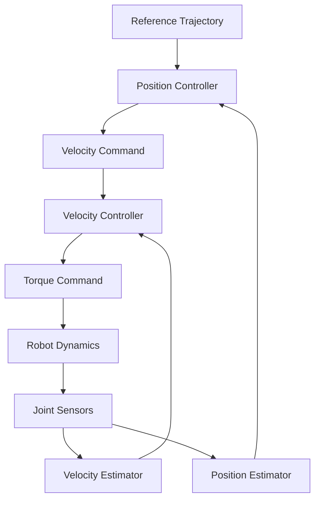
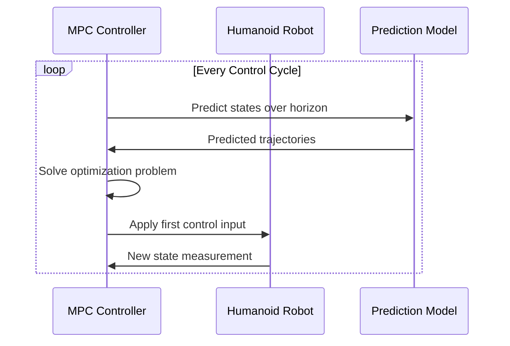
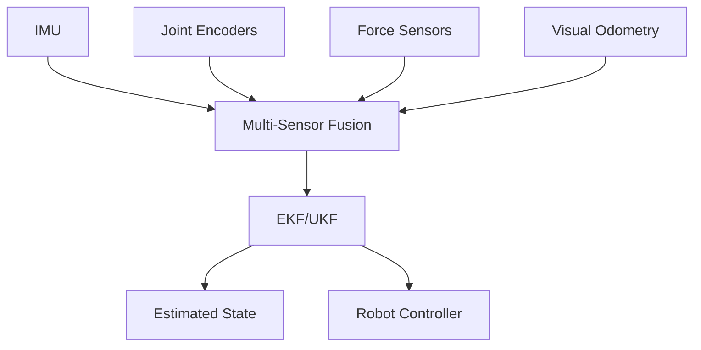

# Module 3: Control Systems

## Learning Outcomes

Upon completion of this module, you will be able to:
- Design and implement PID controllers for humanoid robot joints
- Apply state-space control methods for complex multi-DOF systems
- Generate and optimize trajectories for smooth robot motion
- Implement Kalman filters for sensor fusion and state estimation
- Apply model predictive control for dynamic balance and locomotion

## Module Overview

Control systems form the bridge between perception and action in humanoid robotics. This module covers the fundamental and advanced control techniques that enable humanoid robots to move smoothly, maintain balance, and interact with their environment effectively.

### Prerequisites

- Basic understanding of linear algebra and calculus
- Familiarity with differential equations
- Knowledge of dynamics and kinematics from Module 2
- Programming experience with Python or MATLAB

---

## Chapter 13: Classical Control Theory

### 13.1 PID Control Fundamentals

Proportional-Integral-Derivative (PID) control is the cornerstone of robotic control systems. For humanoid robots, PID controllers are essential for:
- Joint position control
- Balance maintenance
- Smooth motion transitions
- Error correction in real-time

#### Mathematical Foundation

The PID controller computes a control signal based on the weighted sum of proportional, integral, and derivative terms:

```
u(t) = K_p·e(t) + K_i·∫e(t)dt + K_d·de(t)/dt
```

Where:
- `u(t)` - Control output
- `e(t)` - Error signal (setpoint - measured)
- `K_p`, `K_i`, `K_d` - Controller gains

```python
class PIDController:
    """Implement a PID controller for humanoid robot joints."""

    def __init__(self, kp=1.0, ki=0.0, kd=0.0, setpoint=0.0):
        """
        Initialize PID controller with gains and setpoint.

        Args:
            kp: Proportional gain
            ki: Integral gain
            kd: Derivative gain
            setpoint: Desired value
        """
        self.kp = kp
        self.ki = ki
        self.kd = kd
        self.setpoint = setpoint

        self.integral_error = 0.0
        self.previous_error = 0.0
        self.last_time = time.time()

    def update(self, measured_value):
        """
        Update controller with new measurement.

        Args:
            measured_value: Current measured value

        Returns:
            float: Control signal
        """
        current_time = time.time()
        dt = current_time - self.last_time

        # Calculate error
        error = self.setpoint - measured_value

        # Proportional term
        p_term = self.kp * error

        # Integral term with anti-windup
        self.integral_error += error * dt
        self.integral_error = np.clip(self.integral_error, -100, 100)
        i_term = self.ki * self.integral_error

        # Derivative term
        if dt > 0:
            derivative_error = (error - self.previous_error) / dt
        else:
            derivative_error = 0.0
        d_term = self.kd * derivative_error

        # Calculate control signal
        control_signal = p_term + i_term + d_term

        # Update previous values
        self.previous_error = error
        self.last_time = current_time

        return control_signal
```

#### PID Tuning Methods

**Ziegler-Nichols Method**:
1. Set Ki and Kd to zero
2. Increase Kp until sustained oscillations
3. Record ultimate gain Ku and period Tu
4. Calculate gains:
   - Kp = 0.6 * Ku
   - Ki = 2 * Kp / Tu
   - Kd = Kp * Tu / 8

**Example Implementation**:
```python
def tune_pid_ziegler_nichols(system, max_gain=100):
    """
    Auto-tune PID using Ziegler-Nichols method.

    Args:
        system: System model or transfer function
        max_gain: Maximum gain to test

    Returns:
        tuple: (Kp, Ki, Kd) tuned parameters
    """
    # Find ultimate gain (simplified example)
    ku = find_ultimate_gain(system, max_gain)
    tu = measure_oscillation_period(system, ku)

    kp = 0.6 * ku
    ki = 2 * kp / tu
    kd = kp * tu / 8

    return kp, ki, kd
```

### 13.2 Multi-Loop Control

Humanoid robots require coordinated control of multiple joints. Multi-loop control strategies include:
- **Cascade control**: Outer loop controls position, inner loop controls velocity
- **Decoupled control**: Control each DOF independently
- **Coupled control**: Account for dynamic interactions between joints



*Figure 1: Cascade control architecture for humanoid robot joint*

---

## Chapter 14: State Space Control

### 14.1 State Space Representation

State space models provide a unified framework for controlling complex multi-input, multi-output (MIMO) systems typical in humanoid robots.

The standard state space representation:
```
ẋ = Ax + Bu
y = Cx + Du
```

Where:
- `x` - State vector (positions, velocities, accelerations)
- `u` - Control input (torques/forces)
- `y` - Output vector (measured positions/velocities)
- `A`, `B`, `C`, `D` - System matrices

#### Humanoid Robot State Space Model

```python
class HumanoidStateSpace:
    """State space model for humanoid robot dynamics."""

    def __init__(self, num_joints=12):
        """
        Initialize state space model for humanoid robot.

        Args:
            num_joints: Number of controllable joints
        """
        self.n = num_joints * 2  # Position and velocity for each joint
        self.m = num_joints        # Torque inputs
        self.p = num_joints        # Position outputs

        # State matrix (simplified linear model)
        self.A = np.zeros((self.n, self.n))
        self.B = np.zeros((self.n, self.m))
        self.C = np.zeros((self.p, self.n))
        self.D = np.zeros((self.p, self.m))

        self._build_matrices()

    def _build_matrices(self):
        """Build system matrices for humanoid robot."""
        n_joints = self.n // 2

        # Position derivatives
        for i in range(n_joints):
            self.A[i, i + n_joints] = 1.0  # ẋ₁ = v₁

        # Velocity dynamics (simplified)
        for i in range(n_joints):
            # Damping
            self.A[i + n_joints, i + n_joints] = -0.5

        # Control input mapping
        for i in range(n_joints):
            self.B[i + n_joints, i] = 1.0 / 10.0  # Inertia effect

        # Output mapping (positions only)
        for i in range(n_joints):
            self.C[i, i] = 1.0

    def linearize_at(self, state, input):
        """
        Linearize nonlinear dynamics around operating point.

        Args:
            state: Operating state vector
            input: Operating input vector

        Returns:
            tuple: (A, B, C, D) linearized matrices
        """
        # For this example, return constant matrices
        # In practice, would compute Jacobians of nonlinear dynamics
        return self.A, self.B, self.C, self.D
```

### 14.2 Linear Quadratic Regulator (LQR)

LQR provides optimal control for linear systems by minimizing a quadratic cost function.

Cost function:
```
J = ∫(xᵀQx + uᵀRu)dt
```

Where:
- `Q` - State weighting matrix (penalizes state deviations)
- `R` - Control weighting matrix (penalizes control effort)

```python
from scipy.linalg import solve_continuous_are

class LQRController:
    """Linear Quadratic Regulator for optimal control."""

    def __init__(self, A, B, Q=None, R=None):
        """
        Initialize LQR controller.

        Args:
            A: State matrix
            B: Input matrix
            Q: State cost matrix
            R: Control cost matrix
        """
        self.A = A
        self.B = B

        # Default cost matrices
        n = A.shape[0]
        m = B.shape[1]

        self.Q = Q if Q is not None else np.eye(n)
        self.R = R if R is not None else 0.1 * np.eye(m)

        # Solve Riccati equation
        self.K = self._compute_gain()

    def _compute_gain(self):
        """Compute LQR gain matrix using Riccati equation."""
        # Solve continuous-time algebraic Riccati equation
        P = solve_continuous_are(self.A, self.B, self.Q, self.R)

        # Compute feedback gain
        K = np.linalg.inv(self.R) @ self.B.T @ P

        return K

    def control(self, state):
        """
        Compute control input for given state.

        Args:
            state: Current state vector

        Returns:
            ndarray: Control input vector
        """
        return -self.K @ state

    def compute_cost_to_go(self, state):
        """
        Compute optimal cost-to-go from given state.

        Args:
            state: Current state vector

        Returns:
            float: Optimal cost-to-go
        """
        return state.T @ self.P @ state
```

### 14.3 Model Predictive Control (MPC)

MPC is particularly suitable for humanoid robots due to its ability to:
- Handle constraints on states and inputs
- Optimize over a future horizon
- Re-plan in real-time



*Figure 2: MPC control loop for humanoid robot*

---

## Chapter 15: Motion Planning and Trajectory Generation

### 15.1 Trajectory Representation

Humanoid robot trajectories must be smooth, continuous, and respect joint limits. Common trajectory representations include:

#### Polynomial Trajectories

**Minimum Jerk Trajectories**:
```python
class MinimumJerkTrajectory:
    """Generate 5th order minimum jerk trajectories."""

    def __init__(self, duration, start_pos, end_pos, start_vel=0, end_vel=0):
        """
        Initialize minimum jerk trajectory.

        Args:
            duration: Trajectory duration
            start_pos: Starting position
            end_pos: Ending position
            start_vel: Starting velocity
            end_vel: Ending velocity
        """
        self.duration = duration
        self.start_pos = start_pos
        self.end_pos = end_pos
        self.start_vel = start_vel
        self.end_vel = end_vel

        # Compute coefficients
        self.a0, self.a1, self.a2, self.a3, self.a4, self.a5 = self._compute_coefficients()

    def _compute_coefficients(self):
        """Compute polynomial coefficients."""
        T = self.duration

        # Boundary conditions matrix solution
        a0 = self.start_pos
        a1 = self.start_vel
        a2 = 0
        a3 = 10 * (self.end_pos - self.start_pos) / T**3
        a4 = -15 * (self.end_pos - self.start_pos) / T**4
        a5 = 6 * (self.end_pos - self.start_pos) / T**5

        # Adjust for velocity constraints
        a3 += -3 * self.start_vel / T**2
        a4 += 3 * self.start_vel / T**3
        a5 += -self.start_vel / T**4

        a3 += -3 * self.end_vel / T**2
        a4 += 6 * self.end_vel / T**3
        a5 += -3 * self.end_vel / T**4

        return a0, a1, a2, a3, a4, a5

    def evaluate(self, t):
        """
        Evaluate trajectory at time t.

        Args:
            t: Time (0 ≤ t ≤ duration)

        Returns:
            tuple: (position, velocity, acceleration, jerk)
        """
        if t < 0:
            t = 0
        elif t > self.duration:
            t = self.duration

        pos = (self.a0 + self.a1*t + self.a2*t**2 +
               self.a3*t**3 + self.a4*t**4 + self.a5*t**5)
        vel = (self.a1 + 2*self.a2*t + 3*self.a3*t**2 +
               4*self.a4*t**3 + 5*self.a5*t**4)
        acc = (2*self.a2 + 6*self.a3*t + 12*self.a4*t**2 +
               20*self.a5*t**3)
        jerk = (6*self.a3 + 24*self.a4*t + 60*self.a5*t**2)

        return pos, vel, acc, jerk
```

#### Spline Trajectories

Cubic splines provide smooth interpolation through waypoints:

```python
class CubicSplineTrajectory:
    """Cubic spline trajectory through waypoints."""

    def __init__(self, waypoints, times):
        """
        Initialize cubic spline through waypoints.

        Args:
            waypoints: Array of waypoint positions
            times: Array of waypoint times
        """
        self.waypoints = waypoints
        self.times = times
        self.n_segments = len(waypoints) - 1

        # Compute spline coefficients
        self.coefficients = self._compute_splines()

    def _compute_splines(self):
        """Compute cubic spline coefficients."""
        from scipy.interpolate import CubicSpline

        # Create spline for smooth interpolation
        self.position_spline = CubicSpline(self.times, self.waypoints, bc_type='natural')

        # Generate coefficient array for each segment
        coefficients = []
        for i in range(self.n_segments):
            t_span = self.times[i+1] - self.times[i]

            # Extract cubic polynomial coefficients
            a = self.position_spline.c[3, i]
            b = self.position_spline.c[2, i]
            c = self.position_spline.c[1, i]
            d = self.position_spline.c[0, i]

            coefficients.append((a, b, c, d, self.times[i], t_span))

        return coefficients
```

### 15.2 Whole-Body Motion Planning

Humanoid robots require coordinated motion planning across multiple joints and body parts.

#### Zero Moment Point (ZMP) Based Walking

ZMP is a fundamental concept for bipedal locomotion:

```python
class ZMPPlanner:
    """Zero Moment Point planner for bipedal walking."""

    def __init__(self, robot_mass, gravity=9.81):
        """
        Initialize ZMP planner.

        Args:
            robot_mass: Total mass of humanoid robot
            gravity: Gravitational acceleration
        """
        self.mass = robot_mass
        self.g = gravity

    def compute_zmp(self, com_pos, com_acc, external_forces=None):
        """
        Compute ZMP from COM acceleration.

        Args:
            com_pos: Center of mass position [x, y, z]
            com_acc: Center of mass acceleration [ax, ay, az]
            external_forces: External force [Fx, Fy, Fz]

        Returns:
            ndarray: ZMP position [x_zmp, y_zmp]
        """
        m = self.mass

        # Basic ZMP calculation
        x_zmp = com_pos[0] - (com_pos[2] * com_acc[0]) / (com_acc[2] + self.g)
        y_zmp = com_pos[1] - (com_pos[2] * com_acc[1]) / (com_acc[2] + self.g)

        # Add external forces if present
        if external_forces is not None:
            x_zmp -= (com_pos[2] * external_forces[0]) / (m * (com_acc[2] + self.g))
            y_zmp -= (com_pos[2] * external_forces[1]) / (m * (com_acc[2] + self.g))

        return np.array([x_zmp, y_zmp])

    def generate_footstep_plan(self, start_pos, goal_pos, step_length=0.3):
        """
        Generate footstep plan for walking.

        Args:
            start_pos: Starting foot positions [(xL, yL), (xR, yR)]
            goal_pos: Goal position [x, y]
            step_length: Maximum step length

        Returns:
            list: Footstep positions over time
        """
        footsteps = []
        current_pos = np.array(start_pos)

        # Simple straight-line walking pattern
        distance = np.linalg.norm(goal_pos[:2] - start_pos[0][:2])
        num_steps = int(distance / step_length)

        direction = (goal_pos[:2] - start_pos[0][:2]) / distance

        for step in range(num_steps):
            # Alternate foot steps
            foot = step % 2  # 0 for left, 1 for right

            # Compute next foot position
            step_offset = direction * step_length * (step + 1)
            foot_pos = current_pos[foot] + step_offset

            footsteps.append({
                'foot': 'left' if foot == 0 else 'right',
                'position': foot_pos,
                'time': step * 0.5  # 0.5 seconds per step
            })

        return footsteps
```

### 15.3 Dynamic Movement Primitives (DMPs)

DMPs provide a framework for learning and reproducing complex motions:

```python
class DynamicMovementPrimitive:
    """Dynamic Movement Primitive for motion learning and generation."""

    def __init__(self, n_dims=1, tau=1.0, alpha=20.0):
        """
        Initialize DMP.

        Args:
            n_dims: Number of dimensions
            tau: Time constant
            alpha: DMP convergence rate
        """
        self.n_dims = n_dims
        self.tau = tau
        self.alpha = alpha

        # Canonical system parameters
        self.alpha_x = self.alpha / 3.0
        self.x = 1.0  # Canonical state

        # Transformation system parameters
        self.g = np.zeros(n_dims)  # Goal
        self.y0 = np.zeros(n_dims)  # Start
        self.w = np.zeros((100, n_dims))  # Weights

        # Basis functions
        self.c = np.exp(-self.alpha * np.linspace(0, 1, 100))
        self.sigma2 = (0.5 * (1 - self.c[0]) / (1 - self.c[-1]))**2

    def step(self, dt):
        """
        Execute one time step of the DMP.

        Args:
            dt: Time step

        Returns:
            ndarray: Current position
        """
        # Update canonical system
        self.x += self.alpha_x * self.x * dt

        # Compute forcing term
        f = self._compute_forcing_term()

        # Update transformation system
        dy = (self.alpha * (self.g - self.y) + f) / self.tau
        self.y += dy * dt

        return self.y

    def _compute_forcing_term(self):
        """Compute the forcing term using basis functions."""
        psi = np.exp(-self.alpha_x * (self.x - self.c)**2 / self.sigma2)
        f = psi @ self.w / np.sum(psi)

        return f * self.x * (self.g - self.y0)

    def learn_from_trajectory(self, trajectory, dt):
        """
        Learn DMP weights from demonstration trajectory.

        Args:
            trajectory: Demonstrated trajectory [t, y]
            dt: Time step
        """
        # Implementation would use regression to learn weights
        # This is a simplified version
        pass
```

---

## Chapter 16: State Estimation and Sensor Fusion

### 16.1 Kalman Filtering

Kalman filters are essential for fusing multiple sensor measurements and estimating robot state.

#### Extended Kalman Filter (EKF)

```python
class ExtendedKalmanFilter:
    """Extended Kalman Filter for nonlinear state estimation."""

    def __init__(self, state_dim, measurement_dim):
        """
        Initialize EKF.

        Args:
            state_dim: Dimension of state vector
            measurement_dim: Dimension of measurement vector
        """
        self.state_dim = state_dim
        self.measurement_dim = measurement_dim

        # State and covariance
        self.x = np.zeros(state_dim)
        self.P = np.eye(state_dim) * 100

        # Process and measurement noise
        self.Q = np.eye(state_dim) * 0.01  # Process noise
        self.R = np.eye(measurement_dim) * 0.1  # Measurement noise

    def predict(self, dt):
        """
        Prediction step of EKF.

        Args:
            dt: Time step
        """
        # State transition (nonlinear)
        self.x = self._state_transition(self.x, dt)

        # Jacobian of state transition
        F = self._compute_jacobian_f(self.x, dt)

        # Predict covariance
        self.P = F @ self.P @ F.T + self.Q

    def update(self, measurement):
        """
        Update step of EKF.

        Args:
            measurement: Measurement vector
        """
        # Expected measurement
        h = self._measurement_function(self.x)

        # Jacobian of measurement function
        H = self._compute_jacobian_h(self.x)

        # Innovation
        y = measurement - h

        # Innovation covariance
        S = H @ self.P @ H.T + self.R

        # Kalman gain
        K = self.P @ H.T @ np.linalg.inv(S)

        # State update
        self.x = self.x + K @ y

        # Covariance update
        I = np.eye(self.state_dim)
        self.P = (I - K @ H) @ self.P

    def _state_transition(self, x, dt):
        """Nonlinear state transition function."""
        # Example: constant velocity model
        F = np.eye(self.state_dim)
        F[:self.state_dim//2, self.state_dim//2:] = dt * np.eye(self.state_dim//2)
        return F @ x

    def _measurement_function(self, x):
        """Nonlinear measurement function."""
        # Example: measure positions only
        H = np.zeros((self.measurement_dim, self.state_dim))
        H[:, :self.measurement_dim] = np.eye(self.measurement_dim)
        return H @ x

    def _compute_jacobian_f(self, x, dt):
        """Jacobian of state transition."""
        # Linear approximation
        F = np.eye(self.state_dim)
        F[:self.state_dim//2, self.state_dim//2:] = dt * np.eye(self.state_dim//2)
        return F

    def _compute_jacobian_h(self, x):
        """Jacobian of measurement function."""
        H = np.zeros((self.measurement_dim, self.state_dim))
        H[:, :self.measurement_dim] = np.eye(self.measurement_dim)
        return H
```

### 16.2 Multi-Sensor Fusion

Humanoid robots typically have:
- IMU sensors (accelerometers, gyroscopes)
- Joint encoders
- Vision systems
- Force/torque sensors



*Figure 3: Multi-sensor fusion architecture for humanoid robots*

---

## Knowledge Check

### Multiple Choice Questions

1. **What is the primary advantage of MPC over PID control for humanoid robots?**
   - a) Simpler implementation
   - b) Ability to handle constraints and optimize over a horizon
   - c) Lower computational requirements
   - d) Better performance for single-joint control

   **Answer**: b) - MPC can handle state and input constraints while optimizing future behavior

2. **Why is the Zero Moment Point (ZMP) critical for bipedal locomotion?**
   - a) It minimizes energy consumption
   - b) It ensures the robot maintains dynamic balance
   - c) It increases walking speed
   - d) It reduces joint wear

   **Answer**: b) - ZMP must remain within the support polygon for the robot to maintain balance

3. **What does the Extended Kalman Filter (EKF) primarily handle?**
   - a) Linear systems with Gaussian noise
   - b) Nonlinear systems with Gaussian noise
   - c) Nonlinear systems with non-Gaussian noise
   - d) Multiple robot coordination

   **Answer**: b) - EKF extends Kalman filtering to nonlinear systems through linearization

### Short Answer Questions

1. **Explain the trade-off between tracking performance and stability in PID control.**

   **Sample Answer**: High proportional gain improves tracking but can cause oscillations and instability. Integral gain eliminates steady-state error but can cause overshoot. Derivative gain improves stability and damping but amplifies measurement noise.

2. **Why are Dynamic Movement Primitives (DMPs) useful for humanoid robot motion learning?**

   **Sample Answer**: DMPs provide a compact representation of complex motions that can be generalized, scaled, and combined while maintaining smoothness and stability. They also enable learning from demonstration.

### Practical Exercises

1. **Exercise: Implement a PID controller for balancing**

   **Objective**: Create a PID controller to maintain balance on a simulated humanoid robot

   **Steps**:
   - [ ] Define state variables (center of mass position and velocity)
   - [ ] Implement PID controller with appropriate gains
   - [ ] Add constraints for joint limits and torque limits
   - [ ] Test with disturbance rejection

   **Hint**: Use the ZMP calculation to determine balance error

2. **Exercise: Generate a walking gait using splines**

   **Objective**: Create smooth trajectories for bipedal walking using cubic splines

   **Steps**:
   - [ ] Define footstep positions for a walking cycle
   - [] Generate spline trajectories for hip and knee joints
   - [ ] Ensure continuity between steps
   - [] Validate that the generated gait maintains balance

   **Solution Approach**: Use inverse kinematics to compute joint angles from foot positions

## Further Reading

- [Robot Modeling and Control](https://mitpress.mit.edu/books/robot-modeling-control) - Spong, Siciliano, and Lyons
- [Modern Robotics: Mechanics, Planning, and Control](http://hades.mech.northwestern.edu/books/ModernRobotics/) - Lynch and Park
- [Planning Algorithms](https://doi.org/10.1017/CBO9780511543857) - LaValle

## References

- Spong, M. W., Siciliano, B., & Lyons, R. W. (2022). *Robot Modeling and Control* (4th ed.). Wiley.
- Lynch, K. M., & Park, F. C. (2017). *Modern Robotics: Mechanics, Planning, and Control*. Cambridge University Press.
- LaValle, S. M. (2006). *Planning Algorithms*. Cambridge University Press.