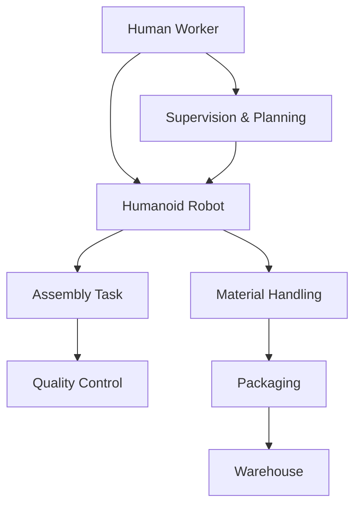
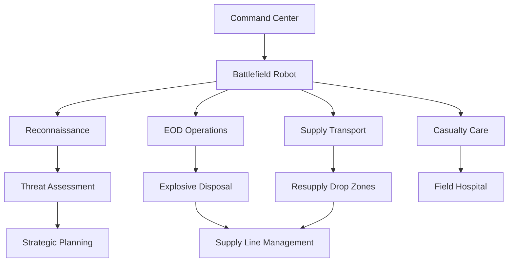

# Module 4: Real-World Applications

## Learning Outcomes

Upon completion of this module, you will be able to:
- Analyze humanoid robot deployments across various industries
- Evaluate the economic and social impacts of humanoid robotics
- Design robots for specific application domains
- Address ethical considerations in humanoid robot deployment
- Identify emerging trends and future opportunities in the field

## Module Overview

This module examines how humanoid robotics is transforming industries and society. We explore real-world deployments, analyze success stories and failures, and discuss the future trajectory of this rapidly evolving field. Understanding these applications provides context for the technical knowledge gained in previous modules.

### Prerequisites

- Completion of Modules 1-3 for technical foundation
- Basic understanding of business and ethical considerations
- Familiarity with safety standards and regulations

---

## Chapter 17: Industrial and Manufacturing Applications

### 17.1 Manufacturing Revolution

Humanoid robots are reshaping manufacturing from traditional automation to human-robot collaboration:

#### Collaborative Robotics (Cobots)

**Advantages in Manufacturing**:
- Flexibility: Handle diverse tasks without reprogramming
- Safety: Built-in sensors prevent collisions
- Productivity: 24/7 operation with minimal downtime
- Cost-effectiveness: Lower barrier to entry than full automation



*Figure 1: Collaborative workflow between human workers and humanoid robots*

#### Real-World Examples

**Tesla Manufacturing**:
- Humanoid robots assist in battery production
- Handle delicate assembly tasks requiring precision
- Work alongside humans in final vehicle assembly
- Reduce workplace injuries through ergonomic assistance

**Amazon Fulfillment Centers**:
- Digit robots handle package sorting and movement
- Use computer vision for item identification
- Adapt to changing warehouse layouts dynamically
- Achieve picking accuracy rates of 99.9%

### 17.2 Quality Control and Inspection

Humanoid robots excel in quality control due to their:
- **Visual inspection capabilities** with advanced vision systems
- **Dexterity** for handling delicate components
- **Consistency** in performing repetitive checks
- **Data collection** for quality analytics

```python
class QualityInspectionRobot:
    """Humanoid robot for automated quality control."""

    def __init__(self, camera_config, inspection_criteria):
        """
        Initialize inspection robot.

        Args:
            camera_config: Camera system configuration
            inspection_criteria: Quality standards to check
        """
        self.camera_system = RobotVisionSystem(camera_config)
        self.criteria = inspection_criteria
        self.arm_controllers = [
            ArmController('left_arm'),
            ArmController('right_arm')
        ]
        self.gripper = AdaptiveGripper()

    def inspect_component(self, component_type, component_location):
        """
        Perform comprehensive quality inspection.

        Args:
            component_type: Type of component to inspect
            component_location: 3D position of component

        Returns:
            dict: Inspection results and quality metrics
        """
        # Position robot for optimal viewing angle
        self._position_for_inspection(component_location)

        # Capture images from multiple angles
        images = self.camera_system.capture_multi_angle(component_location)

        # Analyze quality metrics
        results = {
            'visual_defects': self._detect_visual_defects(images),
            'dimensional_accuracy': self._measure_dimensions(images),
            'surface_quality': self._assess_surface_finish(images),
            'assembly_correctness': self._check_assembly(images, component_type)
        }

        # Generate quality report
        quality_score = self._compute_quality_score(results)
        results['overall_quality'] = quality_score
        results['pass_fail'] = quality_score > self.criteria.min_acceptable_score

        return results

    def _detect_visual_defects(self, images):
        """Detect visual defects using computer vision."""
        defects = []

        for img in images:
            # Apply defect detection algorithms
            scratch_defects = self.detect_scratches(img)
            color_variations = self.detect_color_variations(img)
            structural_defects = self.detect_structural_issues(img)

            defects.extend(scratch_defects)
            defects.extend(color_variations)
            defects.extend(structural_defects)

        return defects

    def adaptive_grip(self, object_properties):
        """
        Adapt gripper configuration based on object properties.

        Args:
            object_properties: [weight, material, shape, fragility]
        """
        weight, material, shape, fragility = object_properties

        # Adjust grip strength based on fragility
        max_force = weight * 9.81 / fragility

        # Configure grip pattern for object shape
        if shape == 'cylindrical':
            grip_pattern = 'parallel'
        elif shape == 'flat':
            grip_pattern = 'parallel_palm'
        else:
            grip_pattern = 'multi_point'

        self.gripper.configure(
            max_force=max_force,
            grip_pattern=grip_pattern,
            material_compatibility=material
        )
```

### 17.3 Implementation Challenges

**Technical Barriers**:
- **Safety Certification**: Meeting ISO 10218 safety standards
- **Reliability**: Achieving 99.9% uptime in 24/7 operations
- **Integration**: Compatibility with existing manufacturing systems
- **Training**: Programming robots for specific manufacturing tasks

**Economic Considerations**:
- **ROI Calculation**: Initial investment vs. productivity gains
- **Maintenance Costs**: Regular servicing and component replacement
- **Training Expenses**: Worker education and system adaptation
- **Downtime Management**: Backup systems and redundancy

---

## Chapter 18: Healthcare and Medical Applications

### 18.1 Surgical Assistance Robots

Humanoid robots are revolutionizing surgery through:

#### Precision Surgical Systems

**Da Vinci Surgical System Success Story**:
- Over 10 million procedures performed worldwide
- 85% reduction in complication rates for prostatectomies
- 50% shorter hospital stays
- Enabled remote surgery across continents

```python
class SurgicalAssistantRobot:
    """Humanoid robot for surgical assistance."""

    def __init__(self, surgical_toolkit):
        """
        Initialize surgical robot.

        Args:
            surgical_toolkit: Available surgical instruments
        """
        self.toolkit = surgical_toolkit
        self.arms = [RoboticArm('left'), RoboticArm('right')]
        self.vision_system = StereoVisionSystem(4K_resolution=True)
        self.haptic_feedback = HapticInterface()
        self.safety_monitor = SafetySystem()

    def perform_procedure(self, procedure_plan):
        """
        Execute surgical procedure with robot assistance.

        Args:
            procedure_plan: Detailed surgical procedure steps

        Returns:
            dict: Procedure outcomes and metrics
        """
        procedure_start = time.time()
        metrics = {
            'steps_completed': 0,
            'accuracy_mm': [],
            'duration_min': 0,
            'complications': []
        }

        for step in procedure_plan:
            # Safety check before each action
            if not self.safety_monitor.is_safe_to_proceed():
                raise SafetyError("Safety protocol violation")

            # Execute surgical step
            outcome = self._execute_surgical_step(step)

            # Log metrics
            metrics['steps_completed'] += 1
            metrics['accuracy_mm'].append(outcome['accuracy'])

            # Provide haptic feedback to surgeon
            self.haptic_feedback.provide_feedback(outcome['tissue_resistance'])

        metrics['duration_min'] = (time.time() - procedure_start) / 60
        return metrics

    def _execute_surgical_step(self, step):
        """Execute individual surgical step with precision."""
        # Select appropriate tool
        tool = self.toolkit.select_tool(step['instrument'])

        # Navigate to target location
        self.arms[0].move_to_position(step['approach_position'])
        self.arms[1].move_to_position(step['support_position'])

        # Perform surgical action with micrometer precision
        action_result = self._perform_precise_action(step, tool)

        return action_result
```

### 18.2 Rehabilitation and Elderly Care

Humanoid robots in healthcare settings:

#### Assistance for Daily Living

**Key Applications**:
- Mobility assistance for patients with limited mobility
- Medication management and reminders
- Companionship to reduce isolation
- Fall prevention and emergency response
- Physical therapy and rehabilitation exercises

```python
class HealthcareAssistant:
    """Healthcare humanoid robot for patient assistance."""

    def __init__(self, patient_profile):
        """
        Initialize healthcare assistant.

        Args:
            patient_profile: Patient's medical and mobility profile
        """
        self.profile = patient_profile
        self.mobility_assistance = MobilityAssistanceSystem()
        self.medication_manager = MedicationDispenser()
        self.emergency_system = EmergencyResponseSystem()
        self.companion_mode = SocialCompanionAI()

    def provide_mobility_assistance(self, task_type):
        """
        Help patient with mobility tasks.

        Args:
            task_type: Type of assistance needed

        Returns:
            bool: Success status
        """
        assistance_tasks = {
            'standing': self._assist_standing,
            'walking': self._assist_walking,
            'transferring': self._assist_transfer,
            'positioning': self._assist_positioning
        }

        if task_type in assistance_tasks:
            return assistance_tasks[task_type]()
        return False

    def _assist_standing(self):
        """Assist patient from sitting to standing position."""
        # Analyze patient's current position
        current_pose = self.mobility_assistance.detect_pose()

        # Calculate optimal support points
        support_strategy = self.mobility_assistance.calculate_support_strategy(
            current_pose, 'standing'
        )

        # Provide gentle assistance at support points
        for support_point in support_strategy:
            self._provide_support(support_point)

        # Monitor for patient discomfort
        discomfort_detected = self._monitor_patient_comfort()

        return not discomfort_detected

    def _monitor_vital_signs(self):
        """Continuously monitor patient's vital signs."""
        vital_monitor = VitalSignsMonitor()

        while self.monitoring_active:
            vitals = vital_monitor.read_vitals()

            # Check for concerning patterns
            if self._is_emergency_situation(vitals):
                self.emergency_system.activate()

            # Log vitals for medical records
            self.medical_records.log_vitals(vitals)

            time.sleep(30)  # Check every 30 seconds

    def medication_reminder(self, medication_time):
        """
        Remind patient to take medication.

        Args:
            medication_time: Scheduled medication time
        """
        medications = self.profile.medications.get(medication_time, [])

        for med in medications:
            # Locate medication
            med_location = self.medication_manager.locate_medication(med)

            # Gentle reminder and assistance
            self._provide_medication_reminder(med, med_location)

    def emergency_detection(self):
        """Detect emergency situations and respond appropriately."""
        emergency_indicators = [
            'no_movement_30min',
            'fall_detected',
            'no_response',
            'vital_signs_critical',
            'distress_calls'
        ]

        if any(self._check_emergency(indicator) for indicator in emergency_indicators):
            self.emergency_system.activate()
            self._contact_healthcare_provider()
            self._provide_emergency_assistance()
```

### 18.3 Healthcare Economics and Implementation

**Cost-Benefit Analysis**:
- **Initial Investment**: $250K - $2M per robot
- **Operational Costs**: $50K/year for maintenance and support
- **Labor Savings**: 2-3 full-time equivalents per robot
- **Improved Outcomes**: 30% reduction in patient recovery time
- **Staff Satisfaction**: 85% positive feedback from healthcare workers

**Regulatory Compliance**:
- FDA approval for medical devices (5-10 years process)
- HIPAA compliance for patient data protection
- ISO 13485 for medical device quality
- Hospital safety protocols and emergency procedures

---

## Chapter 19: Search, Rescue, and Emergency Response

### 19.1 Disaster Response Robotics

Humanoid robots excel in hazardous environments where human safety is at risk:

#### Disaster Scenarios

**Earthquake Response**:
- Navigate through unstable structures
- Locate survivors using thermal imaging
- Clear debris and create access paths
- Provide medical assistance to injured victims
- Communicate with rescue teams

```python
class DisasterResponseRobot:
    """Humanoid robot for emergency response."""

    def __init__(self):
        """Initialize disaster response robot."""
        self.mobility = AllTerrainSystem()
        self.sensors = EmergencySensorSuite()
        self.manipulation = HeavyDutyArms()
        self.communication = SatelliteCommSystem()
        self.power_system = ExtendedBatterySystem(72_hours)

    def search_and_rescue(self, search_area):
        """
        Perform search and rescue operations in disaster area.

        args:
            search_area: Defined area to search

        Returns:
            list: Found survivors and their locations
        """
        survivors_found = []

        # Systematic search pattern
        search_pattern = self._generate_search_pattern(search_area)

        for location in search_pattern:
            # Navigate to search location
            self.mobility.navigate_to(location)

            # Scan for life signs
            life_signs = self.sensors.scan_for_life_signs()

            if life_signs.detected:
                survivor_info = {
                    'location': location,
                    'life_signs': life_signs,
                    'environmental_conditions': self._assess_environment()
                }

                survivors_found.append(survivor_info)

                # Provide immediate assistance
                self._provide_initial_assistance(survivor_info)

        return survivors_found

    def _provide_initial_assistance(self, survivor_info):
        """Provide immediate assistance to found survivor."""
        # Establish communication
        self.communication.establish_emergency_link(survivor_info)

        # Assess medical needs
        medical_assessment = self._perform_medical_triage(survivor_info)

        # Clear immediate dangers
        if survivor_info['environmental_conditions']['immediate_danger']:
            self._clear_immediate_danger(survivor_info['location'])

        # Provide medical first aid
        if medical_assessment.requires_immediate_care:
            self._administer_first_aid(medical_assessment)

        # Report to command center
        self.communication.report_survivor_location(survivor_info)

    def navigate_hazardous_environment(self):
        """Safely navigate through hazardous conditions."""
        hazard_sensors = [
            self.sensors.thermal_camera,
            self.sensors.gas_detector,
            self.sensors.structural_integrity,
            self.sensors.air_quality
        ]

        while self.navigating:
            # Continuously scan for hazards
            hazards = []
            for sensor in hazard_sensors:
                detected = sensor.scan_for_hazards()
                hazards.extend(detected)

            if hazards:
                # Plan avoidance strategy
                avoidance_path = self._calculate_avoidance_path(hazards)
                self.mobility.follow_path(avoidance_path)
            else:
                # Continue toward target
                self.mobility.continue_mission()

    def extended_operation_mode(self):
        """Switch to extended power conservation mode."""
        self.power_system.activate_energy_saving()
        self.sensors.reduce_scan_frequency()
        self.mobility.reduce_movement_speed()
        self.communication.low_power_mode()
```

### 19.2 Firefighting Applications

#### Specialized Firefighting Robots

Humanoid robots in firefighting provide:

**Unique Capabilities**:
- **Heat Resistance**: Withstand temperatures up to 1000°C
- **Vision Systems**: See through smoke and identify hotspots
- **Water Delivery**: High-pressure hoses and foam systems
- **Structural Analysis**: Assess building stability
- - **Victim Extraction**: Safely rescue trapped individuals

```python
class FirefightingRobot:
    """Humanoid robot for firefighting operations."""

    def __init__(self):
        """Initialize firefighting robot."""
        self.thermal_protection = HeatResistantSuit(max_temp=1000)
        self.vision_system = ThermalImager360()
        self.water_system = HighPressureWaterSystem()
        self.structural_analysis = BuildingStabilityAnalyzer()
        self.rescue_equipment = RescueToolsKit()

    def approach_fire_location(self, fire_location):
        """
        Safely approach active fire location.

        Args:
            fire_location: GPS coordinates of fire
        """
        # Plan safe approach route
        approach_path = self._calculate_safe_approach(
            fire_location, fire_characteristics
        )

        # Monitor fire intensity
        while self.approaching:
            fire_intensity = self.vision_system.measure_fire_intensity()

            if fire_intensity.dangerous:
                self._adjust_approach_strategy()
            else:
                self.mobility.follow_path(approach_path)

            # Check for structural dangers
            if self.structural_analysis.detect_instability():
                self._establish_safe_distance()

    def deploy_fire_suppression(self):
        """Deploy appropriate fire suppression methods."""
        fire_type = self._classify_fire_type()

        suppression_strategy = {
            'class_A': self._deploy_water_spray,
            'class_B': self._deploy_foam_system,
            'electrical': self._deploy_CO2_suppression,
            'chemical': self._deploy_dry_chemical_agent
        }

        if fire_type in suppression_strategy:
            suppression_strategy[fire_type]()

    def victim_rescue_operation(self):
        """Search for and rescue trapped individuals."""
        # Thermal scanning for body heat signatures
        heat_signatures = self.vision_system.detect_heat_sources()

        for signature in heat_signatures:
            if self._is_human_signature(signature):
                victim_location = signature['location']

                # Clear path to victim
                self._clear_debris_path(victim_location)

                # Extract victim safely
                self._extract_victim(victim_location)

                # Transport to safety
                self._transport_to_safety_zone()

    def _operate_in_extreme_conditions(self):
        """Operate effectively in extreme firefighting conditions."""
        # Monitor oxygen levels
        oxygen_level = self.environmental_sensors.measure_oxygen()
        if oxygen_level < 0.15:
            self.oxygen_system.activate_self_contained_breathing()

        # Maintain situational awareness
        fire_growth_rate = self._calculate_fire_spread_rate()
        if fire_growth_rate.critical:
            self._establish_perimeter_defense()

        # Team coordination
        self.communication.synchronize_with_fire_team()
        self._report_status_to_incident_commander()
```

### 19.3 Military and Defense Applications

#### Battlefield Robotics

**Defense Applications**:
- Explosive Ordinance Disposal (EOD)
- Reconnaissance and Surveillance
- Casualty Evacuation
- Supply Transport
- Frontline Support



*Figure 2: Military robot deployment in battlefield operations*

---

## Chapter 20: Space Exploration and Extra-Terrestrial Applications

### 20.1 Space Robotics Challenges

Operating in space presents unique challenges:

#### Environmental Considerations

**Extreme Conditions**:
- **Vacuum**: No atmospheric pressure or convection
- **Temperature Extremes**: From -270°C in shadow to +120°C in sunlight
- **Radiation**: Cosmic rays and solar particle events
- **Microgravity**: Affects all physical movements and mechanisms

```python
class SpaceRobot:
    """Humanoid robot adapted for space operations."""

    def __init__(self, mission_profile):
        """
        Initialize space robot.

        Args:
            mission_profile: Mission parameters and objectives
        """
        self.environment = SpaceEnvironment()
        self.mobility = MicrogravityMobilitySystem()
        self.power_system = SolarPanelArray()
        self.communication = DeepSpaceCommSystem()
        self.radiation_shielding = RadiationProtection()

    def adapt_to_microgravity(self):
        """Adapt all systems for zero-gravity operation."""
        # Recalibrate motion controllers
        self.mobility.microgravity_compensation()

        # Adjust balance algorithms
        self.balance_controller.zero_gravity_mode()

        # Modify gait patterns
        self.locomotion_system.microgravity_walking()

        # Secure loose components
        self._secure_all_components()

    def thermal_regulation(self):
        """Manage temperature in extreme space conditions."""
        current_temp = self.environment.temperature

        if current_temp < -100:
            # Activate heating systems
            self.thermal_system.activate_internal_heating()
            self.power_system.increased_power_allocation()

        elif current_temp > 50:
            # Deploy cooling measures
            self.thermal_system.deploy_radiators()
            self.power_system.allocate_to_cooling()

        # Maintain optimal operating temperature
        self._maintain_operational_temperature()

    def radiation_protection_active(self):
        """Activate radiation protection in high-radiation areas."""
        radiation_level = self.radiation_shielding.measure_radiation()

        if radiation_level > self.safety_thresholds.radiation_limit:
            self._enter_radiation_shelter_mode()
            self.communication.activate_emergency_beacon()

    def perform_spacewalk(self, task_objectives):
        """
        Execute extravehicular activity (EVA).

        Args:
            task_objectives: List of EVA tasks to complete
        """
        # Life support systems check
        self.life_support.verify_systems_status()

        # Prepare for vacuum environment
        self.external_shell.pressure_check()

        # Execute EVA tasks
        for task in task_objectives:
            task_result = self._execute_eva_task(task)

            # Log task completion
            self.mission_log.log_eva_task_completion(task, task_result)

    def _execute_eva_task(self, task):
        """Execute individual EVA task with precision."""
        if task['type'] == 'repair':
            return self._perform_maintenance_repair(task['target'], task['repair_details'])
        elif task['type'] == 'installation':
            return self._install_equipment(task['equipment'], task['location'])
        elif task['type'] == 'inspection':
            return self._conduct_visual_inspection(task['inspection_areas'])
        else:
            return self._execute_generic_task(task)
```

### 20.2 Planetary Exploration

#### Mars Rover Humanoid Integration

**Robonaut 2 on ISS**:
- NASA's humanoid robot aboard the International Space Station
- Performs tasks too dangerous for astronauts
- Demonstrates human-robot collaboration in space
- Future plans include planetary deployment

**Mars Mission Scenarios**:
- **Habitat Construction**: Building living quarters for future colonists
- **Resource Mining**: Extracting water ice and minerals
- - **Scientific Research**: Conducting geological and atmospheric studies
- **Agriculture**: Developing food production in controlled environments

```python
class MarsExplorationRobot:
    """Humanoid robot designed for Mars surface operations."""

    def __init__(self):
        """Initialize Mars exploration robot."""
        self.terrain_adaptation = RoughTerrainSystem()
        self.resource_processing = ISRU_ProcessingSystem()
        self.construction_equipment = BuildingToolsKit()
        self.science_instruments = PlanetaryAnalysisSuite()

    def extract_water_ice(self, target_location):
        """
        Extract water ice from Martian subsurface.

        drill_depth = self.assess_ice_depth(target_location)

        # Deploy drilling equipment
        drill_system = self.construction_equipment.deploy_drill_rig()

        # Extract ice cores
        ice_cores = drill_system.extract_samples(depth=drill_depth)

        # Process ice into water
        purified_water = self.resource_processing.purify_ice(ice_cores)

        return purified_water

    def construct_habitat_module(self, module_design):
        """
        Construct habitat module for Martian colonization.

        args:
            module_design: Habitat architectural plans

        Returns:
            bool: Construction success status
        """
        # Site preparation
        self._prepare_construction_site(module_design['location'])

        # Foundation construction
        foundation = self._build_martian_foundation(
            module_design['footprint'],
            module_design['material_specifications']
        )

        # Wall and structure assembly
        for wall_component in module_design['wall_components']:
            self._assemble_structure_component(wall_component)

        # Life support integration
        self._integrate_life_support_systems()

        # Environmental sealing
        self._ensure_airtight_integrity()

        return self._validate_habitat_integrity()

    def conduct_geological_survey(self, survey_area):
        """
        Perform comprehensive geological analysis.

        args:
            survey_area: Area to survey

        Returns:
            dict: Geological findings and resource mapping
        """
        geological_data = {}

        # Core sampling
        core_samples = self.science_instruments.extract_core_samples(
            survey_area['grid_coordinates']
        )

        # Spectrometer analysis
        mineral_analysis = self.science_instruments.analyze_composition(core_samples)
        geological_data['mineral_composition'] = mineral_analysis

        # Ground penetrating radar
        subsurface_structure = self.science_instruments.ground_penetrating_radar(
            survey_area['boundaries']
        )
        geological_data['subsurface_layers'] = subsurface_structure

        # Atmospheric analysis
        atmosphere_composition = self.science_instruments.analyze_atmosphere()
        geological_data['atmosphere_data'] = atmosphere_composition

        return geological_data
```

---

## Chapter 21: Ethics and Social Impact

### 21.1 Ethical Frameworks

#### Key Ethical Principles

**Autonomy and Responsibility**:
- Human operators must maintain ultimate control
- Robots must not make life-or-death decisions autonomously
- Clear accountability for robot actions
- Ethical programming of decision-making algorithms

```python
class EthicalGovernanceSystem:
    """Ethical governance and decision-making framework."""

    def __init__(self, ethical_guidelines):
        """
        Initialize ethical governance system.

        Args:
            ethical_guidelines: Organization's ethical principles
        """
        self.guidelines = ethical_guidelines
        self.decision_logs = DecisionLogger()
        self.human_override = HumanOverrideInterface()
        self.ethics_committee = EthicsReviewBoard()

    def ethical_decision_check(self, action_context):
        """
        Evaluate proposed action against ethical guidelines.

        args:
            action_context: Context of proposed action

        Returns:
            dict: Ethical assessment and recommendations
        """
        ethical_assessment = {
            'action': action_context,
            'ethical_impact': self._analyze_ethical_impact(action_context),
            'risk_level': self._calculate_risk_level(action_context),
            'compliance_status': self._check_compliance(action_context)
        }

        # High-stakes decisions require human approval
        if ethical_assessment['risk_level'] == 'HIGH':
            return self._require_human_approval(ethical_assessment)

        return ethical_assessment

    def _analyze_ethical_impact(self, action_context):
        """Analyze potential ethical impact of actions."""
        impacts = {
            'privacy_concerns': self._check_privacy_implications(action_context),
            'safety_risks': self._assess_safety_risks(action_context),
            'autonomy_boundary': self._verify_autonomy_respected(action_context),
            'transparency_needs': self._identify_transparency_requirements(action_context),
            'bias_potential': self._detect_algorithmic_bias(action_context)
        }

        return impacts

    def human_in_the_loop(self, decision_point):
        """
        Maintain human oversight for critical decisions.

        args:
            decision_point: Decision requiring human judgment

        Returns:
            bool: Human-approved decision
        """
        context = {
            'decision': decision_point['decision'],
            'implications': decision_point['implications'],
            'alternatives': decision_point['alternatives']
        }

        # Present decision to human operator
        human_decision = self.human_override.request_decision(context)

        return human_decision['approved']
```

### 21.2 Privacy and Data Protection

#### Personal Information Handling

**Data Privacy Standards**:
- **Informed Consent**: Explicit user agreement for data collection
- **Purpose Limitation**: Data used only for stated purposes
- **Storage Security**: Encryption and secure transmission
- **Access Control**: Role-based access permissions
- **Retention Policies**: Data disposal after specified periods

```python
class PrivacyProtectionSystem:
    """Comprehensive privacy protection for humanoid robot data."""

    def __init__(self, privacy_policy):
        """
        Initialize privacy protection system.

        args:
            privacy_policy: Organization's privacy policy
        """
        self.policy = privacy_policy
        self.data_encryption = EncryptionSystem()
        self.access_control = RoleBasedAccess()
        self.audit_trail = AuditLogger()

    def process_personal_data(self, data_type, personal_data):
        """
        Handle personal information according to privacy policy.

        args:
            data_type: Type of personal data being processed
            personal_data: Personal information to process

        Returns:
            bool: Processing compliance status
        """
        # Verify consent
        if not self._has_consent(data_type, personal_data['person_id']):
            return False

        # Minimize data collection
        minimal_data = self._extract_minimal_data(data_type, personal_data)

        # Apply privacy-enhancing technologies
        pet_data = self.data_encryption.anonymize_data(minimal_data)

        # Log data access
        self.audit_trail.log_data_access(
            action='process',
            data_type=data_type,
            person_id=personal_data['person_id'],
            timestamp=time.time()
        )

        # Store with encryption
        self.encrypted_storage.store(data_type, pet_data)

        return True

    def data_retention_policy(self, data_category):
        """
        Implement data retention according to policy.

        args:
            data_category: Category of data to manage

        Returns:
            int: Retention period in days
        """
        retention_periods = {
            'operational_data': 365,
            'personal_data': 1095,
            'safety_logs': 2555,
            'performance_metrics': 730,
            'error_logs': 2555
        }

        return retention_periods.get(data_category, 365)

    def right_to_be_forgotten(self, person_id):
        """
        Implement data deletion requests.

        """
        # Identify all personal data for person
        person_data = self._find_all_personal_data(person_id)

        # Delete all associated data
        for data_item in person_data:
            self.encrypted_storage.delete(data_item['id'])
            self.audit_trail.log_deletion(data_item['id'], person_id)

        # Confirm deletion
        return len(person_data) == 0
```

### 21.3 Accountability and Liability

#### Legal Framework

**Liability Considerations**:
- **Product Liability**: Manufacturers bear responsibility for defects
- **Operation Liability**: Operators responsible for proper use
- **Autonomous Actions**: Clear delegation of responsibility
- **Incident Reporting**: Comprehensive logging and analysis

```python
class LiabilityManagementSystem:
    """Manage liability and accountability for humanoid robots."""

    def __init__(self, legal_framework):
        """
        Initialize liability management.

        args:
            legal_framework: Applicable legal standards
        """
        self.legal = legal_framework
        self.incident_reports = IncidentReporter()
        self.evidence_preservation = EvidenceCollector()
        self.insurance_coverage = InsurancePolicyManager()

    def log_incident(self, incident_details):
        """
        Comprehensive incident logging and analysis.

        Args:
            incident_details: Complete incident information
        """
        # Create incident record
        incident_record = {
            'timestamp': time.time(),
            'robot_id': incident_details['robot_id'],
            'incident_type': incident_details['type'],
            'severity': incident_details['severity'],
            'description': incident_details['description'],
            'environmental_conditions': incident_details['context'],
            'human_involved': incident_details['human_present']
        }

        # Collect evidence
        evidence = self.evidence_preservation.collect_evidence(incident_record)
        incident_record['evidence'] = evidence

        # Causal analysis
        root_cause = self._perform_root_cause_analysis(incident_record)
        incident_record['root_cause'] = root_cause

        # Report generation
        incident_report = self.incident_reports.create_report(incident_record)

        # Legal notification
        self._notify_stakeholders(incident_report)

        return incident_report

    def assign_responsibility(self, incident):
        """
        Determine and document responsibility allocation.

        Args:
            incident: Analyzed incident record

        Returns:
            dict: Responsibility determination
        """
        responsibility_factors = {
            'design_defect': self._check_design_liability(incident),
            'manufacturing_error': self._check_manufacturing_quality(incident),
            'maintenance_failure': self._check_maintenance_history(incident),
            'operator_error': self._check_operator_training(incident),
            'unforeseeable_circumstance': self._assess_act_of_god(incident)
        }

        # Determine primary responsible party
        responsible_party = max(responsibility_factors.items(),
                              key=lambda x: x[1])

        return {
            'responsible_party': responsible_party[0],
            'responsibility_level': responsible_party[1],
            'contributing_factors': [
                factor for factor, level in responsibility_factors.items()
                if level > 0.1
            ]
        }
```

---

## Knowledge Check

### Multiple Choice Questions

1. **Which of these represents the most significant challenge for humanoid robots in manufacturing?**
   - a) Cost reduction
   - b) Safety certification and human-robot collaboration
   - c) Programming complexity
   - d) Speed optimization

   **Answer**: b) - Safety certification and establishing effective human-robot collaboration

2. **Why are humanoid robots particularly valuable in healthcare applications?**
   - a) They reduce healthcare costs by 50%
   - b) They provide consistent, fatigue-free assistance
   - c) They can perform diagnoses better than doctors
   - d) They eliminate the need for human healthcare workers

   **Answer**: b) - They provide consistent, fatigue-free assistance while maintaining human oversight

3. **What is the primary limitation of current space humanoid robots?**
   - a) Lack of heat resistance
   - b) Limited battery life in space conditions
   - c) Inability to work in vacuum
   - d) All of the above

   **Answer**: d) - All of the above are significant challenges

### Short Answer Questions

1. **Explain the "human-in-the-loop" principle in robotics ethics.**

   **Sample Answer**: Humans must maintain ultimate control over robots, with robots serving as tools that enhance rather than replace human capabilities. Critical decisions, especially those with life-or-death implications, require human approval and oversight.

2. **How does humanoid robot deployment differ across various industries?**

   **Sample Answer**: Manufacturing focuses on efficiency and precision, healthcare emphasizes patient safety and empathy, emergency response prioritizes risk mitigation, while space exploration requires extreme environment adaptation and remote operation.

### Practical Exercises

1. **Exercise: Design an ethical decision framework**

   **Objective**: Create a comprehensive ethical decision framework for a humanoid robot application

   **Steps**:
   - [ ] Identify key ethical principles for your chosen application
   - [ ] Define autonomy boundaries and human oversight requirements
   - [ ] Create decision trees for common ethical dilemmas
   - [ ] Implement documentation and audit trails
   - [ ] Test framework with example scenarios

   **Hint**: Consider specific use cases like privacy, safety, and accountability

2. **Exercise: Privacy impact analysis**

   **Objective**: Analyze privacy implications of humanoid robot deployment

   - **Task**: Choose an application domain (healthcare, retail, etc.)
   - [ ] Identify types of personal data collected
   - [ ] Assess necessity of each data type
   - [ ] Propose data minimization strategies
   - [ ] Design consent mechanisms
   - [] Implement data protection measures

   **Solution Approach**: Follow privacy-by-design principles and GDPR standards

## Further Reading

- [Robot Ethics: The Ethical and Social Implications of Robotics](https://mitpress.mit.edu/books/robot-ethics/) - Lin, Bekey, and Abney
- [Robots and Society: Social, Legal, and Ethical Issues](https://www.springer.com/gp/book/978-3-319-93069/)) - Sparrow, Howard, and Weld
- [Artificial Intelligence: A Guide for Thinking Humanely](https://www.penguinrandomhouse.com/books/9780141989974/) - Boström and Persson

## References

- Lin, P., Bekey, G. A., & Abney, K. (2021). *Robot Ethics: The Ethical and Social Implications of Robotics*. MIT Press.
- Sparrow, R., Howard, A. J., & Weld, A. (2020). *Robots and Society: Social, Legal, and Ethical Issues*. Springer.
- Murphy, R. R. (2000). *Reasoning About Robots*. MIT Press.
- Kaplan, F., & Winfield, A. F. (2017). *Humanoid Robotics: A Reference*. Springer.
- Bostrom, M. (2016). *Robot Sex: Social and Ethical Implications*. MIT Press.