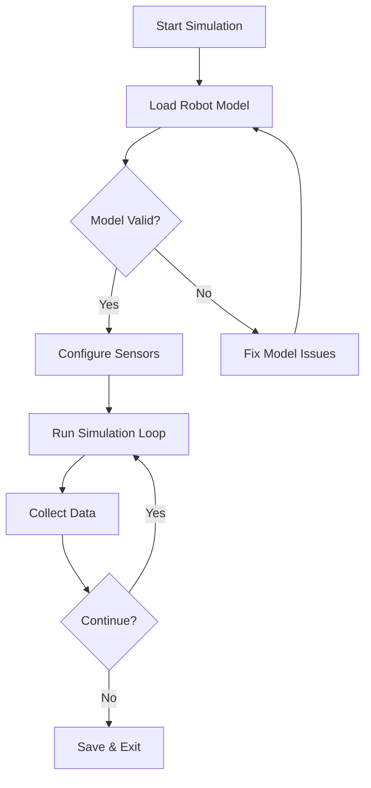
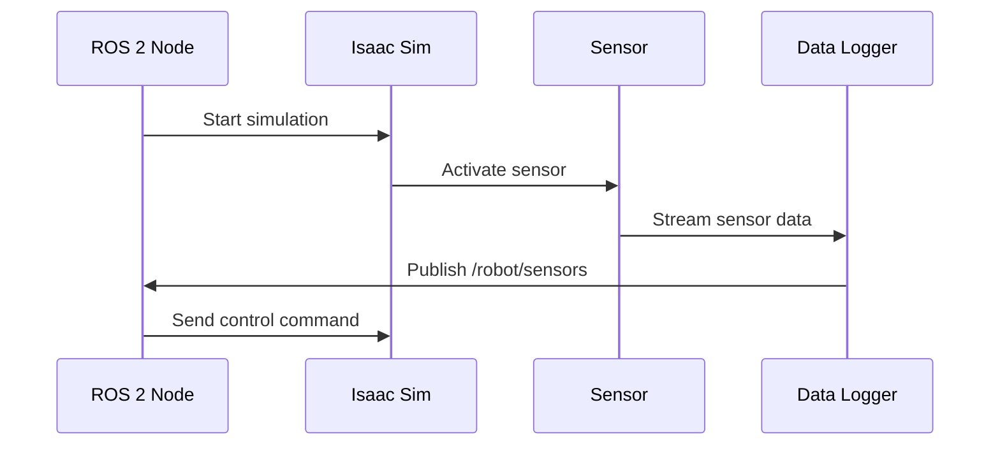

# Quickstart Guide: Enhanced Textbook Content

**Purpose**: Rapid guide for creating descriptive, professional textbook chapters with diagrams
**Audience**: Content creators, technical writers, and developers working on the textbook

## Prerequisites

### Development Environment
- **Node.js** 18+ for Docusaurus
- **Python** 3.8+ for code examples
- **ROS 2** Humble (for robotics content)
- **Git** for version control
- **VS Code** with Mermaid preview extension recommended

### Tools and Dependencies
```bash
# Install Docusaurus CLI
npm install -g @docusaurus/init@latest

# Install Python dependencies (examples)
pip install -r requirements.txt

# ROS 2 setup (Ubuntu/WSL2)
source /opt/ros/humble/setup.bash
```

## 1. Setting Up the Chapter Template

### Clone and Prepare
```bash
git clone <repository>
cd humanoid_robotic_book
npm install
```

### Create New Chapter Structure
```bash
# Create chapter directory
mkdir -p docs/module-2/part4-ai-brain/chapter-8-isaac-sim

# Create standard files
touch chapter-8-isaac-sim.md
mkdir -p static/images/chapter-8
mkdir -p examples/isaac_sim
```

## 2. Chapter Content Guidelines

### Frontmatter Template
```yaml
---
title: "Chapter 8: NVIDIA Isaac Sim & ROS 2 Integration"
sidebar_position: 40
description: "Master Isaac Sim simulation for humanoid robotics with ROS 2"
tags: ['simulation', 'isaac-sim', 'ros2', 'sensors', 'robotics']
authors: ['your-name']
---

# Chapter 8: NVIDIA Isaac Sim & ROS 2 Integration

## Learning Objectives
- [ ] Set up Isaac Sim for humanoid robot simulation
- [ ] Integrate ROS 2 with Isaac Sim using the bridge
- [ ] Create custom robot scenarios with sensor simulation
- [ ] Collect and analyze simulation data

## Prerequisites
- Basic ROS 2 knowledge (Chapter 3-5)
- Python programming fundamentals
- Understanding of 3D coordinate systems

```

### Content Structure Pattern
```markdown
## 1. Introduction
**Hook**: Real-world application (2-3 sentences)
**Context**: Why this technology matters
**Roadmap**: What you'll learn in this chapter

## 2. Core Concepts
### 2.1 [Concept Name]
**Definition**: Clear, concise definition
**Key Points**: 3-5 bullet points
**Visual Aid**: [Diagram reference]

### 2.2 [Related Concept]
**Connection**: How it relates to 2.1
**Practical Example**: Mini code snippet or scenario

## 3. Implementation
### Step-by-Step Guide
```python
# Code example with full documentation
class IsaacSimController:
    """
    Controls Isaac Sim simulation for humanoid robots.

    This class provides a high-level interface for:
    - Loading robot assets
    - Configuring sensors
    - Running simulation loops
    """

    def __init__(self, config: Dict[str, Any]):
        """
        Initialize controller with configuration.

        Args:
            config: Dictionary containing:
                - sim_path: Path to Isaac Sim installation
                - robot_urdf: Path to robot model
                - sensor_config: Sensor configuration
        """
        self.config = config
        self.sim_app = None
        self._setup_environment()
```

## 4. In Practice: [Application]
**Scenario**: Real-world use case
**Implementation**: Complete working example
**Results**: Expected outcomes and metrics

## 5. Advanced Topics
**Deep Dive**: Expert-level content
**Tips & Tricks**: Professional insights
**Common Pitfalls**: What to avoid

## 6. Knowledge Check
### Multiple Choice
1. Question with 4 options
   - a) Correct answer
   - b) Distractor 1
   - c) Distractor 2
   - d) Distractor 3

   **Answer**: a) - [Explanation]

### Practical Exercise
**Task**: Implement X using Y
**Hint**: [Optional guidance]
**Solution**: [Link to solution file]
```

## 3. Creating Professional Diagrams

### Mermaid.js Best Practices

#### Flowchart for Processes


#### Sequence for System Interactions


### Diagram Guidelines
1. **One Concept Per Diagram**: Don't overcrowd
2. **Consistent Styling**: Use same colors for similar elements
3. **Clear Labels**: All elements must be labeled
4. **Captions**: Every diagram needs explanatory caption

## 4. Code Example Standards

### Documentation Template
```python
def process_sensor_data(raw_data: np.ndarray,
                       config: SensorConfig) -> ProcessedData:
    """
    Process raw sensor data into usable format.

    This function applies calibration filters and noise reduction
    to raw sensor readings from Isaac Sim.

    Args:
        raw_data: Raw sensor data array from simulation
        config: Sensor configuration object containing:
            - calibration_matrix: 4x4 transformation matrix
            - noise_filter: Filter configuration
            - output_format: Desired output format

    Returns:
        ProcessedData object containing:
        - filtered_data: Noise-reduced sensor readings
        - calibration_applied: Boolean indicating calibration status
        - timestamp: Processing timestamp

    Raises:
        ValueError: If raw_data dimensions don't match config

    Example:
        >>> config = SensorConfig(calibration_matrix=identity(4))
        >>> data = process_sensor_data(raw, config)
        >>> print(data.filtered_data)
    """
```

### Error Handling Pattern
```python
try:
    # Isaac Sim API call
    result = sim_app.acquire_physics_interface()
    if not result:
        raise IsaacSimError("Failed to acquire physics interface")

    # Process result
    return process_physics_data(result)

except IsaacSimError as e:
    logger.error(f"Isaac Sim error: {e}")
    raise
except Exception as e:
    logger.error(f"Unexpected error in sensor processing: {e}")
    raise RuntimeError("Sensor processing failed") from e
```

## 5. Testing and Validation

### Content Review Checklist
- [ ] Word count meets minimum (2000+ words)
- [ ] All code examples run without errors
- [ ] Diagrams render correctly
- [ ] Internal links work
- [ ] Knowledge checks have answers
- [ ] Alt text for all images
- [ ] Accessibility compliance

### Automated Validation
```bash
# Check Markdown syntax
npx markdownlint docs/**/*.md

# Validate internal links
npx markdown-link-check docs/**/*.md

# Build and preview
npm run build
npm run serve
```

## 6. Removing Blog Functionality

### Update Docusaurus Config
```javascript
// Remove this section from docusaurus.config.js
{
  blog: {
    showReadingTime: true,
    editUrl: '...',
  },
}

// Remove this from navbar items
{to: '/blog', label: 'Blog', position: 'left'},
```

### Clean Up
```bash
# Remove any blog-related files if they exist
rm -rf blog/
rm -rf static/img/blog/
```

## 7. Common Patterns

### Callouts for Emphasis
```markdown
:::tip Pro Tip
Use version control for all simulation configuration files.
This ensures reproducibility across different environments.
:::

:::warning Performance Note
Large-scale simulations (>1000 entities) may require
cluster computing resources. Start small and scale gradually.
:::
```

### Cross-References
```markdown
This builds on the ROS 2 concepts covered in
[Chapter 3](/docs/module-2/part2-nervous-system/chapter-3-ros2-architecture.md).

For advanced simulation techniques, see
[Chapter 10](/docs/module-2/part4-ai-brain/chapter-10-reinforcement-learning.md).
```

## 8. Performance Optimization

### Image Management
```bash
# Optimize images before adding
convert input.png -resize 800x600 -quality 85 output.jpg

# Use webp format for diagrams
convert diagram.svg diagram.webp
```

### Build Optimization
```javascript
// docusaurus.config.js
presets: [
  [
    'classic',
    {
      docs: {
        sidebarPath: './sidebars.js',
        editUrl: '...',
        include: ['**/*.md', '**/*.mdx'],
        exclude: [
          '**/_*.{js,jsx,ts,tsx,md,mdx}',
          '**/_*',
          '**/*.test.{js,jsx,ts,tsx}',
          '**/__tests__/**'
        ]
      }
    }
  ]
]
```

## Next Steps

1. Create your first enhanced chapter using the template
2. Review existing chapters for consistency
3. Set up automated testing for content quality
4. Gather feedback from early readers

## Resources

- [Docusaurus Documentation](https://docusaurus.io/docs)
- [Mermaid.js Guide](https://mermaid-js.github.io/)
- [Markdown Style Guide](https://google.github.io/styleguide/docguide/style.html)
- [Writing Technical Documentation](https://developers.google.com/tech-writing)